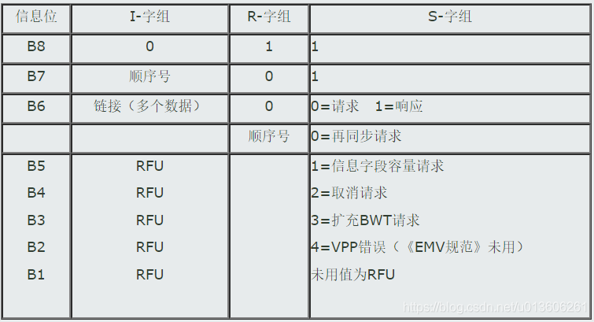
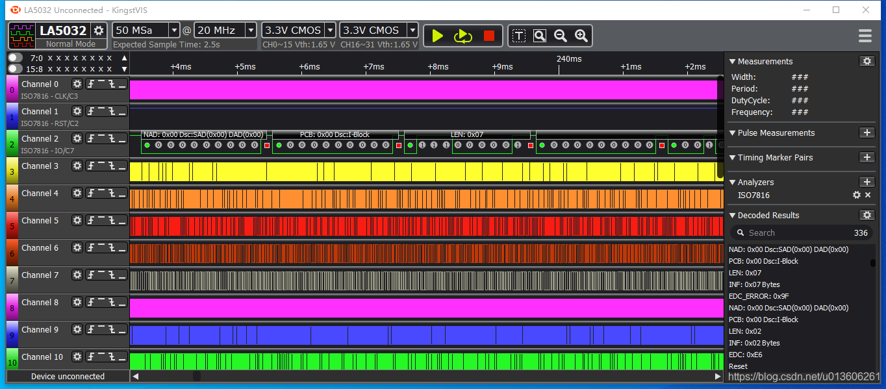
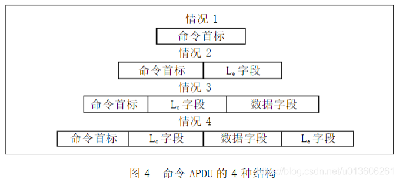
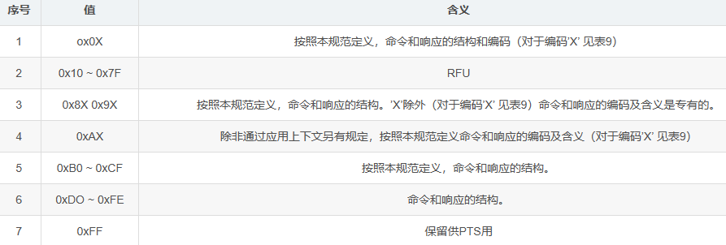
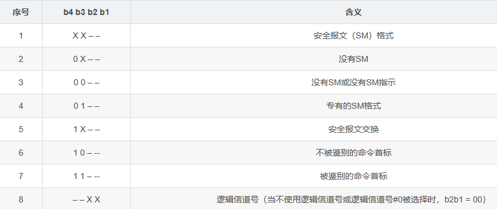

<!-- truncate -->

## 1. 摘要

IC卡必须支持T=0或T=1的协议，但不是同时支持这两种协议，而终端则必须同时支持T=0和T=1的协议。
• T=0通讯协议是异步半双工**字符**传输协议；
• T=1通讯协议是异步半双工**块**传输协议；
在ISO7816-3标准中，具体规定了这两种协议：T0和T1。
IC卡所用的协议在TD1中指定，如果在复位应答信息中没有TD1，则表示用T=0的协议进行通讯。在复位应答后，IC卡和终端之间即用IC卡指定的协议进行通讯。

##  2.硬件接口

1）VCC：电源输入（A类：5V， B类：3V）
2）GND：地
3）RST：复位
4）I/O：输入输出
5）CLK：时钟（A类：1~5MHz， B类：1~4MHz）
注：不同型号的卡引脚数可能不一样。

## 3.读头与卡的操作

### 3.1 ETU（基本时间单元）介绍

7816-3定义的通讯协议，基本上可以说是RS232的翻版并在此基础上进行的改进。在RS232中我们有9600波特率、起始位、奇偶校验位、停止位这些概念，而在7816-3中都完整地保留了下来，只不过7816-3中引入了etu，没有使用bps。etu的定义可以更加精确地描述每个数据位在传输过程中收发双方的职责和角色转换。
根据定义在智能卡上电复位的时候 1 etu = 372 / f ，其中f = 读写设备通过CLK管脚提供给智能卡的时钟频率，通常在1-5 MHz之间。
etu的单位是时间单位秒（毫秒、微秒），等同于**传输每个数据位所需的时间**。对其取倒数得出来的就是每秒传输的数据位，也就是bps。我们取f = 3.579545 MHz，用3579545除以372结果等于9622.4约为9600 bps。
通用的etu计算公式：**1 etu = (F / D) * (1 / f)** ，F和D的值根据7816-3规范中的约定来进行设置。对于上电复位时的取值 F = 372，D = 1即作为默认值Fd和Dd。如果智能卡支持其他速率则需要在ATR中的TA1来指出其他的F和D的值，比如设定F=372，可以把D分别设定为2/4，那么智能卡能支持的通讯速率可以分别为19200/38400。

那么为什么要选择时钟频率为3.579545 MHz？为什么默认的F值选择为372呢？首先3.579545 MHz 是常用石英晶振的标称值，9600 * 372 = 3.5712 MHz，与之最为接近。再说为什么是372，372 = 12 * 31。标准的8051单片机每个指令周期为12个时钟周期，而且定时/计数器也按照1/12 进行分频后再计数的，这样设定对于智能卡芯片来说可以比较容易实现对IO数据通讯的控制，也可以更好地和PC机串口9600速率配合（当然这是指上个世纪80年代的时候，对于现在的智能卡芯片设计技术而言实现任意分频的控制都不是问题了）。
由此可见，这些参数的选择都是为了能够更好地利用当时既有的标准和技术，要知道7816-3在1989年的时候就已经制定了，按照当时的主流PC机配置把串口速率设为9600，用一个232接口芯片（比如Max232）再加上3.579545MHz的晶振，再配合几片74系列的门电路外加5伏的直流电源和几个阻容器件，这就是最基本的RS232串口读卡器了。
PS:
• Fi Di ：TA1 (高4位, 低4位), 详见4.3.1。
• Fn Dn：PPS1 (高4位, 低4位), 详见4.3.1。
• Fd Dd：默认值(Fd = 372, Dd = 1)。

### 3.2 字符帧

在字符之前，I/O端应处于状态Z。如下图，一个字符应由10个连续的时间段组成，每一时间段不 是处于状态 Z,就是处于状态 A,
— 第一个时间段ml应处于状态A；这个时间段是“起始位”。
— m2-m9八个时间段运送1个字节。
— 最后一个时间段m10应确保字符奇偶校验位， 运送“奇偶校验位”。

在每个字符中，如果在时间段mn结束时状态改变，则从字符前沿到mn后沿的延迟应是 tn = (n 士 0. 2) * etu。
•发送方的时间起点是字符的起始沿。当搜索一个字符时，接收方定期地对 I/O取样，取样时间应少于0.2etu。接收方的时间起点是对Z状态的最后一个观察点和 A状态的第一个观察点中间。
• 接收方应在0.7etu(接收方时间)之前确认ml，然后应在(1.5士0.2)etu收到m2，在(2.5士0.2) etu 收到m3,···，在(8.5士0.2) etu收到m9，在(9.5士0.2) etu收到m10。字符奇偶校验在字符帧运送结束之后进行。
注:这样的允许偏差确保完全区分信号测量区和信号跃变区。
两个连续字符的起始沿之间的延迟应至少是12etu，即某个字符的持续时间(10士0.2) etu加上保护时间。在保护时间，接口设备和卡都应保持接收状态，因此 I/O状态为Z。
在复位应答期间，卡发出的两个连续字符的起始沿之间的延迟应不超过 9600 etu。这个最大值被称为“初始等待时间”。

## 4 通信流程

①激活电路。
②冷复位启动卡应答，卡与读头进行通信。
③释放电路。

随着IC卡的触点的实际接通，终端必须启动一个冷复位。
如果IC卡的冷复位的应答所回送的字节不符合前面小节中的规定，或IC卡的复位应答未在19，200初始etu之内完成，终端不必立刻取消用卡过程，而是发出一个热复位信号。
如果应答符合要求，而且是在19，200初始etu之内回送，则终端必须使用回送的参数进行卡片操作过程。
如果终端启动了一个上述的热复位，而IC卡对热复位的应答所回送的字节仍不符合上述小节中的规定，或IC卡的复位应答未能在19，200初始etu之内完成，则终端将执行释放IC卡的触点序列，从而取消用卡过程。
如果对热复位的应答符合这些规定，而且是在19，200初始之内回送，则终端必须使用回送的参数处理卡片操作过程。
不论是对冷复位或热复位，如果在应答时由IC卡回送的相邻二字节的起始位的上升沿之间的时间超过了9600初始etu，终端就必须执行释放触点序列，从而取消用卡过程。

### 4.1 激活流程

①RST置位状态L。
②VCC加电5V（A类）或3V（B类）。
③I/O置为接收状态。
④CLK提供15MHz（A类）或14MHz（B类）。

### 4.2 冷复位

1.VCC供电，RST状态处于L，IO状态处于L情况下。
2.当提供稳定的CLK开始，在200个时钟周期内IO将转变状态到H。
3.当提供稳定的CLK开始，RST至少保持L状态400个时钟周期。
4.当RST进入状态H之后，从RST的H状态上升沿开始的400到40000个时钟周期内，复位应答开始。
5.如果RST状态H的上升沿以后，超过40000个时钟周期，卡片的复位应答没开始，则复位失败，RST上的信号将返回到状态L，设备按照释放时序。

图4 激活与冷复位

### 4.3 热复位

1)VCC保持供电并且CLK提供合适且稳定的时钟信号的情况下。
2)RST置于状态L至少400个时钟周期，启动热复位。
3)IO接口在RST状态L之后的200个时钟周期内，将IO设置为状态H。
4)在RST置位H状态之后的400~40000个时钟周期内，I/O将收到复位应答。
5)若在RST置位H状态之后超过40000个时钟周期，，I/O复位应答没开始，则热复位失败，接口释放电路。

冷复位和热复位不同在于，**冷复位是重新上电并加稳定的时钟信号之后发起，而热复位是在电源和时钟信号保持的情况下，通过RST信号发起**。

### 4.4 时钟停止

1) I/O保持在状态Z至少1860个时钟周期（tg）；
2) 当时钟被停止（从Te到Tf），CLK应保持在状态H或状态L，这个状态由参数X指明。
3) Tf之后，接口设备重启时钟，I/O上的信息交换需在至少700个时钟周期之后（th）。

### 4.5 释放

1) RST置为状态L
2) CLK置为状态L
3) VPP释放（如果已经激活）
4) I/O置为状态A
5) VCC释放

## 5 ATR

ATR是answer to reset（复位应答）。是读头复位卡之后，卡回复读头的第一条指令。复位答复格式如下：

### 5.1 初始字符TS

• TS：初始字符,定义了所有后继字符中数据字节的编码协议，其后面最多跟32个字符。
• 3B：正向约定；3F：反向约定。

### 5.2 格式字符T0

• Y1(m7~m4)：标记TA1、TB1、TC1、TD1是否存在；
• K (m3~m0)：为历史字符的数据长度，常用T=0（异步半双工字符传输协议）, T=1（异步半双工块传输协议）。
• 基本响应： 如果只使用了T=0，IC卡将回送T0=“6X”，指明字符TB1和TC1的存在。如果只使用了T=1，则IC卡回送T0=“EX“，指明字符TB1至TD1的存在。“X”之值表明传送的历史字符的数量。
• 终端反应： 若IC卡回送的T0为任意值，只要它正确地指明并和接口字符TA1至TD1及实际回送的历史字节一致，终端不得拒绝。
表1 T=0的复位应答回送的字符

表2 T=1的复位应答回送的字符

注：T=0和T=1的比较：
T=0是以字符为最小的传输单位。在此协议中，读卡器向卡发送APDU指令，就是由5个字符组成，这5个字符每一个意义都很明确固定。而T=1协议中，除了定义了块的结构外，其他信息都存储在INF中，也就是说读卡器对卡发送的指令和数据都存在这个INF域中，而并没有对这些指令和数据作严格的规定，在这方面T=1较T=0更为灵活。

### 5.3 接口字符TAi、TBi、TCi、TDi（i=1、2、3等等）

TAi：高4bit为FI（时钟率转换因子），低4bit为DI（波特率校正因子）；
TBi：bit1bit5：最大编程电压，bit6bit7：最大编程电流，bit8不使用。
TCi：计算八位额外保护时间的引用。
TA2：存在则是专用模式，不存在则是协商模式，需通过PPS命令去确认协议。
当TA2的bit5=0时使用Fi和Di，若bit5=1时，使用默认值。
TDi： 指明协议类型和是否存在后续接口字符，TDi包括Yi+1和T两部分，Yi+1为高四位组，分别表示后续接口字符TAi+1、TBi+1、TCi+1、TDi+1是否存在，T为低四位组，表示后续发送的协议类型。

#### 5.3.1 TA1

TA1传达FI和DI的数值，其中：FI(高4位)用来确定F的数值，F为时钟频率转换因子，用于修改继复位应答之后由终端所提供的时钟频率。DI(低4位)用来确定D的数值，称为比特率调节因子，用于调整复位应答之后所使用的位持续时间。

• 复位应答时的位持续时间称为初始etu,并由正式算出：
初始etu = 372/f 秒，式中 f 的单位为Hz，表示复位响应时的初始频率。
• 复位应答（以及全局参数F与D的设立）之后的持续时间，称为当前etu，其计算公式为：
当前etu=F/Df 秒，式中f 的单位为Hz，表示后续传送时的当前工作频率。
复位应答期间使用的缺省值为：FI=1和DI=1，表示：F=372和D=1
• 基本响应： IC卡不回送TA1，则在整个后续信息交换过程中继续使用缺省值F=372和D=1。
• 终端反应： 终端不得拒绝一个回送TA1=“11”的IC卡（如果T0的b5位被置为1），并在所有后继交易中，继续使用F=372，D=1。

#### 5.3.2 TB1

TB1传送PI1和I1之值，其中：
– 在b1~b5位中定义，用于确定IC卡所需的最大编程电压P值。b1=0表示IC卡不使用Vpp。
– 在b6~b7位中定义，用于确定IC卡所需的最大编程电流I值。b1=0表示不使用此参数。
– b8位不使用，并设置为逻辑“0”。
• 基本响应： IC卡将回送TB1=“00”，表示IC卡不使用VPP。
• 终端响应： 若T0的b6被置“1”，IC卡回送的TB1为任意值时，或T0的b6被置为“0”，IC卡回送TB1时，终端不得拒绝此卡，但也不产生VPP，并继续用卡过程，就象回送了TB1=“00”一样。

#### 5.3.3 TC1

TC1传送N值，N为额外保护时间。N为TC1的b8b1位的二进制码，其值表示了额外保护时间所增加的etu数,其值为0255之间。N=255（TC1=“FF”）有特别的含义，它表明两相邻字符的起始位前沿之间的最短间隔时间： T=0为12etu；T=1为 11etu。
注意，TC1仅用于从终端送到IC卡的两相邻字符间的定时，它既不用于从IC卡送到终端的两相邻字符间的定时，也不用于反向传送的二字符间的定时（请参看传输协议一节中关于T=0或T=1的时序的叙述）。
• 基本响应: IC卡回送的TC1之值应在“00”至“FF”的范围内。
• 终端响应: 当IC卡不回送TC1（假定T0的b7位被置为“0”）时，终端不得拒绝，并
续用卡过程的处理，就像回送了TC1=“00”一样。
建议在设计IC卡时，应把TC1置成IC卡可接受的最小值，较大的TC1值会导致终端和IC卡间的通信过慢，从而延长了交易时间。

#### 5.3.4 TD1

TD1表示有无更多的接口字节传送，以及关于传输协议类型的信息，其中
– 高半字节用来表示字符TA2至TD2是否存在，b5~b8各位中被置为逻辑“1”的，就表示相应的TA2至TD2中该字符的存在。
– 低半字节提供了关于后继交换所用传输协议类型的信息。
基本响应: 当选用T=0协议时，则IC卡将不回送TD1，后继传送协议缺省为T=0。当选用T=1协议时，则IC卡必须回送TD1=“81”，以表明TD2的存在，并后继传送传输协议为T=1。
终端反应: 当IC卡回送的TD1的高四位组有任意值（假设回送之值正确地表示并与实际回送的接口字符TA2至TD2一致），且低四位组之值为“0“或“1”，则终端不得拒绝。终端必须拒绝回送其它TD1之值的IC卡。

#### 5.3.5 TA2

字符TA2的存在与否相应地表示IC卡是以特定模式或是交互模式工作。
基本响应: IC卡UQF 不回送TA2，TA2不存在表示以交互模式工作。
终端响应: 如果终端在复位应答期间能够支持由IC卡通过TA2所指明的额外条件，它不拒绝这样的IC卡，并应能立即使用这些条件。

#### 5.3.6 TB2

TB2传送PI2，PI2用于确定IC卡所需编程电压P的值。当它存在时，它就取代由TB1中回送的PI1的值。
基本响应: IC卡不应回送TB2。
终端反应: 终端不应拒绝IC卡回送TB2，但不论是否回送、回送了何值，终端均不产生VPP。

#### 5.3.7 TC2

TC2是T=0型协议所特有的，它传达了用来决定由IC卡发送的任意一个字符起始位上升沿与由IC卡或终端传送的前一字符的起始位上升沿之间的最大间隔的工作等待时间（WI）。工作等待时间为：960×D×WI。
基本响应: IC卡不得回送TC2，且后续通讯中使用缺省值WI=10。
终端反应: 终端不得拒绝回送TC2=10的IC卡。

#### 5.3.8 TD2

TD2表示是否还要发送更多的接口字节，以及关于后继传输所用的协议类型，其中
– 高半字节用来表示字符TA3至TD3是否存在，b5~b8各位中被置为逻辑“1”的，就表示相应的TA3至TD3的存在。
– 低半字节表示用于后继传送的协议类型，如果使用T=1，低半字节值为“1”。
基本响应： 如果使用的是T=0，则IC卡不回送TD2，后续传输协议缺省的T=0。如果使用的是T=1，而IC卡必须回送TD2=“31”，以表示TA3和TB3的存在，而后续传输协议为T=1。
终端反应： 当IC卡回送的TD2的高半字节有任意值（假设回送之值正确且与实际回送的接口字符TA3至TD3一致），而低半字节的值为“1”或“E”，则终端不得拒绝，终端必须拒绝回送其它TD2之值的IC卡。

#### 5.3.9 TA3

TA3回送信息域长度整数（IFSI），它决定了IC卡信息字段长度（IFSC），并规定了IC卡能够接收的字组的最大长度。它以字节形式表示IFSC的长度，取值范围为“01”至“FE”之间的任何值，“00”和“FF”二值留作备用。
基本响应： 如果使用了T=1，则IC卡必须以TA3为“10”至“FE”间之值予以回送，以表示初始的IFSC在16至254字节的范围内。
终端反应： 终端不得拒绝未回送TA3（假设TD2的b5位被置为“0”）的IC卡，但如果接受了这样的IC卡，它必须以“20”作为TA3之值继续用卡过程。终端必须拒绝回送的TA3之值在“00”至“0F”间或为“FF”的IC卡。

#### 5.3.10 TB3

TB3表明了用来计算CWT和BWT的CWI和BWI之值， TB3由两部分组成，低半字节（b1b4）用来表示CWI之值，而高半字节(b5b8)用来表示BWI之值。
基本响应： 如果使用了T=1，则IC卡应回送这样的TB3：高半字节取值为‘0’‘5’，低半字节取值为‘0’‘4’。即CWI之值为0至5之间，而BWI之值为0—4之间。

#### 5.3.11 TC3

TC3指明了所用的块错误检测代码的类型，类型由b1位表示，而b2至b8未用。
基本响应： 使用纵向冗余校验（LRC）作为错误检测码时，IC卡不必回送TC3。

### 5.4 历史字符T1、T2、Tk

指明了一些通用信息，如卡的制造商，卡中被嵌入的芯片、卡的文件状态等。

### 5.5 校验字符Tck

TCK具有一个检验复位应答期间所发送数据完整性的值，TCK的值应使从T0至TCK（包括TCK）的所有字节的异或操作结果为0。
基本响应： 如使用T=0协议，将不发送TCK，而在其他情况下，都发送TCK。
终端反应： 在使用T=0协议时，终端应拒绝回送TCK的IC卡。如果IC卡回送了TCK，终端应能对TCK进行赋值。

## 6 ISO7816通信数据实例

本实例使用金思特电子的Kingst LA5016 usb 逻辑分析仪检测ISO7816数据通讯。以下几图是一个完整的数据包分析截图。从图中可以看到，ISO7816协议可以将ATR解析为初始字符TS，格式字符T0/T1，接口字符TAi~TDi，历史字符T1，T2，…，Tk, 及校验字符Tck等 。

协议解析参数设置：

## 7.操作模式

复位应答后，卡是下面两种操作模式之一：
• TA2存在时的专用模式；
• TA2不存在时的协商模式。

### 7.1 专用模式

在专用模式中，紧随复位应答之后，由TA(2)指示的协议使用。
• TA(2)中b5=0时，使用Fi和Di， 复位应答后，Fi，Di立即生效。
• TA(2)中b5=1时，使用缺省值（Fd，Dd）。

### 7.2 协商模式

在协商模式中，只要IFD发送给ICC的第一字节允许在PPS请求与协议命令之间有明显差别，则“缺省选择”是可能的。
• 在复位应答后无PPS请求，则“首选协议”将使用Fd和Dd（缺省值）。
• 当协议由ICC和/或参数F、D的其它值（F范围为Fd到Fi，D的范围为Dd到Di）提供时，IFD 应发送一个带Fd和Dd的PPS请求，以便从协商模式转到专用模式，成功完成 PPS 交换后，协商协议应使用Fn和Dn（PPS1定义）。
如果复位应答仅提供一个协议（T=0到14）和Fd、Dd，则该协议应使用Fd和Dd且紧随复位应答之后。相应的，这样的卡不必支持 PPS。
既不支持PPS又不支持首选协议的 IFD 可采用复位ICC以从协商模式转到IFD支持的专用模式，或者可以拒绝卡。
如果T=0或T=1带有值Fi和Di且 Fi、Di不等于Fd、Dd，则IFD可以选择带有Fd 、Dd 的缺省协议，或发送带Fd和Dd的PPS请求以协调Fn、Dn。

## 8. 协商模式下的PPS协议

Protocol and Parameters Selection，直译为协议和参数选择，是读写器与卡片协商通信协议和传输参数的一个过程。其有两种操作模式：TA(2)存在时的专用模式和TA(2)不存在时的协商模式。
1.专用模式：当TA（2）的bit5=0时使用Fi和Di，若bit5=1时，使用默认值。
2.协商模式：只要IFD发生给ICC的第一个字节允许在PPS请求与协议命令之间有明显差别，则“缺省选择”是可能的。
在复位应答后无PPS请求，则“首选协议”将使用Fd和Dd。
当协议由ICC和/或参数F,D的其他值（F的范围为Fd到Fi，D的范围为Dd到Di）提供时，IFD应发送一个带Fd和Dd的PPS请求，以便从协商模式转到专用模式。成功完成PPS交换后，协商协议应使用Fd和Dd。
只有 IFD 被允许开始 PPS 交换
• IFD 应发送一个PPS请求给ICC；
• 如果ICC收到一个错误PPS请求，则它不作任何响应；
• 如果ICC收到一个正确PPS请求，则应返回一个PPS响应否则将超过初始等待时间；
• 如果超过初始等待时间，则IFD或者复位或者拒绝 IC卡；
• 如果IFD收到错误PPS响应，则IFD或者复位或者拒绝 IC卡；
• 如果PPS交换失败，则IFD或者复位或者拒绝IC卡。

### 8.1 PPS请求的结构和内容

PPS 请求和响应分别包括一个初始字节 PPSS 后随格式字节 PPS0 三个可选参数字节 PPS1，PPS2和PPS3以及一个检测字节 PCK。
PPS 识别 PPS 请求或响应并等于 FF。
PPS0 通过位 b5 b6 b7 分别指明可选字节 PPS1、PPS2、PPS3的存在。位b4~b1传输参数T的值以提出协议。位b8留作未来使用并设定为0。
PPS1允许IFD对卡提出F和D的值。

### 8.2 成功的PPS交换

当PPS响应为下列情况之一时，该PPS交换也是成功的。
(1)PPSS响应 = PPSS请求；
(2)PPS0的响应：
• 应回送B1到B4
• 回送B5或将他置为0（如果B5=1，则PPS1响应=PPS1请求。若B5=0，则无PPS1，则使用Fd和Dd）。
• 回送B6或将他置为0（如果B6=1，则PPS2响应=PPS2请求。若B6=0，则PPS2请求和相应都不存在）。
• 回送B7或将他置为0（如果B7=1，则PPS3响应=PPS3请求。若B7=0，则PPS3请求和相应都不存在）。
PPS交换的其他情况都应被解释为不成功。

PPS响应的数据细节同PPS请求的细节一样，但设置上需要遵从以下规则：
响应PPS0的bit 1~4同请求PPS的bit 1~4一样。
响应PPS0的bit 5~7同请求PPS的bit 5~7一样，或置0。
响应PPS0的bit8同样为保留位。
实际上，绝大部分时候，响应PPS同请求PPS是一样的。

### 8.3 PPS协商示例

如果PPS响应准确反应PPS请求，则PPS交换是成功的。也就是说读卡器给卡发什么，卡就给读卡器返回什么，当然前提是读卡器发送的PPS是正确的。如下图所示，蓝色字符是读卡器发送给卡的，”FF 11 11 FF”，其中第一个 ’FF’ 为PPSS；第一个 ’11’ 为PPS0，高4位的1说明PPS1存在，低4位的1说明T=1；第二个 ’11’ 为PPS1，指定了Fi=1，Di=1，通过查表可知这是372分频；最后一个 ‘FF’ 是前面三个值的异或值。之后卡发送同样的数据（白色字符）作为回复，说明PPS协商成功，这是最普通的情况，也是经常使用的情况，也可能发生其他情况。

使用金思特电子的Kingst LA5016 usb 逻辑分析仪检测IOS7816数据通讯。以下几图是一个完整的PPS数据包分析截图。从图中可以看到，协议的PPS请求中，通过解析PPS0可以检查出只有PPS1存在，而且PPS应答与PPS请求相同，这也是在标准允许的范围内 。

协议解析参数设置：

## 9.协议T=0，异步半双工字符传输

本协议在”复位应答”或”成功的PPS交换”之后开始。

### 9.1 命令头

接口设备通过发送5个字节报头，告诉卡启动什么样的命令。称为命令头。该命令头是5个字节的系列，这5个字节指定为CLA、INS、PI、P2、P3。
• CLA：指令类别，“A0”表示命令类别，“FF”表示PPS过程的头标；
• INS：指令代码，指令代码仅当位b8-b5不等于‘6’和‘9’时才有效；
• P1,P2：指令附加参数(如地址)；
• P3：由INS的编码而定，或是表示命令中送给SIM卡的数据长度，或表示等待从SIM卡响应的数据最大长度。
---- 在输出数据的传送命令中,P3=0表示从卡传输256个字节。
---- 在输入数据的传送命令中,P3=0表示不从卡传输数据。
举例：A0A40000023F00:进入到3F00文件，其中A4是命令，相当于终端中用cd进入文件位置一样。
文件标识符：

3F：主文件；

   • 2F：主文件下的基本文件；

7F：第一级专有文件；

   • 6F：在第一级专有文件下的基本文件；

5F：第二级专有文件；

  • 4F：在第二级专有文件下的基本文件。

### 9.2 过程字节

过程字节的值将指明接口设备请求的动作，即**智能卡的应答响应**。有三种类型的过程字节。
在每一个过程字节中，智能卡可以用一个ACK或NULL字节来把这个命令继续进行下去，或以适当的不应答表示不赞成，或用结束序列SW1-SW2结束这个命令。

• **NULL** 等于’60’：NULL请求不影响数据传出，仅等待一个过程字节。
• **ACK**。在ACK中，位b8b2应与INS中的b8b2相一致或互补，但INS的这些位的值应不等于’6x’和‘9x’。
① 若ACK=INS，所有剩余的字节将随后传送；
② 若ACK与INC异或=0xFF，那么仅下一个字节将被传输。
• **SW1**等于‘6x’或‘9x’，但不等于‘60’。
接受到SW1以后，接口设备将等待一个SW2字节传输。对SW2的值无限制。
结束命令SW1- SW2 在命令的结尾给出卡的状态。置为9000只是处理正常完成。
SW1的有效位的高4位等于6时，SW1的含义与应用无关。
T=0、1的区别： 协议最明显的不同是T=1协议按照OSI的参考模型进行了分层，分别是：物理层、数据链路层和应用层。物理层主要是数据字符的传输，数据链路层主要是数据块的传输，而应用层主要是APDU的交互传输。APDU的交互与数据字符的传输，这些和T=0协议里面描述的大体相同，关键的就是数据链路层定义的数据块传输。因为这个数据链路层的定义，使得T=1协议基本具备了可以实现复杂网络数据传输的全部特征，相比而言T=0协议简直就等同于“裸传”了。

### 9.3 实例

#### 9.3.1 判断SIM卡是否是白卡

#### 9.3.2读取短信中心

#### 9.3.3读取iccid

#### 9.3.4读取IMSI号

## 10 T=0 传输示例

在这个示例中，读卡器会发送Lc（y）个字节到卡中，卡会接受这些数据（由INS值告诉cos执行接收的指令，P3(Lc)作为一个参数传递到所执行的函数中，函数就知道要接收多少个字节了），然后返回状态自（SW）。在这个APDU中，没有Le，所以卡不会向读卡器发送数据（也是由cos控制的）。

## 11 T=0 通信示例

本实例使用金思特电子的Kingst LA5016 usb 逻辑分析仪检测iso7816数据通讯。
以下几图是一个完整的数据包分析截图。

### 11.1 协议解析参数设置

### 11.2 T=0：根据INS的数据，发送主机需要执行的命令，通过解析P3，可以后一帧协议的长度

### 11.3 从机接收到主机的T=0协议后，返回应答命令

### 11.4 主机发送要选择的文件信息

### 11.5 从机返回命令执行结果

## 12.协议T=1，异步半双工字块传输

协议包含IC卡和TTL间的字组传送，以传达命令和R-APDU及控制信息（例如，确认）。数据链路层的字组帧结构，协议的时序和INF，以及协议的运用规定如下。

### 12.1 字组帧结构

• 强制性的组头字段
• 可选性的信息字段
• 强制性的组尾字段
前面所规定的字符帧仍是适用的，字组的结构如下所示：

#### 12.1.1 组头字段

组头字段由3个强制性的字节组成：
• 结点地址用以标识数据块的源地址和目标地址，并提供对VPP状态控制的节点地址。
• 协议控制字节，控制数据的传送。
• 长度，指可选数据域长度。

12.1.1.1 结点地址（NAD—NODE ADDRESS）
NAD 的b1~b3位指明源节点地址（SAD—Source Node Address）,而b5~b7则指明目的节点地址（DAD—Destination Node Address）, b4和b8位未用且必须置为0。

12.1.1.2 协议控制字节（PCB-Protocol Control Byte）
协议通过PCB定义了三种基本块结构（不同类型的“块帧”）：
1）信息快（I 块）：用于传送应用层信息（APDU），及肯定或否定的确认信息。
2）接收就绪块（R块）：用于发送肯定（ACK-Acknowlegement）或否定（NAK-Negative Acknowlegement）的确认信息，其信息域（INF）不出现。
3）管理快（S块）：用于读卡器和卡之间交换控制信息，S块的信息域存在与否取决于S块控制功能的需要。

I-块和R-块会包含有“0”和“1”的序列号，序列号的初始值为“0”，重新同步之后也是再次从“0”开始，之后在“0”和“1”之间交替切换；如果一条应用数据大于数据块信息域的最大长度，则需要分割为若干个链接的数据块来传输；和T=0协议卡片发送“0x60”类似，如果卡片需要较长时间进行命令处理，可以用延长等待时间的WTX请求S-块让终端继续等待；一旦传输过程中出现错误，可以通过数据块重发、重新同步、卡片复位等动作来进行纠错。

12.1.1.3 长度（LEN-Length）
长度指明块的INF（Information Field）的长度，取值范围2~254个字节。0x00表明不存在信息域，0xFF留用。

##### 12.1.2 信息域（INF）

信息字段是有条件的，当出现在I块中时，它传送的是应用数据；在S块中，它传送控制信息；在R块中不包含INF。

#### 12.1.3 尾域（EDC-Error Detection Code检错码）

组尾字段包含所传送的字组的错误检测码（EDC）。当奇偶错或EDC错误发生时，字组是无效的。作为EDC在《EMV规范》中仅支持纵向冗余校验（LRC-Longitudinal Redundancy
Check）。LRC的长度是一个字节，从NAD开始到INF的最后字节在内的所有字节的“异或”值即为此字节之值。

#### 12.1.4 块的编号

I块的编号采用了一位编码的模2数，编号系统对IC卡保持独立，而终端则作为发送方。在复位应答后，发送方传送的第一个I块的编号从0开始，而后，每传送一个I块就加1，此数由发送方在重新同步后，复位为0。
R块的编号也采用了一位编码的模2数。当用来在链接期间去确认一个I块时，R块带有所需求的下一个I块的编号。当用来请求重复某块时，R块带有所接收的I块的编号。
S块不带编号。

### 12.2 信息字段INF的容量和时序

#### 12.2.1信息域大小

IFSC是IC卡所能接收的字组信息字段INF的最大长度,复位应答时,IC卡在TA3中回送的IFSI表示了IC卡的接纳的IFSC的最大长度. IFSI的取值范围为”10”至”EF”, 即IFSC的范围为16-254字节。因此,IC卡可能接收的最大块长度为(IFSC+3+1)字节,包括了头域和尾域。在复位应答中所确定的长度必须用于用卡过程中的其余部分，直至由于IC卡向终端发送S块（IFS请求）取得新的IFSC值为止。
终端的信息域大小（IFSD）即终端可能接收的数据块的最大长度。紧接在复位应答的起始长度必须是32字节，这个长度适用于用卡过程的其余部分，或由终端向IC卡发送一个S块（IFS请求）而得到一个新的IFSC值为止。为了加快IC卡对终端的通讯，建议终端应支持的IFSD之值为254字节。

#### 12.2.2 T=1的时序

按复位应答中TC1之值的规定,由终端送给IC卡的相邻二字符起始位的上升沿间的最小区间必须在11至266etu之间。
由IC卡送给终端的相邻二字符起始位的上升沿间的最短时间间隔应是11个etu，同一块中两个连续字符起始位上升沿之间的最大时间间隔CWT不得超过（2CWI+11）etu， CWI之值在0-5之间， 所以CWT的取值范围为12-43etu之间。
终端发给IC卡的最后一个字符的起始位上升沿与由IC卡发出的第一个字符起始位上升沿之间的最大时间间隔BWT不应超过{（2BWI×960）+11}etu。BWI之值在0-4之间，所以BWT将在971-15371etu之间。
反向传送的二相邻字符的起始位上升沿之间的最小时间间隔（块保护时间BGT）为22etu。

#### 12.2.3容错操作

容错操作时的协议规则定义如下：
A、 在复位应答后，第一个数据块是则终端发往IC卡，而且只能是一个I块S块。
B、若终端不希望使用长度为32字节的初始值，它必须发送一个S（IFS请求）块给IC卡。S（IFS请求）块的PCB之值必须为“c1”，以表达一个改变IFSD的请求。INF域包含一个字节，其值表明了所请求的新IFSD的长度的字节数。这个字节的取值范围为“20”—“FE”之间。IC卡应向终端回送了一个S（IFS响应）块，以确认对IFSD的长度的改变。其中S（IFS响应）块的PCB之值应是“E1”，而INF域应具有与请求改变块的INF域相同的值。
C、若IC卡希望把IFSC的长度从复位应答中所给出其的起始值加以改变，它必须发送一个S（IFS请求）块给终端。S（IFS请求）块的PCB之值必须为“C1”，以表达一个改变IFSC的请求。INF字段必须包含有一字节，其值表明了所请求的新的IFSC的长度的字节数。这个字节的取值范围为必须在“10”至“FE”之间。终端必须回送一个S（IFS响应）块给IC卡，以确认对IFSC的长度的改变。在响应中送出的S（IFS响应）块的PCB之值必须是“E1”，且INF字段必须和请求改变的字组中的INF字段有相同之值。
D、如果使用了结点编址，则由终端所传送的第一个块中的SAD和DAD必须被置为贯穿整个用卡过程始终所用之值。若不采用节点地址，则将其设成零。
E、在用卡过程中，只有本节所规定的块才能相互传送。半双工块传输协议包括了终端和IC卡交替传输块的情况。当发送方完整的传输了一个字组后，就应节换至接收状态。
F、当接收方接收的字符数符合LEN和EDC之值时，接收方就获得了发送权。
G、若接收方需要确认发送方传来的I块，则应在回送给发送方的I块中指明。若使用链接，则在R块的序列号中指明（链接的最后一个数据块除外）
H、若响应中收到的I-块的序列号与前一个已收到的I-块序列号不同，则发送方即认为此I-块已被确认。如果先前未收到过I-块，则在响应中I-块序列号必须为0。
I、当链接时，如果在响应中收R-块的序列号与已确认的I-块的序列号不同，则发送方即认为此I-块已被确认。
J、如果IC卡需要比BWT长的时间去处理先前接收到I-块，它就要发送一个等待时间扩展请求S块（WTX请求–Waiting Time Exension请求），其中INF包含有所需的BWT值的一个字节的二进制整数，其值为BWT的倍数。终端必须传送一个在INF中具有相同值的等待时间扩充响应S（WTX响应）块来确认。取得的时间从S块（WTX响应）的最末字符的上升沿开始算起。
K、S块总是成对使用，一个S（请求）块总对应个S（响应）块。

#### 12.2.4 链接

12.2.4.1 链接的规则

12.2.4.2 链接块的结构

### 12.3 T=1的错误检测和校正

下列错误必须由TTL检出：
• 传输错误（奇偶错或EDC错）或BWT超时。
• 丧失同步（关于字符数量的上溢运行或下溢运行）。
• 协议错（违反协议的规则）。
• 取消关于链接块的请求。
2.按照下述方法进行纠正错误：
• 重新传输块
• 释放IC卡的触点。
3.错在IC卡，则IC卡应按下面给定的顺序，尝试纠正错误；
• 重新传输块。
• 处于无响应的。
4.错误处理协议规则
下列规则用于错误的处理和校正，在每一种情况下有一个R-块送出，低半字节应按表4-3的规定置成相应之值。
• 若在复位应答后，IC卡所接收的第一个块无效。它必须回送一个R块给TTL，并置 b5=0和NAD=0。
• 若TTL发送的任何块在BWT时间内没有得到IC卡的响应，TTL将通过使IC卡触点处于静止状态来结束卡片操作过程。
• 若响应I块的无效块被收到，发送方应发送一个R块，其中b5位置成期望的I块编号。
• 若响应R块的无效块被收到，发送方应重发R块。
• 若响应S块（请求）的S（响应）块没有收到，，发送方应重发一个S块（请求）。
• 若响应S（响应）块的应答中收到无效块，发送方应重发一个R块，b5位设为下一个期望I块的编号。
• 若TTL连续三次传送一个块，或IC卡连续两次传送一个块，而得不到有效的响应时，TTL必须释放IC卡的触点结束此用卡过程。
• 若接收方检测到了上溢运行或下溢运行，在重新传输前必须等待一段时间（取 CWT或BWT的最大值）
• IC卡最多连续三次传送一个S（IFS请求）块，以试图从TTL获得一个有效的S（IFS响应）字组。在三次不成功的尝试后， IC卡即进入接收方式。
• TTL不应发送一个S（ABORT取消请求）块，如果TTL从IC卡收到了一个S（ABORT请求），它必须释放IC卡触点以结束此用卡过程。

### 12.4 协议传输小结

数据链路层主要进行的是3类数据块的交互传输，基本的原则是：
• 第一个数据块一定是从终端发给卡片的I-块或者S-块；
• I-块可以用R-块或者I-块来应答，而S-块的请求只能用S-块的响应来应答；
• I-块和R-块会包含有“0”和“1”的序列号，序列号的初始值为“0”，重新同步之后也是再次从“0”开始，之后在“0”和“1”之间交替切换；
• 如果一条应用数据大于数据块信息域的最大长度，则需要分割为若干个链接的数据块来传输；
• 和T=0协议卡片发送“0x60”类似，如果卡片需要较长时间进行命令处理，可以用延长等待时间的WTX请求S-块让终端继续等待；
• 一旦传输过程中出现错误，可以通过数据块重发、重新同步、卡片复位等动作来进行纠错。

如下图所示，读卡器向卡发送块帧（蓝色）和卡向读卡器返回的块帧。”00” “00” 对应的是NAD和PCB，”07”是INF的长度（LEN）。之后的 ”00 A4 00 00 02 3F 00” 就是INF，在这个例子里没有特殊含义，”9E”是LRC的值，就是将前面所有的值异或（但是这个值是错的，原因在后面说明）。之后是卡的返回数据，也是一个块。”00” “00”对应的是NAD和PCB，”02”是INF的长度(LEN)。之后是”6581”，这是代表前面读卡器发送的数据LRC错误，这是cos处理的。”E6”是LRC，这是正确的值。

## 13 T=0 通信示例

本实例使用金思特电子的Kingst LA5016 usb 逻辑分析仪检测iso7816数据通讯。
以下几图是一个完整的T=1通信数据包分析截图。

### 13.1 协议解析参数设置

### 13.2 T=1，I-Bolck 传输2bytes数据，ECD=0xE6，校验正确

### 13.3 T=1，I-Bolck 传输7bytes数据，ECD=0x9F，但此校验是错误的

## 13. APDU报文结构

### 13.1APDU命令

APDU结构如下所示：

• 在命令APDU的数据字段中呈现的字节数用Lc表示。
• 在响应APDU的数据字段中期望的字节最大数用Le（期望数据的长度）来表示，当Le字段只包含0时，则要求有效数据字节的最大数。

9.2命令主体用的解码约定
在命令响应对中，命令报文和响应报文都可以包含有数据，于是引起了四种APDU结构。
1）情况1： Lc、Le都为空，则主体为空；
2）情况2： Lc为空，Le不为空，从而主体由Le字段组成；
3）情况3：Lc不为空，Le为空，从而主体由Lc字段及其后的数据字段组成；
4）情况4： Lc、Le均不为空，则主体由Lc字段，其后的数据字段及Le字段组成。

• 在情况1时，命令APDU的主体为空，这种命令APDU未运载长度字段。
• 在情况2、3和4时，命令APDU的主体由B1至Bn所表示的N字节组成，如下表所示。这种主体运载了1或2长度字段；B1是第一个长度字段的一部分。
表1 不空的主体

| 命令主体               |
| ---------------------- |
| B1,B2,···，Bn（N字节） |

在卡能力中，在命令APDU内，卡说明了Lc字段和Le字段即可为短的（一个字节，默认值），也可为扩充的（显式语句）。因此，情况2，3和4即可为短的（一个字节用于每个长度字段）也可为补充的（Bn的值为‘00’，并且每个长度值都按2个其他字节进行编码）。
Le用的解码约定：
如果Le的值不为全空而按1个或2个字节进行编码，则Le的值等于该字节的值，他位于从1至255（或65535）的范围内；所有这些位的空值意味着Le的最大值为256（或65536）。表5示出了按照图4和表1中定义的四种情况及可能的Lc，Le扩展的命令APDU的编码。

9.3 APDU响应
APDU由下列内容组成，如图6所示。
• 有条件的可变长度主体；
• 必备的2字节尾标（SW1 SW2).

在响应APDU的数据字段中呈现的字节数用Lr来表示。尾标编码了处理“命令响应对”之后的接收实体的状态。如果该命令被放弃，则响应APDU是一个尾标，它按2个状态字节来编码差错条件。
表6 命令APDU内容

| 代码     | 名称  | 长度      | 描述                                     |
| -------- | ----- | --------- | ---------------------------------------- |
| CLA      | 类别  | 1         | 指令的类别                               |
| INS      | 指令  | 1         | 指令代码                                 |
| P1       | 参数1 | 1         | 指令参数1                                |
| P2       | 参数2 | 1         | 指令参数2                                |
| Lc字段   | 长度  | 变量1或3  | 在命令的数据字段中呈现的字节数           |
| 数据字段 | 数据  | 变量 = Lc | 在命令的数据字段中发送的字节串           |
| Le字段   | 长度  | 变量 <= 3 | 在向命令响应的数据字段中期望的字节最大数 |

表7 响应APDU内容

| 代码     | 名称      | 长度      | 描述                           |
| -------- | --------- | --------- | ------------------------------ |
| 数据字段 | 数据      | 变量 = Lr | 在响应的数据字段中收到的字节串 |
| SW1      | 状态字节1 | 1         | 命令处理状态                   |
| SW2      | 状态字节2 | 1         | 命令处理受限字符               |

后续条规定了类别字节、指令字节、参数字节、数据字段字节和状态字节用的编码约定。除非另有规定，在这些字节中，RFU的比特都编码为0，并且RFU字节也都编码为‘00’。

9.4 CLA类别字节
表8 CLA的编码及含义

表9 当CLA = ‘0X’ ‘8X’ ‘9X’ 或’AX’时，半字节’X’的编码及含义

9.5 INS指令字节

表11 INS代码

9.5.1 ‘DC’ ：Update Binary

9.5.2 ‘CA’：Get Data
Get DATA 命令可在当前上下文（例如，应用特定环境或当前DF）范围内用于检索一个原始数据对象或者包含在结构化数据对象中所包含的一个或多个数据对象。

9.6 参数字节 P1 P2

命令中的参数字节P1,P2可以具有任何值。若参数字节不提供进一步限定，则其应置为’00’.

9.7 数据字段字节 Lc

9.8 响应的状态字节 SW1-SW2**

表12 SW1–SW2的编码

SW1–SW2	操作类型	含义
0x9000	正常的处理	无进一步限定
0x61XX	正常的处理	SW2指示仍然有效的响应字节数（见下面文本）
0x62XX	报警处理	非易失存储器状态不变化（在SW2中进一步的限定，见表13）
0x63XX	报警处理	非易失存储器状态不变化（在SW2中进一步的限定，见表13）
0x64XX	执行差错	非易失存储器状态不变化（SW2 = 00，其他值都是RFU）
0x65XX	执行差错	非易失存储器状态变化（在SW2中进一步的限定，见表15）
0x66XX	执行差错	保留供安全相关的发布使用（本规范本部分补定义）
0x6700	校验差错	错误长度
0x68XX	校验差错	CLA的功能不被支持（在SW2中进一步的限定，见表16）
0x69XX	校验差错	不允许的命令（在SW2中进一步的限定，见表17）
0x6AXX	校验差错	错误的参数P1~P2（在SW2中进一步的限定，见表18）
0x6B00	校验差错	错误的参数P1~P2
0x6CXX	校验差错	错误的长度Le：SW2指示的准确的长度（见下面的文本）
0x6D00	校验差错	指令代码不被支持或无效
0x6E00	校验差错	类别不被支持
0x6F00	校验差错	没有精确的诊断
表12 当SW1 = 62，SW2编码

SW2	含义
0x00	没有信息被给出
0x81	返回数据的一部分可能被损坏
0x82	读出Le字节之前，文件/记录已结束
0x83	选择的文件无效
0x84	FCI未按照5.1.5格式化
表14 当SWI = 0X63时，SW2编码

SW2	含义
0x00	没有信息被给出
0x81	通过最后写入来填满文件
0xCX	通过’X‘值（0~15）提供的计数器（正确的含义依赖于命令）
表15 当SWI = 0X65时，SW2编码

SW2	含义
0x00	没有信息被给出
0x81	存储器故障
表16 当SWI = 0X68时，SW2编码

SW2	含义
0x00	没有信息被给出
0x81	逻辑信道不被支持
0x82	安全报文不被支持
表17 当SWI = 0X69时，SW2编码

SW2	含义
0x00	没有信息被给出
0x81	命令与文件结构补兼容
0x82	安全状态不被满足
0x83	认证方法被阻塞
0x84	引用的数据无效
0x85	使用的条件不被满足
0x86	命令不被允许（无当前EF）
0x87	期望的SM数据对象失踪
0x88	SM数据对象不正确
表18 当SWI = 0X6A时，SW2编码

SW2	含义
0x00	没有信息被给出
0x80	在数据字段中的不正确参数
0x81	功能不被支持
0x82	文件未找到
0x83	记录未找到
0x84	无足够的文件存储空间
0x85	Lc与TLV结构不一致
0x86	不正确的参数P1~P2
0x87	L与P1~P2不一致
0x88	引用的数据未找到
13 T=0 通信示例
本实例使用金思特电子的Kingst LA5016 usb 逻辑分析仪检测iso7816数据通讯。
下图是一个T=1中的INF字段（APDU）的解析参数。

————————————————
版权声明：本文为CSDN博主「maggie2014」的原创文章，遵循CC 4.0 BY-SA版权协议，转载请附上原文出处链接及本声明。
原文链接：https://blog.csdn.net/u013606261/article/details/112648607

