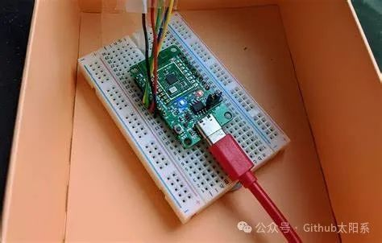
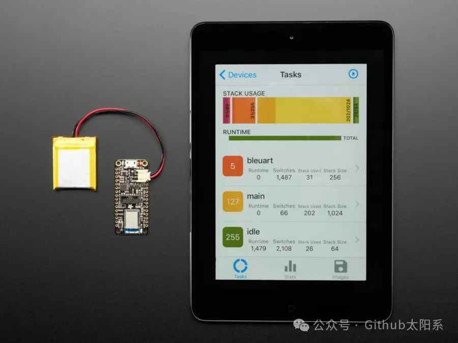
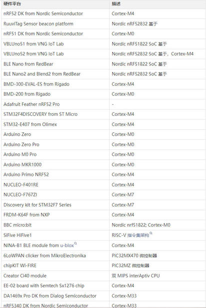

<!-- truncate -->

## 引言

在当今科技高速发展的时代，微型嵌入式设备的应用越来越广泛。这些设备包括了从智能家居产品到可穿戴设备等众多领域。而针对这些微型嵌入式设备的开发，Mynewt操作系统应运而生。本文将详细介绍Mynewt，向大家展示这一款开源操作系统的特点和应用场景。

## 介绍Mynewt

Mynewt是由Apache软件基金会发布的一个开源操作系统平台。它被设计用于连接受限资源的设备，例如传感器和无线射频标签。Mynewt旨在提供一个轻量级、可靠、易于使用的开发平台，以满足嵌入式系统开发者对功耗和成本的苛刻要求。Mynewt使用C和C++编程语言，支持多种处理器体系结构，包括ARM Cortex-M和RISC-V，适用于各种微控制器环境。

## Mynewt的特点

1. 轻量级设计：Mynewt的设计理念是尽可能地减少内存和处理器占用，从而在受限的资源环境中高效运行。

2. 低功耗：针对电池供电的微型嵌入式设备，Mynewt的功耗优化设计可以最大限度地延长电池寿命。

3. 可靠性：Mynewt操作系统具有高度稳定性和可靠性，能够确保设备在各种环境下正常运行。

4. 易于开发：Mynewt提供了丰富的开发工具和文档，使开发者能够快速上手并进行应用开发。

5. 开源：Mynewt是基于Apache许可证的开源项目，任何人都可以免费使用和修改该操作系统。

## Mynewt支持的硬件平台

## Mynewt的应用场景

1. 传感器网络：Mynewt适用于各种传感器网络，如环境监测、工业自动化和农业生产等领域。

2. 智能家居：在智能家居和物联网领域，Mynewt可以用于控制和管理各种家庭设备和传感器。

3. 可穿戴设备：Mynewt也可以应用于可穿戴设备的开发，包括智能手表、健康监测器和智能眼镜等产品。

4. 物联网设备：在物联网设备中，Mynewt可以用于连接各种智能设备，实现设备之间的数据交换和互联。

## Mynewt的优势

• 丰富的应用场景：Mynewt适用于多种嵌入式设备的开发，可以满足不同领域的需求。

• 开源性质：Mynewt的开源性质使得开发者可以自由使用和修改操作系统，降低了开发成本。

• 稳定性与可靠性：Mynewt经过严格的稳定性和可靠性测试，在实际应用中表现出较高的性能。

• 强大的生态系统：Mynewt拥有庞大的开发者社区和丰富的开发资源，能够提供系统级的支持和解决方案。

## 结语

作为一款适用于微型嵌入式设备的开源操作系统，Mynewt在轻量级设计、低功耗、可靠性和应用场景丰富性上展现出了显著的优势。相信随着科技的不断发展，Mynewt将在未来得到更广泛的应用，并为微型嵌入式设备的发展提供更加强大的支持。

项目地址: https://github.com/apache/mynewt-core

**摘自公众号Github太阳系**

