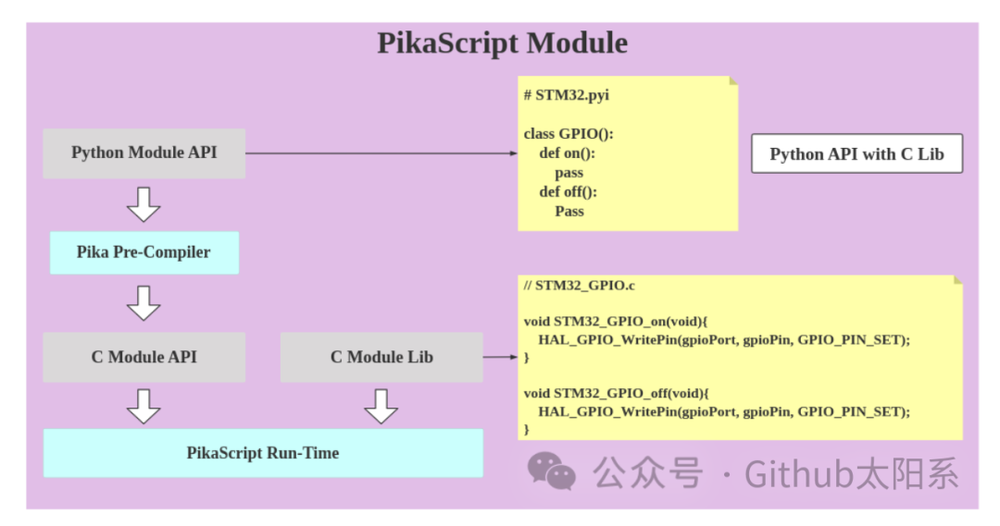
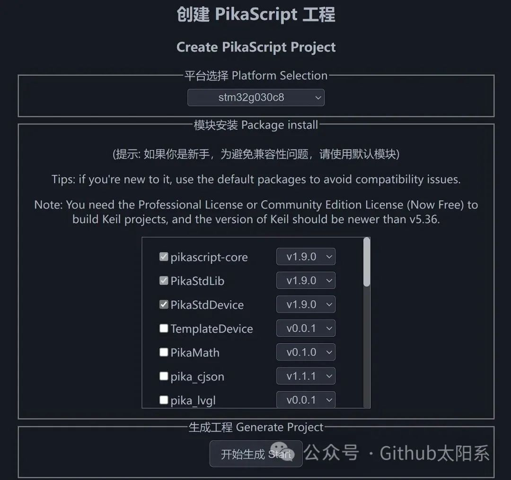

<!-- truncate -->

## 介绍PikaPython

PikaPython是一款超轻量级的Python解释器，仅需4KB的RAM运行，且无需任何依赖。它可以直接使用，无需进行任何配置，也可以轻松地使用C进行扩展。PikaPython也被称为PikaScript和PikaPy。

## 功能特点

1. 超轻量级：PikaPython是一款超轻量级的Python解释器，仅需4KB的RAM运行。这意味着它可以运行在资源受限的嵌入式系统上，如传感器、控制器等等。

2. 零依赖：PikaPython无需任何依赖，即可运行。这样可以避免因为版本不同或依赖缺失等问题而导致的兼容性问题。

3. 即插即用：PikaPython可以直接使用，无需任何配置。这使得它可以更快速地开始开发和使用。

4. 易于扩展：PikaPython可以轻松地使用C进行扩展。这意味着可以通过使用C语言编写的扩展来增强PikaPython的功能。

## 使用场景

1. 嵌入式系统：由于PikaPython是超轻量级的Python解释器，可以运行在资源受限的嵌入式系统上，如传感器、控制器等等。

2. 学习Python：对于初学者来说，PikaPython提供了一个轻松的方法来学习Python语言。由于它是超轻量级的，所以可以在计算机上快速安装和使用。

3. 快速原型设计：PikaPython的即插即用特性和易于扩展的特性，使得它成为快速原型设计的选择。通过使用它，可以更快速地进行原型设计和迭代。

## 总结

PikaPython是一款超轻量级的Python解释器，可以仅需4KB的RAM运行。它无需任何依赖，且可以直接使用，无需任何配置。它还可以轻松地使用C进行扩展，使其具有更多的功能。由于这些特性，PikaPython成为了嵌入式系统、学习Python和快速原型设计的理想选择。如果你正在寻找一款超轻量级的Python解释器，那么PikaPython是你的最佳选择。

项目地址：https://hub.nuaa.cf/pikasTech/PikaPython

**摘自公众号Github太阳系**