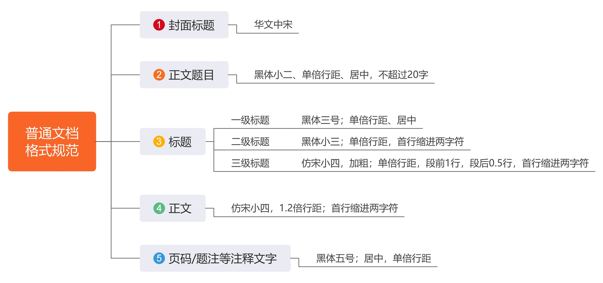
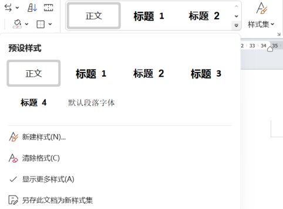
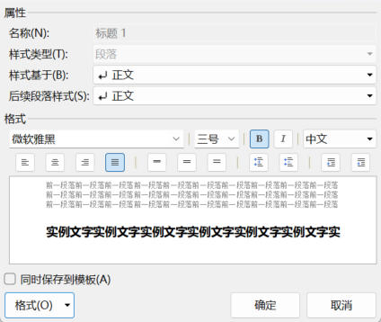
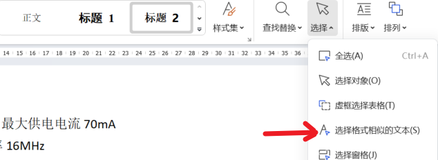
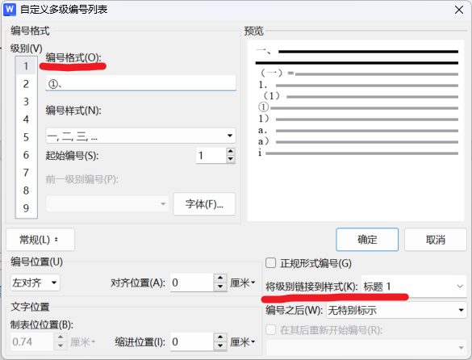
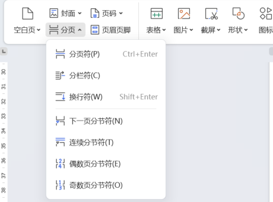

<!-- truncate -->

## 一、规范篇

### 字体

* 非正式发文：   **微软雅黑**
    用于简单的沟通传阅，PC端阅读使用
* 偏正式发文：   **宋体**
    企业的正式发文，表单、文案

1. 标题封面：  **华文中宋**
2. 一二级标题：  **黑体**
3. 三级标题及正文：  **宋体/仿宋**
4. 注释性文字：  **黑体** 
5. 正文
    * 所用字体最好不要超过**3**种
    * 搭配方案1：  **中文：微软雅黑   西方：Arial**
    * 搭配方案2：  **中文：宋体       西方：Times New Roman**

### 字号
1. 一级标题：  **黑体 三号**
2. 二级标题：  **黑体 小三**
3. 三级标题、正文： **宋体 小四**
    * 正文一般用小四，如果有复杂的页眉、页脚，也可以用五号。

### 间距
1. 页边距：  默认
2. 行间距：  根据字号设定，一般为**1.2-1.3倍**。
3. 段间距：  可以单独给标题设置段前、段后间距。  **一般仅给标题三设置段前1行，段后0.5行的行间距。**  
    注意事项：如果全文用微软雅黑，段间距有时无法调整，这时用ALT+A+P打开段落对话框，取消勾选"如果定义了文档网络则对齐到网络"。

### 加分项
1. 内容编辑完成后，可以敲一个回车中间**空一行**，条理更清晰。
2. 文档发给对方时，**关掉【显示编辑标记】**，版面更整洁。
3. 文档≥3页时，要编辑**页码**； ≥5页时，加入**目录**便于他人阅览。

### 减分项
1. 斜体、下划线、删除线的使用。
2. 编号、目录类手动输入。

## 二、逻辑篇

### 样式  
给标题定规范

1. **样式的设置**  
选中标题样式，右键，单击修改。

2. **样式的批量更改**  
选中需要批量更改设置的一个标题，选择所有格式类似文本，选中所有后，应用要更改为的样式，即可更新此类标题的所有内容。

  **注意：** 所有标题样式的基准是正文，在设置好正文样式后不要再做更改。如需修改，可新建一种正文样式。  

3. **标题、正文回车后样式的设置**  
修改样式->后续段落样式。

4. **目录、导航窗格**  
目录、导航窗格的生成与标题样式设置有关。  如果生成的目录不完整，请检查是否所有标题都用了标题样式。  
**小窍门：** 如需调整章节顺序，在导航窗格直接拖动即可，拖动后对应标题的编号也会自动调整。

5. **word转PPT**  
如规范应用了标题样式，只需将文件后缀名.docx改为ppt即可实现格式转换。  

### 多级列表  
给标题定层级

### 节的应用  
多重页码的设置

1. 分节符的使用  

* 封面： 不用设页码  
* 目录： 单独设页码（大写罗马文）  
* 正文： 需要有页码（阿拉伯格式）  

插入"下一页分节符"，取消"链接到前一条页眉"。

2. 页码格式总结
  * 文档内容先分节  
  * 各节之间去链接  
  * 节节独立再耕作  
  * 起始页码紧衔接  

