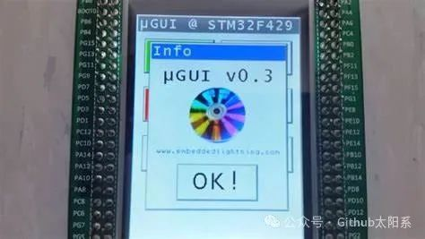
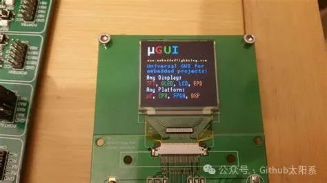
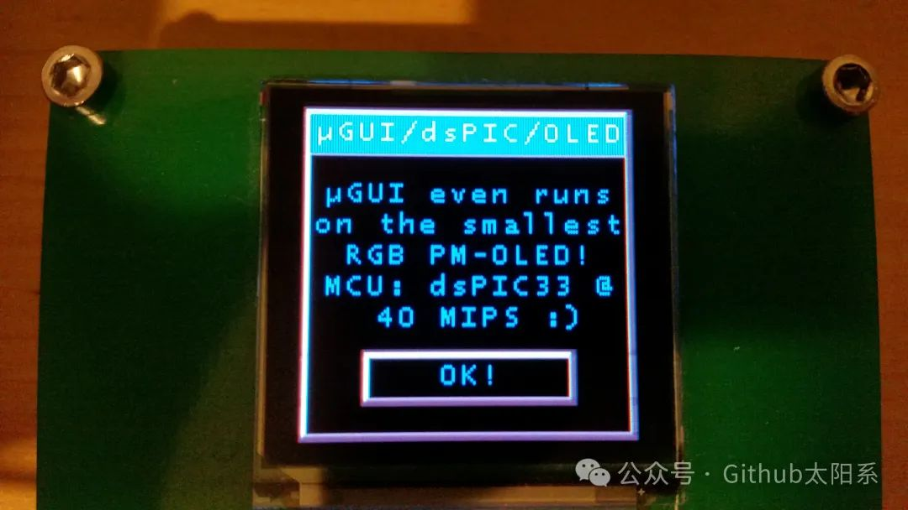

<!-- truncate -->

## 什么是µGUI

µGUI是一个免费开源的嵌入式系统图形库。它是平台无关的，可以轻松地移植到几乎任何微控制器系统上。与其他图形库相比，µGUI具有更小的存储空间占用和更低的计算资源要求，使其成为嵌入式系统开发的理想选择。

## µGUI特点

1. 免费开源：µGUI是一款开源软件，用户可以自由使用、修改和发布，而无需支付任何费用。

2. 平台无关：µGUI不依赖于特定的硬件平台，可以方便地移植到大多数微控制器系统上，包括ARM、AVR、PIC等。

3. 低资源占用：µGUI具有较小的存储空间占用和较低的计算资源要求，适用于资源有限的嵌入式系统。

4. 高度可定制化：µGUI提供了灵活的API接口，用户可以根据自己的需求对其进行定制和扩展。

5. 支持多种显示设备：µGUI可以适配不同类型的显示设备，包括液晶显示屏、OLED显示屏等。

6. 支持多种控件：µGUI提供了多种常用的图形控件，如按钮、文本框、下拉框等，使开发人员可以方便地构建用户界面。

7. 可扩展的图形效果：µGUI支持图形绘制功能，开发人员可以根据需要实现各种图形效果，如线条、矩形、圆形等。

8. 用户友好的开发环境：µGUI提供了集成开发环境和图形设计工具，使开发人员可以快速开发和调试嵌入式应用程序。

## µGUI的应用领域

µGUI广泛应用于各种嵌入式系统中，包括工业控制、医疗设备、智能家居等领域。以下是一些常见的应用场景：

1. 工业控制界面：µGUI提供了丰富的图形控件和图形效果，可以用于设计工业控制界面，如触摸屏监控、控制面板等。

2. 医疗设备界面：µGUI的低资源占用和高度可定制化使其成为设计医疗设备界面的理想选择，可以用于设计监护仪、体温计等设备的用户界面。

3. 智能家居控制界面：µGUI可以适配各种显示设备，可以用于设计智能家居控制界面，如智能灯控制、温湿度监测等。

4. 汽车电子仪表盘：µGUI的平台无关性和低资源占用使其成为设计汽车电子仪表盘的理想选择，可以用于实现车速、油量等信息的显示。

## µGUI的使用流程

使用µGUI进行嵌入式系统开发的一般流程如下：

1. 安装µGUI：首先需要下载并安装µGUI的开发包，该开发包包括源代码、文档和示例程序。

2. 配置开发环境：根据目标平台选择合适的编译器和开发工具，并进行相应的配置。

3. 创建应用程序：在创建应用程序时，需要包含µGUI的头文件，并初始化µGUI库。

4. 设计用户界面：使用µGUI提供的图形控件和图形效果，设计用户界面，并进行布局和控件的添加。

5. 处理用户输入：根据用户的输入，处理相应的事件和动作，并更新用户界面。

6. 编译和下载：将应用程序编译成目标平台可执行的文件，并下载到目标设备上进行测试和调试。

7. 调试和优化：在测试和调试过程中，可以根据需要对应用程序进行优化，提高性能和稳定性。

## 总结

综上所述，µGUI作为一款免费开源的嵌入式系统图形库，具有广泛的应用领域和良好的发展前景。通过不断的改进和优化，µGUI将能够更好地满足嵌入式系统开发的需求，为开发人员提供更好的开发工具和图形界面设计方案。

源码地址：https://github.com/achimdoebler/UGUI

**摘自公众号Github太阳系**