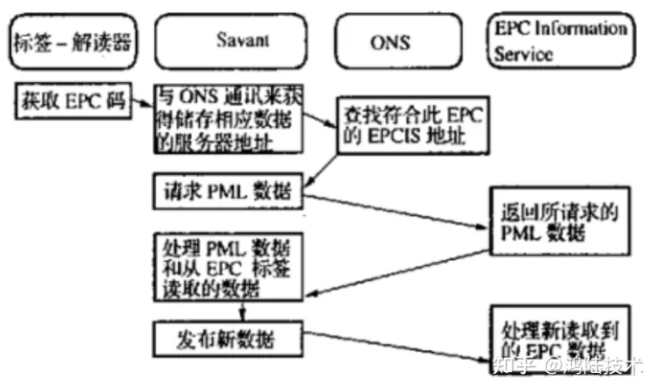

<!-- truncate -->

摘自知乎-鸿陆技术 https://zhuanlan.zhihu.com/p/547540054

随着经济全球化发展，客户的个性化需求日益增长，不确定性也大大增加，在贸易物流、生产制造等领域对供应链效率提出了越来越高的要求。由于物品标识和识别技术的落后，造成信息不对称，严重地影响到社会物流效率。

1998年，麻省理工学院(MIT)的两位教授提出，以射频识别技术(RFID)为基础，对所有的货品或物品赋予其唯一的编号方案，来进行唯一的标识。这一标识方案采用数字编码，并且通过实物互联网来实现对物品信息的进一步查询。这一技术设想催生了EPC(产品电子代码)和物联网概念的提出。即利用数字编码，通过一个开放的、全球性的标准体系，借助于低价位的电子标签，经由互联网来实现物品信息的追踪和即时交换处理，在此基础上进一步加强信息的收集、整合和互换。

RFID是简单实用且特别适合用于自动化控制的灵活性应用技术，其所具备的独特优越性是其它识别技术无法企及的。它既可支持只读工作模式也可支持读写工作模式，且无需接触或瞄准；可自由工作在各种恶劣环境下；可进行高度的数据集成。但由于该技术很难被仿冒和侵入，因此RFID技术也具备了极高的安全防护能力。

:::tip
EPC的全称是**Electronic Product Code**，中文译作产品电子代码，它是为了提高物流供应链管理水平、降低成本而发展起来的一项新技术，可以实现对所有实体对象(包括零售商品、物流单元、集装箱、货运包装等)的唯一有效标识。EPC系统则是以EPC为每一实体对象的标识码，利用RFID(射频识别)技术优势和互联网的基础资源优势，搭建覆盖全球的“物联网”。
:::

EPC的信息编码方式可以与传统的条码兼容，但是其信息容量大大增强，弥补了条码技术不能识别到单品层次的不足。同时，由于EPC系统采用了比条码技术更为先进的RFID技术，可以实现相对较远距离的快速识别，并且加强了RFID标签的环境适应能力，被誉为具有革命性意义的新技术。它将给供应链管理、物流、生产控制、零售等领域带来革命性影响，将在全球范围内从根本上改善对生产、运输、仓储、销售各环节物品流动监控管理的水平，大大提高对生产和销售计划实施调控的能力，增加企业竞争力。

EPC／RFID物品识别功能的实现主要由EPC编码标准、RFID电子标签、读写器、Savant网络、对象名解析服务以及EPC信息服务系统等六方面组成。

## EPC编码

EPC是提供对物理对象的唯一标识。储存在EPC编码中的信息包括嵌入信息和参考信息。嵌入信息可以包括货品重量、尺寸、有效期、目的地等。其基本思想是利用现有的计算机网络和当前的信息资源来存储数据，这样EPC就成了一个网络指针，拥有最小的信息量。参考信息其实是有关物品属性的网络信息。

## RFID电子标签

RFID电子标签是由天线、集成电路、连接集成电路与天线的部分、天线所在的底层四部分构成。RFID电子标签中存储EPC码，RFID电子标签有主动型、被动型和半主动型三种类型。主动和半主动标签在追踪高价值商品时非常有用，它们可以远距离的扫描，但这种标签每个成本也较高。被动标签相对便宜，应用广泛。

## 读写器

使用多种方式与标签交互信息，近距离读取被动标签中的信息最常用的方法就是电感式耦合。标签利用这个磁场发送电磁波给读写器。这些返回的电磁波被转换为数据信息，即标签的EPC编码。读写器读取信息的距离取决于RFID读写器的能量和使用的频率。通常来讲，高频率的标签有更大的读取距离。

## Savant系统

每件产品都加上RFID电子标签之后，在产品的生产、运输和销售过程中，读写器将不断收到一连串的EPC码。为了在网上传送和管理这些数据，Auto-ID中心开发了一种名叫Savant的软件系统，它是一个树状结构，这种结构可以简化管理，提高系统运行效率。它可以安装在商店、本地配送中心、区域甚至全国数据中心中，它的主要任务是数据校对、识读器协调、数据传送、数据存储和任务管理。

## 对象名解析服务系统(0NS)

0NS通过将EPC码与相应物品信息进行匹配来查找有关实物的参考信息。比如：当一个读写器取到EPC标签的信息时，EPC码就传递给Savant系统，然后再在局域网或因特网上利用ONS找到这个产品信息所存储的位置。由ONS给Savant系统指明了存储这个产品的有关信息的服务器，并将这个文件中的关于这个产品的信息传递过来。

## EPC码的识读流程

解读器读取一个EPC码，将信息传送给Savant系统，并通过ONS获取与当前所探测到的远程EPC信息服务器的地址，此后Savant向远程的EPC信息服务器发送读取PML数据的请求，EPC信息服务器返回给Savant它所请求的PML数据，再由Savant处理新读取的EPC码的内容。

## EPC信息服务

在物联网中，有关产品信息的文件存储在EPC信息服务器中。这些服务器往往由生产厂家来维护。所有产品信息将用一种新型的标准计算机语言——物理标记语言(PML)书写，PML是基于为人们广为接受的可扩展标识语言(ⅪL)发展而来的。PML文件将被存储在EPC信息服务器上，为其它计算机提供他们需要的文件。

在强大的市场导向下，RFID技术、EPC与物联网在世界范围内必将引起一场重大的变革，它将成为未来一个新的经济增长点。在现今激烈的市场竞争中，快速、准确、实时的信息获取及处理能力将成为企业获得竞争优势的关键。

RFID技术是能够让物品“开口说话”的一种技术。在“物联网”的构想中，RFID标签中存储着规范而具有互用性的信息，通过无线数据通信网络把它们自动采集到中央信息系统，实现物品(商品)的识别，进而通过开放性的计算机网络实现信息交换和共享，实现对物品的“透明”管理。