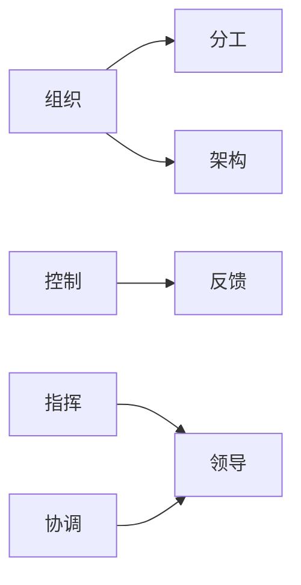
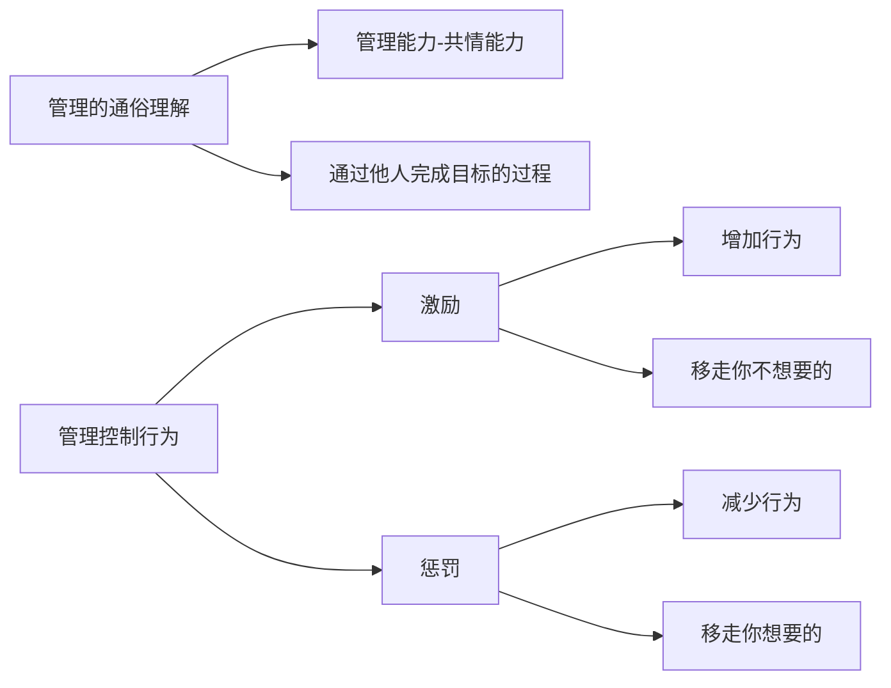
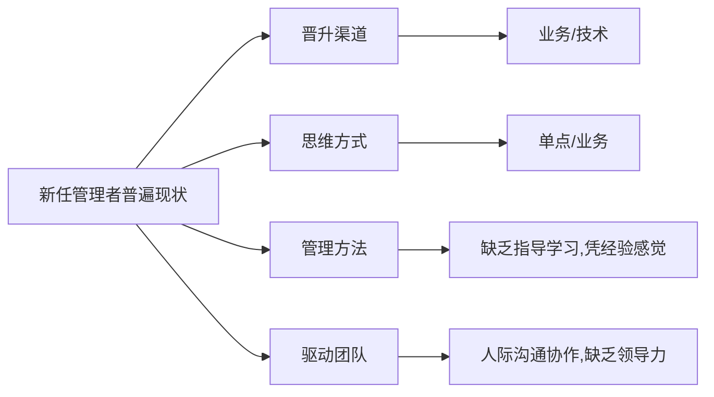
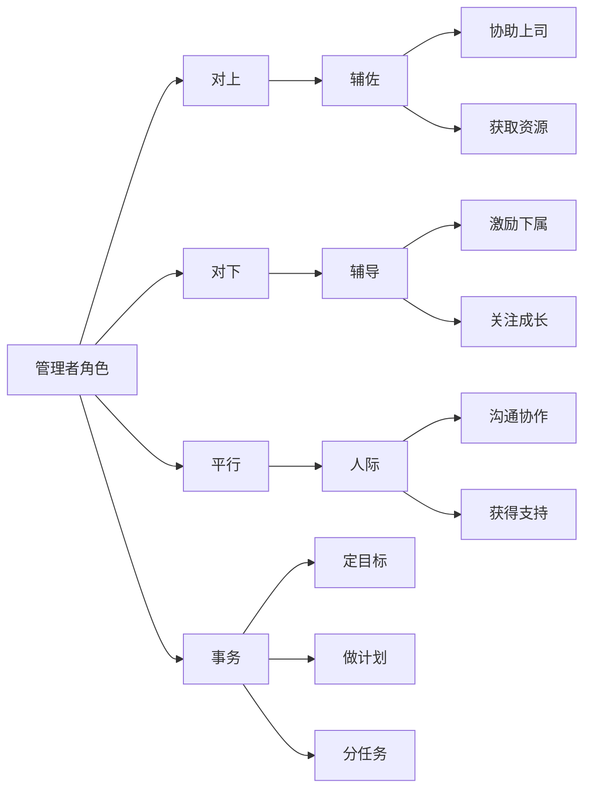
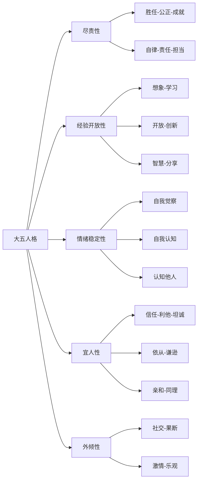

---
slug: basic-skills
title: 管理学基础
date: 2022-08-15
authors: 玉麒麟
tags: [职业规划]
---

## 管理学定义

- 管理是**设计**并保持一种**良好环境**，使**人们**在**群体**状态下**高效率**地完成**既定组织目标**的过程。
- 通过实施**计划、组织、控制、指挥、协调***等要素开展管理活动，并对结果负责。
  - 组织可细分为分工和架构
  - 控制包括反馈
  - 指挥和协调可总结为**领导**

- 管理需要**管理**和**领导**两大基本动作。 管理关注事，领导关注人。
  - 管理的通俗理解：管理能力≈共情能力；通过他人完成目标的过程；
  - 管理控制行为：激励（增加行为，移走你不想要的)、惩罚（减少行为，移走你想要的）

##  管理思想的演变

- 泰勒科学管理   在每个工作流程里面设置节点控制工作，每个节点设置标准。
- 法约尔管理五要素：  计划、组织、控制、指挥、协调
- 霍桑实验： “经济人”“社会人” 除物质外，心理因素对调动人的工作积极性有很大的影响。
- 麦克利兰： 权力动机(发挥个人价值)、归属动机(团队凝聚力)、成就动机(满足成就感)。
- 现代管理理论： 德鲁克、戴明、西蒙

## 个体/群体/组织目标

- 个体：  能力、动力、潜力、精力
- 群体： 组织能力

## 组织的概念

- 管理学家切斯特巴纳德认为**组织是有意识调整了的两个人或更多人的行为或各种力量的系统***。

## 管理（领导）有效性的五大来源

- 目标系统： 是否有**共同目标**的人群；
- 能力系统：是否有**运用知识和技能**的人群；
- 资源系统：是否有**足够的资源**去匹配人群；
- 心理系统：是否有**群体中相互作用支持**的人群；
- 文化系统：是否有**共同的认知及价值观理念趋同**的人群；

## 管理的本质是提升组织能力与组织行为

# 模块二：角色转变

## 彼得原理

- 使你**成为管理者的能力**不代表能使你成为一个**好的管理者**。
- 新任管理者普遍现状
  - 晋升渠道 ：业务/技术
  - 思维方式：单点/业务
  - 管理方法：缺乏指导学习,凭经验感觉
  - 驱动团队：人际沟通协作,缺乏领导力
    

## 管理者角色

- 对上 --> 辅佐
  - 协助上司
  - 获取资源
- 对下 --> 辅导
  - 激励下属
  - 关注成长
- 平行--> 人际
  - 沟通协作
  - 获得支持
- 事务
  - 定目标
  - 做计划
  - 分任务

## 角色转变 - 从个人贡献者转变为管理者

### 1. 责任：只为自己负责 ->为他人负责

- 个人贡献者
  - 通过个人能力完成任务
  - 高质量的技术或专业化工作
  - 遵循公司价值观
- 管理者
  - 通过他人完成任务
  - 下属员工的成功
  - 管理性工作和修养
  - 部门的成功
  - 像一位真正的管理者
  - 正直诚实

### 2.时间： 时间控制 -> 目标计划分工

- 个人贡献者
  - 遵循公司价值观
  - 按时完成任务 - 通常是短期的时间安排
- 管理者
  - 年度时间计划
  - **与下属沟通的时间**
  - 为部门和团队工作**设定时间方面的优先次序**
  - 与其他部门、客户和供应商沟通时间
- 重要/紧急 四象限处理法
  - 重要、紧急：  马上去做
  - 重要、不紧急： 计划去做
  - 不重要、紧急： 授权去做
  - 不重要、不紧急：不做

### 3.技能： 个体技能 -> 管理(领导)技能

- 个人贡献者
  - 技术或业务能力
  - 团队协作能力
  - 为了个人利益和个人成果建立人际关系
  - 合理利用公司的工具、流程和规则
- 管理者
  - 制定目标
  - 流程优化
  - 人员选拔与培养
  - 绩效管理与反馈
  - 激励与辅导
  - 沟通和营造工作氛围
  - 团队建设

## 怎样的管理者是下属愿意追随的？

- 大五人格

  - 尽责性 ：胜任、公正、成就，自律、责任、担当。

  - 经验开放性：想象、学习，开放、创新，智慧、分享。

  - 情绪稳定性：自我觉察、自我认知、认知他人。

  - 宜人性：信任、利他、坦诚，依从、谦逊，亲和、同理。

  - 外倾性：社交、果断，激情、乐观。

## 管理者最重要的三件事

### 1.管自己  - 认知照镜子

- 自我认知
- 持续学习
- 以身作则

### 2.管任务 - 做事有章法

- 制定目标
- 追踪过程
- 拿出结果

### 3.带团队 - 对人有影响

- 组建团队
- 团队建设
- 下属成长

## 自我提升的四个重点

### 1.向上管理

​    不断自问“ **我怎样做才能使上司的工作更加顺利**”。

- 了解**上司工作目标和重点**
- 了解上司的工作习惯
- **保持沟通**，让上司知道你在忙什么
- **及时汇报**，不让上司感到意外
- **不要浪费上司的时间**（提案、结论、总结）

### 2.情绪认知

-  人的情绪主要源于自己的信念以及他对生活情境的评价和解释的不同。
  - 某个事务的主观体验所引起
  - 伴随着生理和行为变化
  - 比较强烈的感觉
- A（**诱发事件**：发生了什么） -> B(**想法**：对事情的看法、解释、评价) ->C（**情绪行为**：我的行为、情绪结果）
- A（Antecedent **前因**）+ B（Belief **信念**） -> C（Consenquence **结果**）
- “你所有的问题都是因你而生”
- 应激反应
- 非认知疗法
  - 运动
  - 连接
  - 助人

### 3.提升系统性思维

- 系统思考：从整体上对影响系统行为的各种力量及其相互关系进行思考，培养人们对动态变化、复杂的系统性问题的理解和应对能力。

- 长度

  - 传统思维：静态的方式、观察线性因果链
  - 系统思考：动态的方法，分析因果之间相互关连和发展动态

- 深度

  - 传统思维：关注个别事件

  - 系统思考：透过表象、认清系统的动态级驱动系统潜在的“结构”

- 宽度

  - 传统思维：局限于本位

  - 系统思考：看到全局和整体

### 4.行为风格认知

