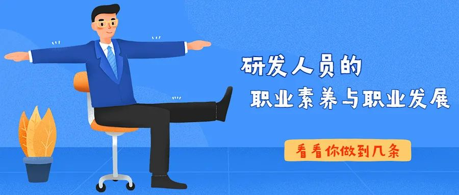

<!-- truncate -->

:::tip
### 前言
每年公司新员工入职，我都会结合个人十几年工作经验，跟大家聊一聊研发人员应具备的职业素质和个人职业规划。期望大家能在后续职业生涯中少走一些弯路。听了研发管理大学杨飞老师的研发人员职业素养和职业规划的培训，感觉总结非常到位，与大家分享。
:::tip

##  1 研发人员的职业化

### 01 形象职业化

   提起警察，首先映入脑海的就是标志性的警服。说起程序员，格子衫、牛仔裤，一看就是程序员。形象职业化，通俗讲就是让大家一看就知道你是干哪行的。这里要注意当你从程序员走上管理岗位，虽然不一定要西装革履，但是要从形象上有一定的变化。

### 02 行为职业化

   行为职业化讲的是长期从事一项工作会形成的习惯。

### 03 道德职业化

   不同的行业有不同的职业道德，在研发领域，保密是我们最重要的职业素质和职业道德。

### 04 能力职业化

   研发人员往往只关注技术能力而忽视应该具备的其他能力，如沟通能力，只有在各种必须的能力上达到一定职业化水平，个人在职位、待遇方面才能不断提升。

## 2 研发人员的职业意识

### 01 全局意识

   研发人员应该深刻理解公司企业文化、愿景、使命、价值观，并能够认同公司企业文化，跟随公司战略。

   宣导正确的价值观、营造良好的组织氛围是所有员工的责任。

   同时，应该建立全流程的职业意识，从市场端看到交付端，不要仅仅盯着自己开发工作这一个点。

### 02 创新意识

:::tip
   为用户创造价值、为市场创造价值的创新才叫真正的创新。-张瑞敏

   领先半步是先进，领先一步是先烈。-任正非

   我们必须拿出成果，不能像有些德国教授，毕生研究蜜蜂身上的绒毛  -爱迪生
:::

   创新要注重结果，切勿盲目创新。

   有系统地抛弃昨天；有系统地寻求创新机会，在市场地薄弱处寻找机会，在新知识地萌芽期寻找机会，在市场地需求中寻找机会。

### 03 市场意识 

   研发人员应具备一种自觉的思想境界，时刻以满足客户需求为行为准则，最大限度地满足市场需求和获取利润为自己的目标。

   研发人员在产品立项、开发、投放市场和售后过程中要注意自己市场意识的培养，处理好与用户、市场部门、售后服务等部门的关系。

   理解竞争优势的三种基本战略： 

​      \*  优秀的运营（强调效率、成本、价格）

​      \*  产品领先（强调技术和产品的优势 ）
 
​      \*  顾客亲昵行为（比竞争者更了解客户、长期发展与客户的关系）

### 04 改进意识 

   \* 持续改进的力量。

​         曾子曾经说过：吾日三醒吾身。  

​         每日改进1%，一年后，将有意想不到的收获。

​    \* 心怀大局，小事入手

​         小改进，大奖励，大建议，只鼓励。

​    \* 马上行动

​         临渊羡鱼，不如退而结网。

​    \* 改进的方法

​         PDCA。

​    \* 避免误区
  
​         改进不是推倒重来；

​         正视错误，勇于改进；

​         循序渐进，持之以恒。

### 05 执行意识 

   执行力是有效利用资源，保质保量达成目标的能力。

   执行力是贯彻战略意图，完成预定目标的操作能力。

   把企业战略、规划转换成效益，成功是关键。

   执行力包含完成任务的意愿、完成任务的能力、完成任务的程度。

## 3 研发人员的核心能力

### 01 主动性 

   主动性的几个层次：

​     \* 在工作中不惜投入较多精力；

​     \* 善于发现和创造新的机会；

​     \* 提前预计到事件发生的可能性；

​     \* 有计划地采取行动提高工作绩效，避免问题地发生、或创造新的机会。

​    研发人员切记不能有给多少钱办多少事的想法，如果你认为公司给你的薪资和你的付出不匹配，你可以选择离开，但不能因此消极怠工，这样不仅仅是公司受损失，更是浪费了个人宝贵的时间。

​    在面试时我一定会问到对于加班问题的看法，并不是说公司对加班有强制要求，而是想以此考察面试者的主动学习能力。

### 02 团队合作 

   个人愿意作为群体中的一个成员，与群体中其他人一起协作完成任务，而不是单独的或采取竞争的方式从事工作。

   TEAM = Together We Everyone Achieve More

   高效团队特征：共同愿景和目标、有效的领导、分工合作、互补的技能、良好的沟通。

### 03 坚韧性 

   坚韧性是指在非常艰苦或不利的情况下，克服外部和自身的困难，坚持完成所从事的任务。

   古之立大事者，不惟有超世之才，亦必有坚忍不拔之志。-苏轼

   3Q时代：IQ智商、EQ情商、AQ逆商。逆商往往是决定你职业生涯高度的最关键因素。

### 04 学习能力 

​   在工作中积极获取与工作相关信息和知识，并对获取的信息进行加工和理解，从而不断地更新自己的知识结构，提高自己的工作技能。

## 4 研发人员的职业心态
:::tip
   愿意做事的人，才会主动去做事；

   用心做事的人，才会把事情做成；

   真心做事的人，才能把事做好。
:::
### 01 积极的心态 

   不为失败找理由，要为成功找方法。

   在任何特定的环境中，人们还有一种最后的自由，就是选择自己态度的自由。

### 02 责任感与使命感 

   先有为后有位；

   承担才能成长；

   困难与机会并存，困难和挑战是你成长的重要机会。

### 03 务实的心态 

   切记浮躁；

   一次将事情做好；

   细节决定成败。

## 5  研发人员的职业化技能修炼

### 01 时间管理 

   重视计划的重要性；

   不要碌碌无为，就要学会规划时间；

   重要而不紧急的事，往往是最值得重视的；

   安排好每天三件事：必须做的、应该做的、可以做的。

### 02 会议管理 

   会前（提前准备、计划清晰）、 会中（做好纪要）、会后（做好跟踪）

### 03 职业化的工作习惯 

​    目标导向、过程规范、重视文档质量、让资料保持有序、谋定而后动；

​    掌握必要的项目管理的知识（做好计划，WBS分解、风险管理）;

​    执行与报告（结构化思维）;

​    培养学习的习惯（培养兴趣，分享成果，坚持不懈）。

