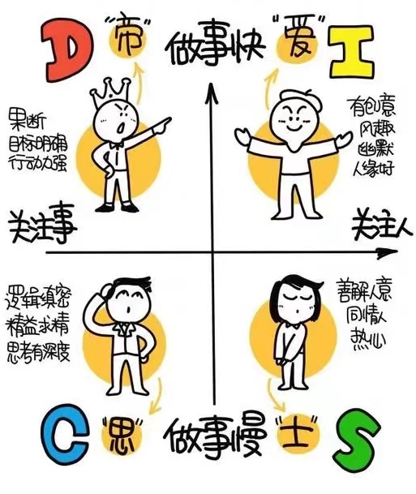

<!-- truncate -->

许多公司在招聘过程中会对应聘者做职场性格的测评，比如DISC、MBTI等。我在应聘现公司岗位时也要求进行DISC测评，当时有点抗拒和反感，感觉个人隐私受到侵犯。三年过去了，最近公司组织的一次管理培训，再次进行DISC测评并对测评结果进行分析。结合这三年的管理工作，发现DISC是一个非常有效的管理工具。

中国人讲察言观色，根据对方的行为灵活应对，国外的DISC则是根据测评分类，对每个类别的人的特点及如何沟通、响应做了归纳总结，做到“有备而来”。

:::tip
   个人行为风格在职场中的指导作用很大。比如： 

如何和不同行为风格的人沟通？包括和客户、同事和老板。

如何招聘到互补型团队成员？增加团队多样性，提升团队业绩。

如何通过言谈举止快速识别对方的行为风格？比如客户，同事或老板。
:::

什么是DISC？

DISC是由哈佛大学威廉.马斯顿博士于1928年创立一个心理学理论，该理论根据正常人对环境的反应的两个维度——主动/被动和重视人/重视事——将人的行为风格（业界也有人将其称为“人格类型“）分为四大类：

D（Dominance）- 支配型（老虎）：“自信、果断、快速、敏捷、有魄力，能自我激励”

I （Inducement）- 表现型（孔雀）：“乐观、热情、爱交际，有魅力，受人欢迎”

S（Submission）- 和蔼型（考拉）：“耐心、亲切、稳定，是一个好的倾听者和合作者”

C（Compliance）- 分析型（猫头鹰）：“谨慎、严谨，强调规则，关注细节，追求完美”

## D（Dominance）- 支配型（老虎）

### 关键词

- 积极进取、争强好胜、强势、直截了当、自信、直率
- 害怕：被人利用
- 面对压力： 可能会粗心、没耐心

### 优缺点

| 优点     | 缺点               |
| -------- | ------------------ |
| 独立果决 | 不善合作、专横跋扈 |
| 结果导向 | 轻忽感觉           |
| 率直     | 冷酷无情           |
| 务实自律 | 短视近利           |

### 沟通方式

| 正确                                        | 错误                         |
| ------------------------------------------- | ---------------------------- |
| 拜访前做好充分准备（会谈目的、相应材料） 。 | 忘记或丢失东西， 三心二意。  |
| 以愉快和职业的 方式，单刀直入只谈论工作。   | 随性， 不职业， 不正规。     |
| 清晰而富有逻辑地演示事实， 并且高效。       | 留下空白或含糊和未知的问题。 |
| 沟通要清晰、 明确、 简洁， 针对要点。       | 毫无目的， 浪费时间。        |
| 提供备选方案， 让他们自己选择结果。         | 直接给他一个答案。           |
| 完成工作后， 有风度的离开。                 | 完成工作后， 聊天和拉家常。  |

## I （Inducement）- 表现型（孔雀）

### 关键词

- 善于言辞、健谈、有说服力、善于交际、友好、乐观积极
- 害怕：失去他人认可
- 面对压力时：可能会杂乱无章、口出恶言

### 优缺点

| 优点     | 缺点     |
| -------- | -------- |
| 口齿伶俐 | 不善倾听 |
| 步调快速 | 缺乏耐心 |
| 有想象力 | 不切实际 |
| 轻松活泼 | 容易分心 |

### 沟通方式

| 正确                                   | 错误                                   |
| -------------------------------------- | -------------------------------------- |
| 准备互动活动，支持他们的理想和目的     | 质疑他们想法中的逻辑性、可行性         |
| 留时间寒暄建立关系                     | 表现冷酷，保守                         |
| 讨论他们的目标或他们感兴趣的人         | 用数据，事实，备选方案和抽象观点       |
| 提供尽可能少的细节，提供解决方式       | 驳斥他们的意愿，不执行他们的决定       |
| 询问他们关于“ 个人方面” 的想法和观点   | 忽略人际方面的因素，过于主观武断       |
| 花足够多的时间讨论他们的想法           | 开过多的玩笑，或者过于坚守议程         |
| 从他们觉得优秀或重要的人那里得到推荐   | 居高临下和他们说话，提供过多的细节信息 |
| 提供特殊的，马上能兑现的、个人层面奖励 | 表现过于教条或过于遵从规范             |
| 对他们个人及其观点表示支持             | 仅对事实表现出支持                     |

## C（Compliance）- 分析型（猫头鹰）

### 关键词

- 仔细、有条不紊、严谨准确、完美注意、逻辑性强
- 害怕：被批评
- 面对压力时：可能会退缩、慢半拍

### 优缺点

| 优点     | 缺点     |
| -------- | -------- |
| 谨言慎行 | 优柔寡断 |
| 劳苦尽心 | 吹毛求疵 |
| 任务导向 | 轻忽感觉 |
| 讲求系统 | 官僚作风 |

### 沟通方式

| 正确                                                   | 错误                                                         |
| ------------------------------------------------------ | ------------------------------------------------------------ |
| 事前做好准备工作                                       | 混乱没有章法                                                 |
| 紧扣工作内容                                           | 花时间讨论私人问题                                           |
| 提供任何建议都应严谨，并使用罗列正反观点的方法进行论证 | 对决策过程匆忙应付                                           |
| 提供具体的细节或数字， 承诺的事一定要办到              | 对于客户可以得到些什么结果的描述模糊不 清， 且对于对方预计你会完成的事项再也没 有交待。 |
| 制定一个时间表， 防止发生意外                          | 对事情放任自流。                                             |
|                                                        |                                                              |
| 有异议要做一个组织严密的演示说明                       | 使用小聪明来设法操纵客户                                     |
| 给他们时间确认你的行动的可靠性， 要准 确和现实         | 使用的资源不可靠， 没有计划性                                |
| 向其提供可靠的、 可证明的、 实际的证据                 | 使用其他人的说法作为证明和作证                               |
| 当需要时， 留出足够的时间来让客户进行 整体思考         | 太过强求或对最后期限的要求不切实际                           |

## S（Submission）- 和蔼型（考拉）

### 关键词

- 可靠、深思熟虑、亲切友好、善倾听、周到、自制力强
- 害怕：失去保障
- 面对压力时：可能会犹豫不决、唯命是从

### 优缺点

| 优点     | 缺点     |
| -------- | -------- |
| 圆融老辣 | 逃避冲突 |
| 值得信赖 | 依赖他人 |
| 支援度高 | 默认顺从 |
| 人际导向 | 抗拒改变 |

### 沟通方式

| 正确                                                       | 错误                                           |
| ---------------------------------------------------------- | ---------------------------------------------- |
| 见面至少以一个个人话题展开谈话                             | 立即开始谈公事                                 |
| 找到共同兴趣， 并把它作为你在个人层面 上表达真诚的一种方式 | 避免个人层面的联系， 冷漠                      |
| 坦诚且开放                                                 | 怀有隐含的想法和动机， 想操纵客户              |
| 讨论个人目标——专注聆听并作出回应                           | 迫使谈话根据你的目标迅速做决定                 |
| 谈想法的时候， 突出人际层面的问题                          | 过度使用事实和数据来支持想法                   |
| 通过询问“为什么” 来发掘客户观点                            | 用职位或权威的力量使他们感到威胁               |
| 尽早发现他们不满意或不同意的信号                           | 操纵他们同意某个方案， 因为他们不会“予 以反击” |
| 清楚的定义， 书面方式表达个人想法                          | 提供模糊不清的方案， 或者多个选择              |
| 确保把风险降到最低， 对总体满意度和丰 厚的回报作出保证     | 承诺自己实现不了的事， 不管后续事              |

