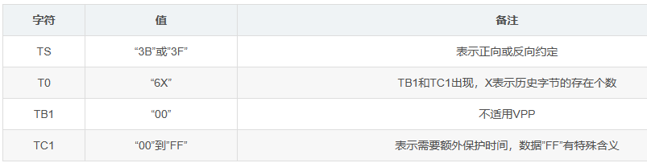
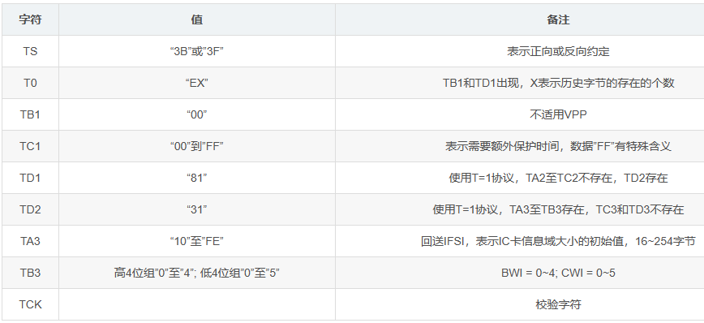
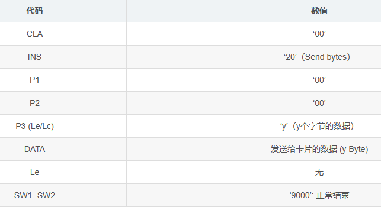
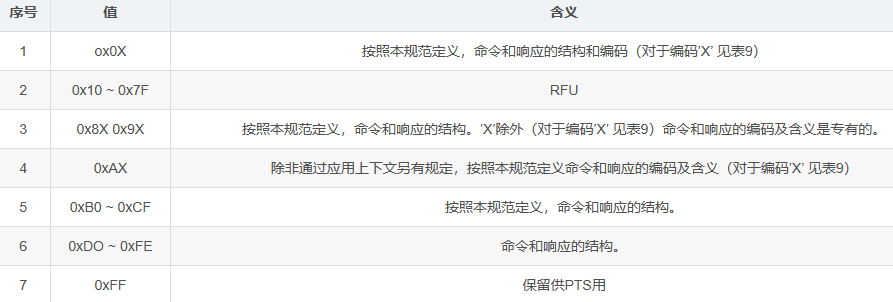

<!-- truncate -->

## 1. 鎽樿

IC鍗″繀椤绘敮鎸乀=0鎴朤=1鐨勫崗璁紝浣嗕笉鏄悓鏃舵敮鎸佽繖涓ょ鍗忚锛岃€岀粓绔垯蹇呴』鍚屾椂鏀寔T=0鍜孴=1鐨勫崗璁€?
鈥?T=0閫氳鍗忚鏄紓姝ュ崐鍙屽伐**瀛楃**浼犺緭鍗忚锛?
鈥?T=1閫氳鍗忚鏄紓姝ュ崐鍙屽伐**鍧?*浼犺緭鍗忚锛?
鍦↖SO7816-3鏍囧噯涓紝鍏蜂綋瑙勫畾浜嗚繖涓ょ鍗忚锛歍0鍜孴1銆?
IC鍗℃墍鐢ㄧ殑鍗忚鍦═D1涓寚瀹氾紝濡傛灉鍦ㄥ浣嶅簲绛斾俊鎭腑娌℃湁TD1锛屽垯琛ㄧず鐢═=0鐨勫崗璁繘琛岄€氳銆傚湪澶嶄綅搴旂瓟鍚庯紝IC鍗″拰缁堢涔嬮棿鍗崇敤IC鍗℃寚瀹氱殑鍗忚杩涜閫氳銆?

##  2.纭欢鎺ュ彛

1锛塚CC锛氱數婧愯緭鍏ワ紙A绫伙細5V锛?B绫伙細3V锛?
2锛塆ND锛氬湴
3锛塕ST锛氬浣?
4锛塈/O锛氳緭鍏ヨ緭鍑?
5锛塁LK锛氭椂閽燂紙A绫伙細1~5MHz锛?B绫伙細1~4MHz锛?
娉細涓嶅悓鍨嬪彿鐨勫崱寮曡剼鏁板彲鑳戒笉涓€鏍枫€?

## 3.璇诲ご涓庡崱鐨勬搷浣?

### 3.1 ETU锛堝熀鏈椂闂村崟鍏冿級浠嬬粛

7816-3瀹氫箟鐨勯€氳鍗忚锛屽熀鏈笂鍙互璇存槸RS232鐨勭炕鐗堝苟鍦ㄦ鍩虹涓婅繘琛岀殑鏀硅繘銆傚湪RS232涓垜浠湁9600娉㈢壒鐜囥€佽捣濮嬩綅銆佸鍋舵牎楠屼綅銆佸仠姝綅杩欎簺姒傚康锛岃€屽湪7816-3涓兘瀹屾暣鍦颁繚鐣欎簡涓嬫潵锛屽彧涓嶈繃7816-3涓紩鍏ヤ簡etu锛屾病鏈変娇鐢╞ps銆俥tu鐨勫畾涔夊彲浠ユ洿鍔犵簿纭湴鎻忚堪姣忎釜鏁版嵁浣嶅湪浼犺緭杩囩▼涓敹鍙戝弻鏂圭殑鑱岃矗鍜岃鑹茶浆鎹€?
鏍规嵁瀹氫箟鍦ㄦ櫤鑳藉崱涓婄數澶嶄綅鐨勬椂鍊?1 etu = 372 / f 锛屽叾涓璮 = 璇诲啓璁惧閫氳繃CLK绠¤剼鎻愪緵缁欐櫤鑳藉崱鐨勬椂閽熼鐜囷紝閫氬父鍦?-5 MHz涔嬮棿銆?
etu鐨勫崟浣嶆槸鏃堕棿鍗曚綅绉掞紙姣銆佸井绉掞級锛岀瓑鍚屼簬**浼犺緭姣忎釜鏁版嵁浣嶆墍闇€鐨勬椂闂?*銆傚鍏跺彇鍊掓暟寰楀嚭鏉ョ殑灏辨槸姣忕浼犺緭鐨勬暟鎹綅锛屼篃灏辨槸bps銆傛垜浠彇f = 3.579545 MHz锛岀敤3579545闄や互372缁撴灉绛変簬9622.4绾︿负9600 bps銆?
閫氱敤鐨別tu璁＄畻鍏紡锛?*1 etu = (F / D) * (1 / f)** 锛孎鍜孌鐨勫€兼牴鎹?816-3瑙勮寖涓殑绾﹀畾鏉ヨ繘琛岃缃€傚浜庝笂鐢靛浣嶆椂鐨勫彇鍊?F = 372锛孌 = 1鍗充綔涓洪粯璁ゅ€糉d鍜孌d銆傚鏋滄櫤鑳藉崱鏀寔鍏朵粬閫熺巼鍒欓渶瑕佸湪ATR涓殑TA1鏉ユ寚鍑哄叾浠栫殑F鍜孌鐨勫€硷紝姣斿璁惧畾F=372锛屽彲浠ユ妸D鍒嗗埆璁惧畾涓?/4锛岄偅涔堟櫤鑳藉崱鑳芥敮鎸佺殑閫氳閫熺巼鍙互鍒嗗埆涓?9200/38400銆?

![鍦ㄨ繖閲屾彃鍏ュ浘鐗囨弿杩癩(../static/img/blog/20210115101047209.png)

閭ｄ箞涓轰粈涔堣閫夋嫨鏃堕挓棰戠巼涓?.579545 MHz锛熶负浠€涔堥粯璁ょ殑F鍊奸€夋嫨涓?72鍛紵棣栧厛3.579545 MHz 鏄父鐢ㄧ煶鑻辨櫠鎸殑鏍囩О鍊硷紝9600 * 372 = 3.5712 MHz锛屼笌涔嬫渶涓烘帴杩戙€傚啀璇翠负浠€涔堟槸372锛?72 = 12 * 31銆傛爣鍑嗙殑8051鍗曠墖鏈烘瘡涓寚浠ゅ懆鏈熶负12涓椂閽熷懆鏈燂紝鑰屼笖瀹氭椂/璁℃暟鍣ㄤ篃鎸夌収1/12 杩涜鍒嗛鍚庡啀璁℃暟鐨勶紝杩欐牱璁惧畾瀵逛簬鏅鸿兘鍗¤姱鐗囨潵璇村彲浠ユ瘮杈冨鏄撳疄鐜板IO鏁版嵁閫氳鐨勬帶鍒讹紝涔熷彲浠ユ洿濂藉湴鍜孭C鏈轰覆鍙?600閫熺巼閰嶅悎锛堝綋鐒惰繖鏄寚涓婁釜涓栫邯80骞翠唬鐨勬椂鍊欙紝瀵逛簬鐜板湪鐨勬櫤鑳藉崱鑺墖璁捐鎶€鏈€岃█瀹炵幇浠绘剰鍒嗛鐨勬帶鍒堕兘涓嶆槸闂浜嗭級銆?
鐢辨鍙锛岃繖浜涘弬鏁扮殑閫夋嫨閮芥槸涓轰簡鑳藉鏇村ソ鍦板埄鐢ㄥ綋鏃舵棦鏈夌殑鏍囧噯鍜屾妧鏈紝瑕佺煡閬?816-3鍦?989骞寸殑鏃跺€欏氨宸茬粡鍒跺畾浜嗭紝鎸夌収褰撴椂鐨勪富娴丳C鏈洪厤缃妸涓插彛閫熺巼璁句负9600锛岀敤涓€涓?32鎺ュ彛鑺墖锛堟瘮濡侻ax232锛夊啀鍔犱笂3.579545MHz鐨勬櫠鎸紝鍐嶉厤鍚堝嚑鐗?4绯诲垪鐨勯棬鐢佃矾澶栧姞5浼忕殑鐩存祦鐢垫簮鍜屽嚑涓樆瀹瑰櫒浠讹紝杩欏氨鏄渶鍩烘湰鐨凴S232涓插彛璇诲崱鍣ㄤ簡銆?
PS:
鈥?Fi Di 锛歍A1 (楂?浣? 浣?浣?, 璇﹁4.3.1銆?
鈥?Fn Dn锛歅PS1 (楂?浣? 浣?浣?, 璇﹁4.3.1銆?
鈥?Fd Dd锛氶粯璁ゅ€?Fd = 372, Dd = 1)銆?

### 3.2 瀛楃甯?

鍦ㄥ瓧绗︿箣鍓嶏紝I/O绔簲澶勪簬鐘舵€乑銆傚涓嬪浘锛屼竴涓瓧绗﹀簲鐢?0涓繛缁殑鏃堕棿娈电粍鎴愶紝姣忎竴鏃堕棿娈典笉 鏄浜庣姸鎬?Z,灏辨槸澶勪簬鐘舵€?A,
鈥?绗竴涓椂闂存ml搴斿浜庣姸鎬丄锛涜繖涓椂闂存鏄€滆捣濮嬩綅鈥濄€?
鈥?m2-m9鍏釜鏃堕棿娈佃繍閫?涓瓧鑺傘€?
鈥?鏈€鍚庝竴涓椂闂存m10搴旂‘淇濆瓧绗﹀鍋舵牎楠屼綅锛?杩愰€佲€滃鍋舵牎楠屼綅鈥濄€?

![鍦ㄨ繖閲屾彃鍏ュ浘鐗囨弿杩癩(../static/img/blog/20210114114602795.png)

鍦ㄦ瘡涓瓧绗︿腑锛屽鏋滃湪鏃堕棿娈祄n缁撴潫鏃剁姸鎬佹敼鍙橈紝鍒欎粠瀛楃鍓嶆部鍒癿n鍚庢部鐨勫欢杩熷簲鏄?tn = (n 澹?0. 2) * etu銆?
鈥㈠彂閫佹柟鐨勬椂闂磋捣鐐规槸瀛楃鐨勮捣濮嬫部銆傚綋鎼滅储涓€涓瓧绗︽椂锛屾帴鏀舵柟瀹氭湡鍦板 I/O鍙栨牱锛屽彇鏍锋椂闂村簲灏戜簬0.2etu銆傛帴鏀舵柟鐨勬椂闂磋捣鐐规槸瀵筞鐘舵€佺殑鏈€鍚庝竴涓瀵熺偣鍜?A鐘舵€佺殑绗竴涓瀵熺偣涓棿銆?
鈥?鎺ユ敹鏂瑰簲鍦?.7etu(鎺ユ敹鏂规椂闂?涔嬪墠纭ml锛岀劧鍚庡簲鍦?1.5澹?.2)etu鏀跺埌m2锛屽湪(2.5澹?.2) etu 鏀跺埌m3,路路路锛屽湪(8.5澹?.2) etu鏀跺埌m9锛屽湪(9.5澹?.2) etu鏀跺埌m10銆傚瓧绗﹀鍋舵牎楠屽湪瀛楃甯ц繍閫佺粨鏉熶箣鍚庤繘琛屻€?
娉?杩欐牱鐨勫厑璁稿亸宸‘淇濆畬鍏ㄥ尯鍒嗕俊鍙锋祴閲忓尯鍜屼俊鍙疯穬鍙樺尯銆?
涓や釜杩炵画瀛楃鐨勮捣濮嬫部涔嬮棿鐨勫欢杩熷簲鑷冲皯鏄?2etu锛屽嵆鏌愪釜瀛楃鐨勬寔缁椂闂?10澹?.2) etu鍔犱笂淇濇姢鏃堕棿銆傚湪淇濇姢鏃堕棿锛屾帴鍙ｈ澶囧拰鍗￠兘搴斾繚鎸佹帴鏀剁姸鎬侊紝鍥犳 I/O鐘舵€佷负Z銆?
鍦ㄥ浣嶅簲绛旀湡闂达紝鍗″彂鍑虹殑涓や釜杩炵画瀛楃鐨勮捣濮嬫部涔嬮棿鐨勫欢杩熷簲涓嶈秴杩?9600 etu銆傝繖涓渶澶у€艰绉颁负鈥滃垵濮嬬瓑寰呮椂闂粹€濄€?

## 4 閫氫俊娴佺▼

鈶犳縺娲荤數璺€?
鈶″喎澶嶄綅鍚姩鍗″簲绛旓紝鍗′笌璇诲ご杩涜閫氫俊銆?
鈶㈤噴鏀剧數璺€?

闅忕潃IC鍗＄殑瑙︾偣鐨勫疄闄呮帴閫氾紝缁堢蹇呴』鍚姩涓€涓喎澶嶄綅銆?
濡傛灉IC鍗＄殑鍐峰浣嶇殑搴旂瓟鎵€鍥為€佺殑瀛楄妭涓嶇鍚堝墠闈㈠皬鑺備腑鐨勮瀹氾紝鎴朓C鍗＄殑澶嶄綅搴旂瓟鏈湪19锛?00鍒濆etu涔嬪唴瀹屾垚锛岀粓绔笉蹇呯珛鍒诲彇娑堢敤鍗¤繃绋嬶紝鑰屾槸鍙戝嚭涓€涓儹澶嶄綅淇″彿銆?
濡傛灉搴旂瓟绗﹀悎瑕佹眰锛岃€屼笖鏄湪19锛?00鍒濆etu涔嬪唴鍥為€侊紝鍒欑粓绔繀椤讳娇鐢ㄥ洖閫佺殑鍙傛暟杩涜鍗＄墖鎿嶄綔杩囩▼銆?
濡傛灉缁堢鍚姩浜嗕竴涓笂杩扮殑鐑浣嶏紝鑰孖C鍗″鐑浣嶇殑搴旂瓟鎵€鍥為€佺殑瀛楄妭浠嶄笉绗﹀悎涓婅堪灏忚妭涓殑瑙勫畾锛屾垨IC鍗＄殑澶嶄綅搴旂瓟鏈兘鍦?9锛?00鍒濆etu涔嬪唴瀹屾垚锛屽垯缁堢灏嗘墽琛岄噴鏀綢C鍗＄殑瑙︾偣搴忓垪锛屼粠鑰屽彇娑堢敤鍗¤繃绋嬨€?
濡傛灉瀵圭儹澶嶄綅鐨勫簲绛旂鍚堣繖浜涜瀹氾紝鑰屼笖鏄湪19锛?00鍒濆涔嬪唴鍥為€侊紝鍒欑粓绔繀椤讳娇鐢ㄥ洖閫佺殑鍙傛暟澶勭悊鍗＄墖鎿嶄綔杩囩▼銆?
涓嶈鏄鍐峰浣嶆垨鐑浣嶏紝濡傛灉鍦ㄥ簲绛旀椂鐢盜C鍗″洖閫佺殑鐩搁偦浜屽瓧鑺傜殑璧峰浣嶇殑涓婂崌娌夸箣闂寸殑鏃堕棿瓒呰繃浜?600鍒濆etu锛岀粓绔氨蹇呴』鎵ц閲婃斁瑙︾偣搴忓垪锛屼粠鑰屽彇娑堢敤鍗¤繃绋嬨€?

### 4.1 婵€娲绘祦绋?

鈶燫ST缃綅鐘舵€丩銆?
鈶CC鍔犵數5V锛圓绫伙級鎴?V锛圔绫伙級銆?
鈶/O缃负鎺ユ敹鐘舵€併€?
鈶LK鎻愪緵15MHz锛圓绫伙級鎴?4MHz锛圔绫伙級銆?

![鍦ㄨ繖閲屾彃鍏ュ浘鐗囨弿杩癩(../static/img/blog/20210114104533319.png)

### 4.2 鍐峰浣?

1.VCC渚涚數锛孯ST鐘舵€佸浜嶭锛孖O鐘舵€佸浜嶭鎯呭喌涓嬨€?
2.褰撴彁渚涚ǔ瀹氱殑CLK寮€濮嬶紝鍦?00涓椂閽熷懆鏈熷唴IO灏嗚浆鍙樼姸鎬佸埌H銆?
3.褰撴彁渚涚ǔ瀹氱殑CLK寮€濮嬶紝RST鑷冲皯淇濇寔L鐘舵€?00涓椂閽熷懆鏈熴€?
4.褰揜ST杩涘叆鐘舵€丠涔嬪悗锛屼粠RST鐨凥鐘舵€佷笂鍗囨部寮€濮嬬殑400鍒?0000涓椂閽熷懆鏈熷唴锛屽浣嶅簲绛斿紑濮嬨€?
5.濡傛灉RST鐘舵€丠鐨勪笂鍗囨部浠ュ悗锛岃秴杩?0000涓椂閽熷懆鏈燂紝鍗＄墖鐨勫浣嶅簲绛旀病寮€濮嬶紝鍒欏浣嶅け璐ワ紝RST涓婄殑淇″彿灏嗚繑鍥炲埌鐘舵€丩锛岃澶囨寜鐓ч噴鏀炬椂搴忋€?

![鍦ㄨ繖閲屾彃鍏ュ浘鐗囨弿杩癩(../static/img/blog/20210114104550311.png)

鍥? 婵€娲讳笌鍐峰浣?

### 4.3 鐑浣?

1)VCC淇濇寔渚涚數骞朵笖CLK鎻愪緵鍚堥€備笖绋冲畾鐨勬椂閽熶俊鍙风殑鎯呭喌涓嬨€?
2)RST缃簬鐘舵€丩鑷冲皯400涓椂閽熷懆鏈燂紝鍚姩鐑浣嶃€?
3)IO鎺ュ彛鍦≧ST鐘舵€丩涔嬪悗鐨?00涓椂閽熷懆鏈熷唴锛屽皢IO璁剧疆涓虹姸鎬丠銆?
4)鍦≧ST缃綅H鐘舵€佷箣鍚庣殑400~40000涓椂閽熷懆鏈熷唴锛孖/O灏嗘敹鍒板浣嶅簲绛斻€?
5)鑻ュ湪RST缃綅H鐘舵€佷箣鍚庤秴杩?0000涓椂閽熷懆鏈燂紝锛孖/O澶嶄綅搴旂瓟娌″紑濮嬶紝鍒欑儹澶嶄綅澶辫触锛屾帴鍙ｉ噴鏀剧數璺€?

![鍦ㄨ繖閲屾彃鍏ュ浘鐗囨弿杩癩(../static/img/blog/20210114104732454.png)

鍐峰浣嶅拰鐑浣嶄笉鍚屽湪浜庯紝**鍐峰浣嶆槸閲嶆柊涓婄數骞跺姞绋冲畾鐨勬椂閽熶俊鍙蜂箣鍚庡彂璧凤紝鑰岀儹澶嶄綅鏄湪鐢垫簮鍜屾椂閽熶俊鍙蜂繚鎸佺殑鎯呭喌涓嬶紝閫氳繃RST淇″彿鍙戣捣**銆?

### 4.4 鏃堕挓鍋滄

1) I/O淇濇寔鍦ㄧ姸鎬乑鑷冲皯1860涓椂閽熷懆鏈燂紙tg锛夛紱
2) 褰撴椂閽熻鍋滄锛堜粠Te鍒癟f锛夛紝CLK搴斾繚鎸佸湪鐘舵€丠鎴栫姸鎬丩锛岃繖涓姸鎬佺敱鍙傛暟X鎸囨槑銆?
3) Tf涔嬪悗锛屾帴鍙ｈ澶囬噸鍚椂閽燂紝I/O涓婄殑淇℃伅浜ゆ崲闇€鍦ㄨ嚦灏?00涓椂閽熷懆鏈熶箣鍚庯紙th锛夈€?

### 4.5 閲婃斁

1) RST缃负鐘舵€丩
2) CLK缃负鐘舵€丩
3) VPP閲婃斁锛堝鏋滃凡缁忔縺娲伙級
4) I/O缃负鐘舵€丄
5) VCC閲婃斁

## 5 ATR

ATR鏄痑nswer to reset锛堝浣嶅簲绛旓級銆傛槸璇诲ご澶嶄綅鍗′箣鍚庯紝鍗″洖澶嶈澶寸殑绗竴鏉℃寚浠ゃ€傚浣嶇瓟澶嶆牸寮忓涓嬶細

### 5.1 鍒濆瀛楃TS

鈥?TS锛氬垵濮嬪瓧绗?瀹氫箟浜嗘墍鏈夊悗缁у瓧绗︿腑鏁版嵁瀛楄妭鐨勭紪鐮佸崗璁紝鍏跺悗闈㈡渶澶氳窡32涓瓧绗︺€?
鈥?3B锛氭鍚戠害瀹氾紱3F锛氬弽鍚戠害瀹氥€?

### 5.2 鏍煎紡瀛楃T0

![鍦ㄨ繖閲屾彃鍏ュ浘鐗囨弿杩癩(../static/img/blog/2021011415265817.png)

![鍦ㄨ繖閲屾彃鍏ュ浘鐗囨弿杩癩(../static/img/blog/20210114152750814.png)

鈥?Y1(m7~m4)锛氭爣璁癟A1銆乀B1銆乀C1銆乀D1鏄惁瀛樺湪锛?
鈥?K (m3~m0)锛氫负鍘嗗彶瀛楃鐨勬暟鎹暱搴︼紝甯哥敤T=0锛堝紓姝ュ崐鍙屽伐瀛楃浼犺緭鍗忚锛? T=1锛堝紓姝ュ崐鍙屽伐鍧椾紶杈撳崗璁級銆?
鈥?鍩烘湰鍝嶅簲锛?濡傛灉鍙娇鐢ㄤ簡T=0锛孖C鍗″皢鍥為€乀0=鈥?X鈥濓紝鎸囨槑瀛楃TB1鍜孴C1鐨勫瓨鍦ㄣ€傚鏋滃彧浣跨敤浜員=1锛屽垯IC鍗″洖閫乀0=鈥淓X鈥滐紝鎸囨槑瀛楃TB1鑷砊D1鐨勫瓨鍦ㄣ€傗€淴鈥濅箣鍊艰〃鏄庝紶閫佺殑鍘嗗彶瀛楃鐨勬暟閲忋€?
鈥?缁堢鍙嶅簲锛?鑻C鍗″洖閫佺殑T0涓轰换鎰忓€硷紝鍙瀹冩纭湴鎸囨槑骞跺拰鎺ュ彛瀛楃TA1鑷砊D1鍙婂疄闄呭洖閫佺殑鍘嗗彶瀛楄妭涓€鑷达紝缁堢涓嶅緱鎷掔粷銆?
琛? T=0鐨勫浣嶅簲绛斿洖閫佺殑瀛楃

琛? T=1鐨勫浣嶅簲绛斿洖閫佺殑瀛楃

娉細T=0鍜孴=1鐨勬瘮杈冿細
T=0鏄互瀛楃涓烘渶灏忕殑浼犺緭鍗曚綅銆傚湪姝ゅ崗璁腑锛岃鍗″櫒鍚戝崱鍙戦€丄PDU鎸囦护锛屽氨鏄敱5涓瓧绗︾粍鎴愶紝杩?涓瓧绗︽瘡涓€涓剰涔夐兘寰堟槑纭浐瀹氥€傝€孴=1鍗忚涓紝闄や簡瀹氫箟浜嗗潡鐨勭粨鏋勫锛屽叾浠栦俊鎭兘瀛樺偍鍦↖NF涓紝涔熷氨鏄璇诲崱鍣ㄥ鍗″彂閫佺殑鎸囦护鍜屾暟鎹兘瀛樺湪杩欎釜INF鍩熶腑锛岃€屽苟娌℃湁瀵硅繖浜涙寚浠ゅ拰鏁版嵁浣滀弗鏍肩殑瑙勫畾锛屽湪杩欐柟闈=1杈僒=0鏇翠负鐏垫椿銆?

### 5.3 鎺ュ彛瀛楃TAi銆乀Bi銆乀Ci銆乀Di锛坕=1銆?銆?绛夌瓑锛?

TAi锛氶珮4bit涓篎I锛堟椂閽熺巼杞崲鍥犲瓙锛夛紝浣?bit涓篋I锛堟尝鐗圭巼鏍℃鍥犲瓙锛夛紱
TBi锛歜it1bit5锛氭渶澶х紪绋嬬數鍘嬶紝bit6bit7锛氭渶澶х紪绋嬬數娴侊紝bit8涓嶄娇鐢ㄣ€?
TCi锛氳绠楀叓浣嶉澶栦繚鎶ゆ椂闂寸殑寮曠敤銆?
TA2锛氬瓨鍦ㄥ垯鏄笓鐢ㄦā寮忥紝涓嶅瓨鍦ㄥ垯鏄崗鍟嗘ā寮忥紝闇€閫氳繃PPS鍛戒护鍘荤‘璁ゅ崗璁€?
褰揟A2鐨刡it5=0鏃朵娇鐢‵i鍜孌i锛岃嫢bit5=1鏃讹紝浣跨敤榛樿鍊笺€?
TDi锛?鎸囨槑鍗忚绫诲瀷鍜屾槸鍚﹀瓨鍦ㄥ悗缁帴鍙ｅ瓧绗︼紝TDi鍖呮嫭Yi+1鍜孴涓ら儴鍒嗭紝Yi+1涓洪珮鍥涗綅缁勶紝鍒嗗埆琛ㄧず鍚庣画鎺ュ彛瀛楃TAi+1銆乀Bi+1銆乀Ci+1銆乀Di+1鏄惁瀛樺湪锛孴涓轰綆鍥涗綅缁勶紝琛ㄧず鍚庣画鍙戦€佺殑鍗忚绫诲瀷銆?

![鍦ㄨ繖閲屾彃鍏ュ浘鐗囨弿杩癩(../static/img/blog/20210114110229307.png)

#### 5.3.1 TA1

TA1浼犺揪FI鍜孌I鐨勬暟鍊硷紝鍏朵腑锛欶I(楂?浣?鐢ㄦ潵纭畾F鐨勬暟鍊硷紝F涓烘椂閽熼鐜囪浆鎹㈠洜瀛愶紝鐢ㄤ簬淇敼缁у浣嶅簲绛斾箣鍚庣敱缁堢鎵€鎻愪緵鐨勬椂閽熼鐜囥€侱I(浣?浣?鐢ㄦ潵纭畾D鐨勬暟鍊硷紝绉颁负姣旂壒鐜囪皟鑺傚洜瀛愶紝鐢ㄤ簬璋冩暣澶嶄綅搴旂瓟涔嬪悗鎵€浣跨敤鐨勪綅鎸佺画鏃堕棿銆?

![鍦ㄨ繖閲屾彃鍏ュ浘鐗囨弿杩癩(../static/img/blog/2021011411025583.png)

![鍦ㄨ繖閲屾彃鍏ュ浘鐗囨弿杩癩(../static/img/blog/20210114110303273.png)

鈥?澶嶄綅搴旂瓟鏃剁殑浣嶆寔缁椂闂寸О涓哄垵濮媏tu,骞剁敱姝ｅ紡绠楀嚭锛?
鍒濆etu = 372/f 绉掞紝寮忎腑 f 鐨勫崟浣嶄负Hz锛岃〃绀哄浣嶅搷搴旀椂鐨勫垵濮嬮鐜囥€?
鈥?澶嶄綅搴旂瓟锛堜互鍙婂叏灞€鍙傛暟F涓嶥鐨勮绔嬶級涔嬪悗鐨勬寔缁椂闂达紝绉颁负褰撳墠etu锛屽叾璁＄畻鍏紡涓猴細
褰撳墠etu=F/Df 绉掞紝寮忎腑f 鐨勫崟浣嶄负Hz锛岃〃绀哄悗缁紶閫佹椂鐨勫綋鍓嶅伐浣滈鐜囥€?
澶嶄綅搴旂瓟鏈熼棿浣跨敤鐨勭己鐪佸€间负锛欶I=1鍜孌I=1锛岃〃绀猴細F=372鍜孌=1
鈥?鍩烘湰鍝嶅簲锛?IC鍗′笉鍥為€乀A1锛屽垯鍦ㄦ暣涓悗缁俊鎭氦鎹㈣繃绋嬩腑缁х画浣跨敤缂虹渷鍊糉=372鍜孌=1銆?
鈥?缁堢鍙嶅簲锛?缁堢涓嶅緱鎷掔粷涓€涓洖閫乀A1=鈥?1鈥濈殑IC鍗★紙濡傛灉T0鐨刡5浣嶈缃负1锛夛紝骞跺湪鎵€鏈夊悗缁т氦鏄撲腑锛岀户缁娇鐢‵=372锛孌=1銆?

#### 5.3.2 TB1

TB1浼犻€丳I1鍜孖1涔嬪€硷紝鍏朵腑锛?
鈥?鍦╞1~b5浣嶄腑瀹氫箟锛岀敤浜庣‘瀹欼C鍗℃墍闇€鐨勬渶澶х紪绋嬬數鍘婸鍊笺€俠1=0琛ㄧずIC鍗′笉浣跨敤Vpp銆?
鈥?鍦╞6~b7浣嶄腑瀹氫箟锛岀敤浜庣‘瀹欼C鍗℃墍闇€鐨勬渶澶х紪绋嬬數娴両鍊笺€俠1=0琛ㄧず涓嶄娇鐢ㄦ鍙傛暟銆?
鈥?b8浣嶄笉浣跨敤锛屽苟璁剧疆涓洪€昏緫鈥?鈥濄€?
鈥?鍩烘湰鍝嶅簲锛?IC鍗″皢鍥為€乀B1=鈥?0鈥濓紝琛ㄧずIC鍗′笉浣跨敤VPP銆?
鈥?缁堢鍝嶅簲锛?鑻0鐨刡6琚疆鈥?鈥濓紝IC鍗″洖閫佺殑TB1涓轰换鎰忓€兼椂锛屾垨T0鐨刡6琚疆涓衡€?鈥濓紝IC鍗″洖閫乀B1鏃讹紝缁堢涓嶅緱鎷掔粷姝ゅ崱锛屼絾涔熶笉浜х敓VPP锛屽苟缁х画鐢ㄥ崱杩囩▼锛屽氨璞″洖閫佷簡TB1=鈥?0鈥濅竴鏍枫€?

#### 5.3.3 TC1

TC1浼犻€丯鍊硷紝N涓洪澶栦繚鎶ゆ椂闂淬€侼涓篢C1鐨刡8b1浣嶇殑浜岃繘鍒剁爜锛屽叾鍊艰〃绀轰簡棰濆淇濇姢鏃堕棿鎵€澧炲姞鐨別tu鏁?鍏跺€间负0255涔嬮棿銆侼=255锛圱C1=鈥淔F鈥濓級鏈夌壒鍒殑鍚箟锛屽畠琛ㄦ槑涓ょ浉閭诲瓧绗︾殑璧峰浣嶅墠娌夸箣闂寸殑鏈€鐭棿闅旀椂闂达細 T=0涓?2etu锛汿=1涓?11etu銆?
娉ㄦ剰锛孴C1浠呯敤浜庝粠缁堢閫佸埌IC鍗＄殑涓ょ浉閭诲瓧绗﹂棿鐨勫畾鏃讹紝瀹冩棦涓嶇敤浜庝粠IC鍗￠€佸埌缁堢鐨勪袱鐩搁偦瀛楃闂寸殑瀹氭椂锛屼篃涓嶇敤浜庡弽鍚戜紶閫佺殑浜屽瓧绗﹂棿鐨勫畾鏃讹紙璇峰弬鐪嬩紶杈撳崗璁竴鑺備腑鍏充簬T=0鎴朤=1鐨勬椂搴忕殑鍙欒堪锛夈€?
鈥?鍩烘湰鍝嶅簲: IC鍗″洖閫佺殑TC1涔嬪€煎簲鍦ㄢ€?0鈥濊嚦鈥淔F鈥濈殑鑼冨洿鍐呫€?
鈥?缁堢鍝嶅簲: 褰揑C鍗′笉鍥為€乀C1锛堝亣瀹歍0鐨刡7浣嶈缃负鈥?鈥濓級鏃讹紝缁堢涓嶅緱鎷掔粷锛屽苟
缁敤鍗¤繃绋嬬殑澶勭悊锛屽氨鍍忓洖閫佷簡TC1=鈥?0鈥濅竴鏍枫€?
寤鸿鍦ㄨ璁C鍗℃椂锛屽簲鎶奣C1缃垚IC鍗″彲鎺ュ彈鐨勬渶灏忓€硷紝杈冨ぇ鐨凾C1鍊间細瀵艰嚧缁堢鍜孖C鍗￠棿鐨勯€氫俊杩囨參锛屼粠鑰屽欢闀夸簡浜ゆ槗鏃堕棿銆?

#### 5.3.4 TD1

TD1琛ㄧず鏈夋棤鏇村鐨勬帴鍙ｅ瓧鑺備紶閫侊紝浠ュ強鍏充簬浼犺緭鍗忚绫诲瀷鐨勪俊鎭紝鍏朵腑
鈥?楂樺崐瀛楄妭鐢ㄦ潵琛ㄧず瀛楃TA2鑷砊D2鏄惁瀛樺湪锛宐5~b8鍚勪綅涓缃负閫昏緫鈥?鈥濈殑锛屽氨琛ㄧず鐩稿簲鐨凾A2鑷砊D2涓瀛楃鐨勫瓨鍦ㄣ€?
鈥?浣庡崐瀛楄妭鎻愪緵浜嗗叧浜庡悗缁т氦鎹㈡墍鐢ㄤ紶杈撳崗璁被鍨嬬殑淇℃伅銆?
鍩烘湰鍝嶅簲: 褰撻€夌敤T=0鍗忚鏃讹紝鍒橧C鍗″皢涓嶅洖閫乀D1锛屽悗缁т紶閫佸崗璁己鐪佷负T=0銆傚綋閫夌敤T=1鍗忚鏃讹紝鍒橧C鍗″繀椤诲洖閫乀D1=鈥?1鈥濓紝浠ヨ〃鏄嶵D2鐨勫瓨鍦紝骞跺悗缁т紶閫佷紶杈撳崗璁负T=1銆?
缁堢鍙嶅簲: 褰揑C鍗″洖閫佺殑TD1鐨勯珮鍥涗綅缁勬湁浠绘剰鍊硷紙鍋囪鍥為€佷箣鍊兼纭湴琛ㄧず骞朵笌瀹為檯鍥為€佺殑鎺ュ彛瀛楃TA2鑷砊D2涓€鑷达級锛屼笖浣庡洓浣嶇粍涔嬪€间负鈥?鈥滄垨鈥?鈥濓紝鍒欑粓绔笉寰楁嫆缁濄€傜粓绔繀椤绘嫆缁濆洖閫佸叾瀹僒D1涔嬪€肩殑IC鍗°€?

#### 5.3.5 TA2

瀛楃TA2鐨勫瓨鍦ㄤ笌鍚︾浉搴斿湴琛ㄧずIC鍗℃槸浠ョ壒瀹氭ā寮忔垨鏄氦浜掓ā寮忓伐浣溿€?
鍩烘湰鍝嶅簲: IC鍗QF 涓嶅洖閫乀A2锛孴A2涓嶅瓨鍦ㄨ〃绀轰互浜や簰妯″紡宸ヤ綔銆?
缁堢鍝嶅簲: 濡傛灉缁堢鍦ㄥ浣嶅簲绛旀湡闂磋兘澶熸敮鎸佺敱IC鍗￠€氳繃TA2鎵€鎸囨槑鐨勯澶栨潯浠讹紝瀹冧笉鎷掔粷杩欐牱鐨処C鍗★紝骞跺簲鑳界珛鍗充娇鐢ㄨ繖浜涙潯浠躲€?

#### 5.3.6 TB2

TB2浼犻€丳I2锛孭I2鐢ㄤ簬纭畾IC鍗℃墍闇€缂栫▼鐢靛帇P鐨勫€笺€傚綋瀹冨瓨鍦ㄦ椂锛屽畠灏卞彇浠ｇ敱TB1涓洖閫佺殑PI1鐨勫€笺€?
鍩烘湰鍝嶅簲: IC鍗′笉搴斿洖閫乀B2銆?
缁堢鍙嶅簲: 缁堢涓嶅簲鎷掔粷IC鍗″洖閫乀B2锛屼絾涓嶈鏄惁鍥為€併€佸洖閫佷簡浣曞€硷紝缁堢鍧囦笉浜х敓VPP銆?

#### 5.3.7 TC2

TC2鏄疶=0鍨嬪崗璁墍鐗规湁鐨勶紝瀹冧紶杈句簡鐢ㄦ潵鍐冲畾鐢盜C鍗″彂閫佺殑浠绘剰涓€涓瓧绗﹁捣濮嬩綅涓婂崌娌夸笌鐢盜C鍗℃垨缁堢浼犻€佺殑鍓嶄竴瀛楃鐨勮捣濮嬩綅涓婂崌娌夸箣闂寸殑鏈€澶ч棿闅旂殑宸ヤ綔绛夊緟鏃堕棿锛圵I锛夈€傚伐浣滅瓑寰呮椂闂翠负锛?60脳D脳WI銆?
鍩烘湰鍝嶅簲: IC鍗′笉寰楀洖閫乀C2锛屼笖鍚庣画閫氳涓娇鐢ㄧ己鐪佸€糤I=10銆?
缁堢鍙嶅簲: 缁堢涓嶅緱鎷掔粷鍥為€乀C2=10鐨処C鍗°€?

#### 5.3.8 TD2

TD2琛ㄧず鏄惁杩樿鍙戦€佹洿澶氱殑鎺ュ彛瀛楄妭锛屼互鍙婂叧浜庡悗缁т紶杈撴墍鐢ㄧ殑鍗忚绫诲瀷锛屽叾涓?
鈥?楂樺崐瀛楄妭鐢ㄦ潵琛ㄧず瀛楃TA3鑷砊D3鏄惁瀛樺湪锛宐5~b8鍚勪綅涓缃负閫昏緫鈥?鈥濈殑锛屽氨琛ㄧず鐩稿簲鐨凾A3鑷砊D3鐨勫瓨鍦ㄣ€?
鈥?浣庡崐瀛楄妭琛ㄧず鐢ㄤ簬鍚庣户浼犻€佺殑鍗忚绫诲瀷锛屽鏋滀娇鐢═=1锛屼綆鍗婂瓧鑺傚€间负鈥?鈥濄€?
鍩烘湰鍝嶅簲锛?濡傛灉浣跨敤鐨勬槸T=0锛屽垯IC鍗′笉鍥為€乀D2锛屽悗缁紶杈撳崗璁己鐪佺殑T=0銆傚鏋滀娇鐢ㄧ殑鏄疶=1锛岃€孖C鍗″繀椤诲洖閫乀D2=鈥?1鈥濓紝浠ヨ〃绀篢A3鍜孴B3鐨勫瓨鍦紝鑰屽悗缁紶杈撳崗璁负T=1銆?
缁堢鍙嶅簲锛?褰揑C鍗″洖閫佺殑TD2鐨勯珮鍗婂瓧鑺傛湁浠绘剰鍊硷紙鍋囪鍥為€佷箣鍊兼纭笖涓庡疄闄呭洖閫佺殑鎺ュ彛瀛楃TA3鑷砊D3涓€鑷达級锛岃€屼綆鍗婂瓧鑺傜殑鍊间负鈥?鈥濇垨鈥淓鈥濓紝鍒欑粓绔笉寰楁嫆缁濓紝缁堢蹇呴』鎷掔粷鍥為€佸叾瀹僒D2涔嬪€肩殑IC鍗°€?

#### 5.3.9 TA3

TA3鍥為€佷俊鎭煙闀垮害鏁存暟锛圛FSI锛夛紝瀹冨喅瀹氫簡IC鍗′俊鎭瓧娈甸暱搴︼紙IFSC锛夛紝骞惰瀹氫簡IC鍗¤兘澶熸帴鏀剁殑瀛楃粍鐨勬渶澶ч暱搴︺€傚畠浠ュ瓧鑺傚舰寮忚〃绀篒FSC鐨勯暱搴︼紝鍙栧€艰寖鍥翠负鈥?1鈥濊嚦鈥淔E鈥濅箣闂寸殑浠讳綍鍊硷紝鈥?0鈥濆拰鈥淔F鈥濅簩鍊肩暀浣滃鐢ㄣ€?
鍩烘湰鍝嶅簲锛?濡傛灉浣跨敤浜員=1锛屽垯IC鍗″繀椤讳互TA3涓衡€?0鈥濊嚦鈥淔E鈥濋棿涔嬪€间簣浠ュ洖閫侊紝浠ヨ〃绀哄垵濮嬬殑IFSC鍦?6鑷?54瀛楄妭鐨勮寖鍥村唴銆?
缁堢鍙嶅簲锛?缁堢涓嶅緱鎷掔粷鏈洖閫乀A3锛堝亣璁綯D2鐨刡5浣嶈缃负鈥?鈥濓級鐨処C鍗★紝浣嗗鏋滄帴鍙椾簡杩欐牱鐨処C鍗★紝瀹冨繀椤讳互鈥?0鈥濅綔涓篢A3涔嬪€肩户缁敤鍗¤繃绋嬨€傜粓绔繀椤绘嫆缁濆洖閫佺殑TA3涔嬪€煎湪鈥?0鈥濊嚦鈥?F鈥濋棿鎴栦负鈥淔F鈥濈殑IC鍗°€?

#### 5.3.10 TB3

TB3琛ㄦ槑浜嗙敤鏉ヨ绠桟WT鍜孊WT鐨凜WI鍜孊WI涔嬪€硷紝 TB3鐢变袱閮ㄥ垎缁勬垚锛屼綆鍗婂瓧鑺傦紙b1b4锛夌敤鏉ヨ〃绀篊WI涔嬪€硷紝鑰岄珮鍗婂瓧鑺?b5b8)鐢ㄦ潵琛ㄧずBWI涔嬪€笺€?
鍩烘湰鍝嶅簲锛?濡傛灉浣跨敤浜員=1锛屽垯IC鍗″簲鍥為€佽繖鏍风殑TB3锛氶珮鍗婂瓧鑺傚彇鍊间负鈥?鈥欌€?鈥欙紝浣庡崐瀛楄妭鍙栧€间负鈥?鈥欌€?鈥欍€傚嵆CWI涔嬪€间负0鑷?涔嬮棿锛岃€孊WI涔嬪€间负0鈥?涔嬮棿銆?

#### 5.3.11 TC3

TC3鎸囨槑浜嗘墍鐢ㄧ殑鍧楅敊璇娴嬩唬鐮佺殑绫诲瀷锛岀被鍨嬬敱b1浣嶈〃绀猴紝鑰宐2鑷砨8鏈敤銆?
鍩烘湰鍝嶅簲锛?浣跨敤绾靛悜鍐椾綑鏍￠獙锛圠RC锛変綔涓洪敊璇娴嬬爜鏃讹紝IC鍗′笉蹇呭洖閫乀C3銆?

### 5.4 鍘嗗彶瀛楃T1銆乀2銆乀k

鎸囨槑浜嗕竴浜涢€氱敤淇℃伅锛屽鍗＄殑鍒堕€犲晢锛屽崱涓宓屽叆鐨勮姱鐗囥€佸崱鐨勬枃浠剁姸鎬佺瓑銆?

### 5.5 鏍￠獙瀛楃Tck

TCK鍏锋湁涓€涓楠屽浣嶅簲绛旀湡闂存墍鍙戦€佹暟鎹畬鏁存€х殑鍊硷紝TCK鐨勫€煎簲浣夸粠T0鑷砊CK锛堝寘鎷琓CK锛夌殑鎵€鏈夊瓧鑺傜殑寮傛垨鎿嶄綔缁撴灉涓?銆?
鍩烘湰鍝嶅簲锛?濡備娇鐢═=0鍗忚锛屽皢涓嶅彂閫乀CK锛岃€屽湪鍏朵粬鎯呭喌涓嬶紝閮藉彂閫乀CK銆?
缁堢鍙嶅簲锛?鍦ㄤ娇鐢═=0鍗忚鏃讹紝缁堢搴旀嫆缁濆洖閫乀CK鐨処C鍗°€傚鏋淚C鍗″洖閫佷簡TCK锛岀粓绔簲鑳藉TCK杩涜璧嬪€笺€?

## 6 ISO7816閫氫俊鏁版嵁瀹炰緥

鏈疄渚嬩娇鐢ㄩ噾鎬濈壒鐢靛瓙鐨凨ingst LA5016 usb 閫昏緫鍒嗘瀽浠娴婭SO7816鏁版嵁閫氳銆備互涓嬪嚑鍥炬槸涓€涓畬鏁寸殑鏁版嵁鍖呭垎鏋愭埅鍥俱€備粠鍥句腑鍙互鐪嬪埌锛孖SO7816鍗忚鍙互灏咥TR瑙ｆ瀽涓哄垵濮嬪瓧绗S锛屾牸寮忓瓧绗0/T1锛屾帴鍙ｅ瓧绗Ai~TDi锛屽巻鍙插瓧绗1锛孴2锛屸€︼紝Tk, 鍙婃牎楠屽瓧绗ck绛?銆?

鍗忚瑙ｆ瀽鍙傛暟璁剧疆锛?

![鍦ㄨ繖閲屾彃鍏ュ浘鐗囨弿杩癩(../static/img/blog/2021011411305369.png)

![鍦ㄨ繖閲屾彃鍏ュ浘鐗囨弿杩癩(../static/img/blog/20210114113118420.png)

![鍦ㄨ繖閲屾彃鍏ュ浘鐗囨弿杩癩(../static/img/blog/20210114113127651.png)

## 7.鎿嶄綔妯″紡

澶嶄綅搴旂瓟鍚庯紝鍗℃槸涓嬮潰涓ょ鎿嶄綔妯″紡涔嬩竴锛?
鈥?TA2瀛樺湪鏃剁殑涓撶敤妯″紡锛?
鈥?TA2涓嶅瓨鍦ㄦ椂鐨勫崗鍟嗘ā寮忋€?

### 7.1 涓撶敤妯″紡

鍦ㄤ笓鐢ㄦā寮忎腑锛岀揣闅忓浣嶅簲绛斾箣鍚庯紝鐢盩A(2)鎸囩ず鐨勫崗璁娇鐢ㄣ€?
鈥?TA(2)涓璪5=0鏃讹紝浣跨敤Fi鍜孌i锛?澶嶄綅搴旂瓟鍚庯紝Fi锛孌i绔嬪嵆鐢熸晥銆?
鈥?TA(2)涓璪5=1鏃讹紝浣跨敤缂虹渷鍊硷紙Fd锛孌d锛夈€?

### 7.2 鍗忓晢妯″紡

鍦ㄥ崗鍟嗘ā寮忎腑锛屽彧瑕両FD鍙戦€佺粰ICC鐨勭涓€瀛楄妭鍏佽鍦≒PS璇锋眰涓庡崗璁懡浠や箣闂存湁鏄庢樉宸埆锛屽垯鈥滅己鐪侀€夋嫨鈥濇槸鍙兘鐨勩€?
鈥?鍦ㄥ浣嶅簲绛斿悗鏃燩PS璇锋眰锛屽垯鈥滈閫夊崗璁€濆皢浣跨敤Fd鍜孌d锛堢己鐪佸€硷級銆?
鈥?褰撳崗璁敱ICC鍜?鎴栧弬鏁癋銆丏鐨勫叾瀹冨€硷紙F鑼冨洿涓篎d鍒癋i锛孌鐨勮寖鍥翠负Dd鍒癉i锛夋彁渚涙椂锛孖FD 搴斿彂閫佷竴涓甫Fd鍜孌d鐨凱PS璇锋眰锛屼互渚夸粠鍗忓晢妯″紡杞埌涓撶敤妯″紡锛屾垚鍔熷畬鎴?PPS 浜ゆ崲鍚庯紝鍗忓晢鍗忚搴斾娇鐢‵n鍜孌n锛圥PS1瀹氫箟锛夈€?
濡傛灉澶嶄綅搴旂瓟浠呮彁渚涗竴涓崗璁紙T=0鍒?4锛夊拰Fd銆丏d锛屽垯璇ュ崗璁簲浣跨敤Fd鍜孌d涓旂揣闅忓浣嶅簲绛斾箣鍚庛€傜浉搴旂殑锛岃繖鏍风殑鍗′笉蹇呮敮鎸?PPS銆?
鏃笉鏀寔PPS鍙堜笉鏀寔棣栭€夊崗璁殑 IFD 鍙噰鐢ㄥ浣岻CC浠ヤ粠鍗忓晢妯″紡杞埌IFD鏀寔鐨勪笓鐢ㄦā寮忥紝鎴栬€呭彲浠ユ嫆缁濆崱銆?
濡傛灉T=0鎴朤=1甯︽湁鍊糉i鍜孌i涓?Fi銆丏i涓嶇瓑浜嶧d銆丏d锛屽垯IFD鍙互閫夋嫨甯︽湁Fd 銆丏d 鐨勭己鐪佸崗璁紝鎴栧彂閫佸甫Fd鍜孌d鐨凱PS璇锋眰浠ュ崗璋僃n銆丏n銆?

## 8. 鍗忓晢妯″紡涓嬬殑PPS鍗忚

Protocol and Parameters Selection锛岀洿璇戜负鍗忚鍜屽弬鏁伴€夋嫨锛屾槸璇诲啓鍣ㄤ笌鍗＄墖鍗忓晢閫氫俊鍗忚鍜屼紶杈撳弬鏁扮殑涓€涓繃绋嬨€傚叾鏈変袱绉嶆搷浣滄ā寮忥細TA(2)瀛樺湪鏃剁殑涓撶敤妯″紡鍜孴A(2)涓嶅瓨鍦ㄦ椂鐨勫崗鍟嗘ā寮忋€?
1.涓撶敤妯″紡锛氬綋TA锛?锛夌殑bit5=0鏃朵娇鐢‵i鍜孌i锛岃嫢bit5=1鏃讹紝浣跨敤榛樿鍊笺€?
2.鍗忓晢妯″紡锛氬彧瑕両FD鍙戠敓缁橧CC鐨勭涓€涓瓧鑺傚厑璁稿湪PPS璇锋眰涓庡崗璁懡浠や箣闂存湁鏄庢樉宸埆锛屽垯鈥滅己鐪侀€夋嫨鈥濇槸鍙兘鐨勩€?
鍦ㄥ浣嶅簲绛斿悗鏃燩PS璇锋眰锛屽垯鈥滈閫夊崗璁€濆皢浣跨敤Fd鍜孌d銆?
褰撳崗璁敱ICC鍜?鎴栧弬鏁癋,D鐨勫叾浠栧€硷紙F鐨勮寖鍥翠负Fd鍒癋i锛孌鐨勮寖鍥翠负Dd鍒癉i锛夋彁渚涙椂锛孖FD搴斿彂閫佷竴涓甫Fd鍜孌d鐨凱PS璇锋眰锛屼互渚夸粠鍗忓晢妯″紡杞埌涓撶敤妯″紡銆傛垚鍔熷畬鎴怭PS浜ゆ崲鍚庯紝鍗忓晢鍗忚搴斾娇鐢‵d鍜孌d銆?
鍙湁 IFD 琚厑璁稿紑濮?PPS 浜ゆ崲
鈥?IFD 搴斿彂閫佷竴涓狿PS璇锋眰缁橧CC锛?
鈥?濡傛灉ICC鏀跺埌涓€涓敊璇疨PS璇锋眰锛屽垯瀹冧笉浣滀换浣曞搷搴旓紱
鈥?濡傛灉ICC鏀跺埌涓€涓纭甈PS璇锋眰锛屽垯搴旇繑鍥炰竴涓狿PS鍝嶅簲鍚﹀垯灏嗚秴杩囧垵濮嬬瓑寰呮椂闂达紱
鈥?濡傛灉瓒呰繃鍒濆绛夊緟鏃堕棿锛屽垯IFD鎴栬€呭浣嶆垨鑰呮嫆缁?IC鍗★紱
鈥?濡傛灉IFD鏀跺埌閿欒PPS鍝嶅簲锛屽垯IFD鎴栬€呭浣嶆垨鑰呮嫆缁?IC鍗★紱
鈥?濡傛灉PPS浜ゆ崲澶辫触锛屽垯IFD鎴栬€呭浣嶆垨鑰呮嫆缁滻C鍗°€?

### 8.1 PPS璇锋眰鐨勭粨鏋勫拰鍐呭

PPS 璇锋眰鍜屽搷搴斿垎鍒寘鎷竴涓垵濮嬪瓧鑺?PPSS 鍚庨殢鏍煎紡瀛楄妭 PPS0 涓変釜鍙€夊弬鏁板瓧鑺?PPS1锛孭PS2鍜孭PS3浠ュ強涓€涓娴嬪瓧鑺?PCK銆?
PPS 璇嗗埆 PPS 璇锋眰鎴栧搷搴斿苟绛変簬 FF銆?
PPS0 閫氳繃浣?b5 b6 b7 鍒嗗埆鎸囨槑鍙€夊瓧鑺?PPS1銆丳PS2銆丳PS3鐨勫瓨鍦ㄣ€備綅b4~b1浼犺緭鍙傛暟T鐨勫€间互鎻愬嚭鍗忚銆備綅b8鐣欎綔鏈潵浣跨敤骞惰瀹氫负0銆?
PPS1鍏佽IFD瀵瑰崱鎻愬嚭F鍜孌鐨勫€笺€?

![鍦ㄨ繖閲屾彃鍏ュ浘鐗囨弿杩癩(../static/img/blog/20210114132923141.png)

### 8.2 鎴愬姛鐨凱PS浜ゆ崲

褰揚PS鍝嶅簲涓轰笅鍒楁儏鍐典箣涓€鏃讹紝璇PS浜ゆ崲涔熸槸鎴愬姛鐨勩€?
(1)PPSS鍝嶅簲 = PPSS璇锋眰锛?
(2)PPS0鐨勫搷搴旓細
鈥?搴斿洖閫丅1鍒癇4
鈥?鍥為€丅5鎴栧皢浠栫疆涓?锛堝鏋淏5=1锛屽垯PPS1鍝嶅簲=PPS1璇锋眰銆傝嫢B5=0锛屽垯鏃燩PS1锛屽垯浣跨敤Fd鍜孌d锛夈€?
鈥?鍥為€丅6鎴栧皢浠栫疆涓?锛堝鏋淏6=1锛屽垯PPS2鍝嶅簲=PPS2璇锋眰銆傝嫢B6=0锛屽垯PPS2璇锋眰鍜岀浉搴旈兘涓嶅瓨鍦級銆?
鈥?鍥為€丅7鎴栧皢浠栫疆涓?锛堝鏋淏7=1锛屽垯PPS3鍝嶅簲=PPS3璇锋眰銆傝嫢B7=0锛屽垯PPS3璇锋眰鍜岀浉搴旈兘涓嶅瓨鍦級銆?
PPS浜ゆ崲鐨勫叾浠栨儏鍐甸兘搴旇瑙ｉ噴涓轰笉鎴愬姛銆?

PPS鍝嶅簲鐨勬暟鎹粏鑺傚悓PPS璇锋眰鐨勭粏鑺備竴鏍凤紝浣嗚缃笂闇€瑕侀伒浠庝互涓嬭鍒欙細
鍝嶅簲PPS0鐨刡it 1~4鍚岃姹侾PS鐨刡it 1~4涓€鏍枫€?
鍝嶅簲PPS0鐨刡it 5~7鍚岃姹侾PS鐨刡it 5~7涓€鏍凤紝鎴栫疆0銆?
鍝嶅簲PPS0鐨刡it8鍚屾牱涓轰繚鐣欎綅銆?
瀹為檯涓婏紝缁濆ぇ閮ㄥ垎鏃跺€欙紝鍝嶅簲PPS鍚岃姹侾PS鏄竴鏍风殑銆?

### 8.3 PPS鍗忓晢绀轰緥

濡傛灉PPS鍝嶅簲鍑嗙‘鍙嶅簲PPS璇锋眰锛屽垯PPS浜ゆ崲鏄垚鍔熺殑銆備篃灏辨槸璇磋鍗″櫒缁欏崱鍙戜粈涔堬紝鍗″氨缁欒鍗″櫒杩斿洖浠€涔堬紝褰撶劧鍓嶆彁鏄鍗″櫒鍙戦€佺殑PPS鏄纭殑銆傚涓嬪浘鎵€绀猴紝钃濊壊瀛楃鏄鍗″櫒鍙戦€佺粰鍗＄殑锛屸€滷F 11 11 FF鈥濓紝鍏朵腑绗竴涓?鈥橣F鈥?涓篜PSS锛涚涓€涓?鈥?1鈥?涓篜PS0锛岄珮4浣嶇殑1璇存槑PPS1瀛樺湪锛屼綆4浣嶇殑1璇存槑T=1锛涚浜屼釜 鈥?1鈥?涓篜PS1锛屾寚瀹氫簡Fi=1锛孌i=1锛岄€氳繃鏌ヨ〃鍙煡杩欐槸372鍒嗛锛涙渶鍚庝竴涓?鈥楩F鈥?鏄墠闈笁涓€肩殑寮傛垨鍊笺€備箣鍚庡崱鍙戦€佸悓鏍风殑鏁版嵁锛堢櫧鑹插瓧绗︼級浣滀负鍥炲锛岃鏄嶱PS鍗忓晢鎴愬姛锛岃繖鏄渶鏅€氱殑鎯呭喌锛屼篃鏄粡甯镐娇鐢ㄧ殑鎯呭喌锛屼篃鍙兘鍙戠敓鍏朵粬鎯呭喌銆?

![鍦ㄨ繖閲屾彃鍏ュ浘鐗囨弿杩癩(../static/img/blog/20210114133142707.png)

浣跨敤閲戞€濈壒鐢靛瓙鐨凨ingst LA5016 usb 閫昏緫鍒嗘瀽浠娴婭OS7816鏁版嵁閫氳銆備互涓嬪嚑鍥炬槸涓€涓畬鏁寸殑PPS鏁版嵁鍖呭垎鏋愭埅鍥俱€備粠鍥句腑鍙互鐪嬪埌锛屽崗璁殑PPS璇锋眰涓紝閫氳繃瑙ｆ瀽PPS0鍙互妫€鏌ュ嚭鍙湁PPS1瀛樺湪锛岃€屼笖PPS搴旂瓟涓嶱PS璇锋眰鐩稿悓锛岃繖涔熸槸鍦ㄦ爣鍑嗗厑璁哥殑鑼冨洿鍐?銆?

鍗忚瑙ｆ瀽鍙傛暟璁剧疆锛?

![鍦ㄨ繖閲屾彃鍏ュ浘鐗囨弿杩癩(../static/img/blog/20210114150828856.png)

![鍦ㄨ繖閲屾彃鍏ュ浘鐗囨弿杩癩(../static/img/blog/20210114150836396.png)

![鍦ㄨ繖閲屾彃鍏ュ浘鐗囨弿杩癩(../static/img/blog/20210114150845150.png)

## 9.鍗忚T=0锛屽紓姝ュ崐鍙屽伐瀛楃浼犺緭

鏈崗璁湪鈥濆浣嶅簲绛斺€濇垨鈥濇垚鍔熺殑PPS浜ゆ崲鈥濅箣鍚庡紑濮嬨€?

### 9.1 鍛戒护澶?

鎺ュ彛璁惧閫氳繃鍙戦€?涓瓧鑺傛姤澶达紝鍛婅瘔鍗″惎鍔ㄤ粈涔堟牱鐨勫懡浠ゃ€傜О涓哄懡浠ゅご銆傝鍛戒护澶存槸5涓瓧鑺傜殑绯诲垪锛岃繖5涓瓧鑺傛寚瀹氫负CLA銆両NS銆丳I銆丳2銆丳3銆?
鈥?CLA锛氭寚浠ょ被鍒紝鈥淎0鈥濊〃绀哄懡浠ょ被鍒紝鈥淔F鈥濊〃绀篜PS杩囩▼鐨勫ご鏍囷紱
鈥?INS锛氭寚浠や唬鐮侊紝鎸囦护浠ｇ爜浠呭綋浣峛8-b5涓嶇瓑浜庘€?鈥欏拰鈥?鈥欐椂鎵嶆湁鏁堬紱
鈥?P1,P2锛氭寚浠ら檮鍔犲弬鏁?濡傚湴鍧€)锛?
鈥?P3锛氱敱INS鐨勭紪鐮佽€屽畾锛屾垨鏄〃绀哄懡浠や腑閫佺粰SIM鍗＄殑鏁版嵁闀垮害锛屾垨琛ㄧず绛夊緟浠嶴IM鍗″搷搴旂殑鏁版嵁鏈€澶ч暱搴︺€?
---- 鍦ㄨ緭鍑烘暟鎹殑浼犻€佸懡浠や腑,P3=0琛ㄧず浠庡崱浼犺緭256涓瓧鑺傘€?
---- 鍦ㄨ緭鍏ユ暟鎹殑浼犻€佸懡浠や腑,P3=0琛ㄧず涓嶄粠鍗′紶杈撴暟鎹€?
涓句緥锛欰0A40000023F00:杩涘叆鍒?F00鏂囦欢锛屽叾涓瑼4鏄懡浠わ紝鐩稿綋浜庣粓绔腑鐢╟d杩涘叆鏂囦欢浣嶇疆涓€鏍枫€?
鏂囦欢鏍囪瘑绗︼細

3F锛氫富鏂囦欢锛?

   鈥?2F锛氫富鏂囦欢涓嬬殑鍩烘湰鏂囦欢锛?

7F锛氱涓€绾т笓鏈夋枃浠讹紱

   鈥?6F锛氬湪绗竴绾т笓鏈夋枃浠朵笅鐨勫熀鏈枃浠讹紱

5F锛氱浜岀骇涓撴湁鏂囦欢锛?

  鈥?4F锛氬湪绗簩绾т笓鏈夋枃浠朵笅鐨勫熀鏈枃浠躲€?

### 9.2 杩囩▼瀛楄妭

杩囩▼瀛楄妭鐨勫€煎皢鎸囨槑鎺ュ彛璁惧璇锋眰鐨勫姩浣滐紝鍗?*鏅鸿兘鍗＄殑搴旂瓟鍝嶅簲**銆傛湁涓夌绫诲瀷鐨勮繃绋嬪瓧鑺傘€?
鍦ㄦ瘡涓€涓繃绋嬪瓧鑺備腑锛屾櫤鑳藉崱鍙互鐢ㄤ竴涓狝CK鎴朜ULL瀛楄妭鏉ユ妸杩欎釜鍛戒护缁х画杩涜涓嬪幓锛屾垨浠ラ€傚綋鐨勪笉搴旂瓟琛ㄧず涓嶈禐鎴愶紝鎴栫敤缁撴潫搴忓垪SW1-SW2缁撴潫杩欎釜鍛戒护銆?

![鍦ㄨ繖閲屾彃鍏ュ浘鐗囨弿杩癩(../static/img/blog/20210114162103856.png)

鈥?**NULL** 绛変簬鈥?0鈥欙細NULL璇锋眰涓嶅奖鍝嶆暟鎹紶鍑猴紝浠呯瓑寰呬竴涓繃绋嬪瓧鑺傘€?
鈥?**ACK**銆傚湪ACK涓紝浣峛8b2搴斾笌INS涓殑b8b2鐩镐竴鑷存垨浜掕ˉ锛屼絾INS鐨勮繖浜涗綅鐨勫€煎簲涓嶇瓑浜庘€?x鈥欏拰鈥?x鈥欍€?
鈶?鑻CK=INS锛屾墍鏈夊墿浣欑殑瀛楄妭灏嗛殢鍚庝紶閫侊紱
鈶?鑻CK涓嶪NC寮傛垨=0xFF锛岄偅涔堜粎涓嬩竴涓瓧鑺傚皢琚紶杈撱€?
鈥?**SW1**绛変簬鈥?x鈥欐垨鈥?x鈥欙紝浣嗕笉绛変簬鈥?0鈥欍€?
鎺ュ彈鍒癝W1浠ュ悗锛屾帴鍙ｈ澶囧皢绛夊緟涓€涓猄W2瀛楄妭浼犺緭銆傚SW2鐨勫€兼棤闄愬埗銆?
缁撴潫鍛戒护SW1- SW2 鍦ㄥ懡浠ょ殑缁撳熬缁欏嚭鍗＄殑鐘舵€併€傜疆涓?000鍙槸澶勭悊姝ｅ父瀹屾垚銆?
SW1鐨勬湁鏁堜綅鐨勯珮4浣嶇瓑浜?鏃讹紝SW1鐨勫惈涔変笌搴旂敤鏃犲叧銆?
T=0銆?鐨勫尯鍒細 鍗忚鏈€鏄庢樉鐨勪笉鍚屾槸T=1鍗忚鎸夌収OSI鐨勫弬鑰冩ā鍨嬭繘琛屼簡鍒嗗眰锛屽垎鍒槸锛氱墿鐞嗗眰銆佹暟鎹摼璺眰鍜屽簲鐢ㄥ眰銆傜墿鐞嗗眰涓昏鏄暟鎹瓧绗︾殑浼犺緭锛屾暟鎹摼璺眰涓昏鏄暟鎹潡鐨勪紶杈擄紝鑰屽簲鐢ㄥ眰涓昏鏄疉PDU鐨勪氦浜掍紶杈撱€侫PDU鐨勪氦浜掍笌鏁版嵁瀛楃鐨勪紶杈擄紝杩欎簺鍜孴=0鍗忚閲岄潰鎻忚堪鐨勫ぇ浣撶浉鍚岋紝鍏抽敭鐨勫氨鏄暟鎹摼璺眰瀹氫箟鐨勬暟鎹潡浼犺緭銆傚洜涓鸿繖涓暟鎹摼璺眰鐨勫畾涔夛紝浣垮緱T=1鍗忚鍩烘湰鍏峰浜嗗彲浠ュ疄鐜板鏉傜綉缁滄暟鎹紶杈撶殑鍏ㄩ儴鐗瑰緛锛岀浉姣旇€岃█T=0鍗忚绠€鐩村氨绛夊悓浜庘€滆８浼犫€濅簡銆?

### 9.3 瀹炰緥

#### 9.3.1 鍒ゆ柇SIM鍗℃槸鍚︽槸鐧藉崱

![鍦ㄨ繖閲屾彃鍏ュ浘鐗囨弿杩癩(../static/img/blog/20210114162146300.png)

#### 9.3.2璇诲彇鐭俊涓績

![鍦ㄨ繖閲屾彃鍏ュ浘鐗囨弿杩癩(../static/img/blog/20210114162156618.png)

#### 9.3.3璇诲彇iccid

![鍦ㄨ繖閲屾彃鍏ュ浘鐗囨弿杩癩(../static/img/blog/20210114162205941.png)

#### 9.3.4璇诲彇IMSI鍙?

![鍦ㄨ繖閲屾彃鍏ュ浘鐗囨弿杩癩(../static/img/blog/20210114162214374.png)

## 10 T=0 浼犺緭绀轰緥

鍦ㄨ繖涓ず渚嬩腑锛岃鍗″櫒浼氬彂閫丩c锛坹锛変釜瀛楄妭鍒板崱涓紝鍗′細鎺ュ彈杩欎簺鏁版嵁锛堢敱INS鍊煎憡璇塩os鎵ц鎺ユ敹鐨勬寚浠わ紝P3(Lc)浣滀负涓€涓弬鏁颁紶閫掑埌鎵€鎵ц鐨勫嚱鏁颁腑锛屽嚱鏁板氨鐭ラ亾瑕佹帴鏀跺灏戜釜瀛楄妭浜嗭級锛岀劧鍚庤繑鍥炵姸鎬佽嚜锛圫W锛夈€傚湪杩欎釜APDU涓紝娌℃湁Le锛屾墍浠ュ崱涓嶄細鍚戣鍗″櫒鍙戦€佹暟鎹紙涔熸槸鐢眂os鎺у埗鐨勶級銆?

## 11 T=0 閫氫俊绀轰緥

鏈疄渚嬩娇鐢ㄩ噾鎬濈壒鐢靛瓙鐨凨ingst LA5016 usb 閫昏緫鍒嗘瀽浠娴媔so7816鏁版嵁閫氳銆?
浠ヤ笅鍑犲浘鏄竴涓畬鏁寸殑鏁版嵁鍖呭垎鏋愭埅鍥俱€?

### 11.1 鍗忚瑙ｆ瀽鍙傛暟璁剧疆

![鍦ㄨ繖閲屾彃鍏ュ浘鐗囨弿杩癩(../static/img/blog/20210114162410515.png)

### 11.2 T=0锛氭牴鎹甀NS鐨勬暟鎹紝鍙戦€佷富鏈洪渶瑕佹墽琛岀殑鍛戒护锛岄€氳繃瑙ｆ瀽P3锛屽彲浠ュ悗涓€甯у崗璁殑闀垮害

![鍦ㄨ繖閲屾彃鍏ュ浘鐗囨弿杩癩(../static/img/blog/20210114162418940.jpg)

### 11.3 浠庢満鎺ユ敹鍒颁富鏈虹殑T=0鍗忚鍚庯紝杩斿洖搴旂瓟鍛戒护

![鍦ㄨ繖閲屾彃鍏ュ浘鐗囨弿杩癩(../static/img/blog/20210114162427301.jpg)

### 11.4 涓绘満鍙戦€佽閫夋嫨鐨勬枃浠朵俊鎭?

![鍦ㄨ繖閲屾彃鍏ュ浘鐗囨弿杩癩(../static/img/blog/20210114162438795.jpg)

### 11.5 浠庢満杩斿洖鍛戒护鎵ц缁撴灉

![鍦ㄨ繖閲屾彃鍏ュ浘鐗囨弿杩癩(../static/img/blog/20210114162446496.jpg)

## 12.鍗忚T=1锛屽紓姝ュ崐鍙屽伐瀛楀潡浼犺緭

鍗忚鍖呭惈IC鍗″拰TTL闂寸殑瀛楃粍浼犻€侊紝浠ヤ紶杈惧懡浠ゅ拰R-APDU鍙婃帶鍒朵俊鎭紙渚嬪锛岀‘璁わ級銆傛暟鎹摼璺眰鐨勫瓧缁勫抚缁撴瀯锛屽崗璁殑鏃跺簭鍜孖NF锛屼互鍙婂崗璁殑杩愮敤瑙勫畾濡備笅銆?

### 12.1 瀛楃粍甯х粨鏋?

鈥?寮哄埗鎬х殑缁勫ご瀛楁
鈥?鍙€夋€х殑淇℃伅瀛楁
鈥?寮哄埗鎬х殑缁勫熬瀛楁
鍓嶉潰鎵€瑙勫畾鐨勫瓧绗﹀抚浠嶆槸閫傜敤鐨勶紝瀛楃粍鐨勭粨鏋勫涓嬫墍绀猴細

![鍦ㄨ繖閲屾彃鍏ュ浘鐗囨弿杩癩(../static/img/blog/2021011416485579.png)

#### 12.1.1 缁勫ご瀛楁

缁勫ご瀛楁鐢?涓己鍒舵€х殑瀛楄妭缁勬垚锛?
鈥?缁撶偣鍦板潃鐢ㄤ互鏍囪瘑鏁版嵁鍧楃殑婧愬湴鍧€鍜岀洰鏍囧湴鍧€锛屽苟鎻愪緵瀵筕PP鐘舵€佹帶鍒剁殑鑺傜偣鍦板潃銆?
鈥?鍗忚鎺у埗瀛楄妭锛屾帶鍒舵暟鎹殑浼犻€併€?
鈥?闀垮害锛屾寚鍙€夋暟鎹煙闀垮害銆?

12.1.1.1 缁撶偣鍦板潃锛圢AD鈥擭ODE ADDRESS锛?
NAD 鐨刡1~b3浣嶆寚鏄庢簮鑺傜偣鍦板潃锛圫AD鈥擲ource Node Address锛?鑰宐5~b7鍒欐寚鏄庣洰鐨勮妭鐐瑰湴鍧€锛圖AD鈥擠estination Node Address锛? b4鍜宐8浣嶆湭鐢ㄤ笖蹇呴』缃负0銆?

12.1.1.2 鍗忚鎺у埗瀛楄妭锛圥CB-Protocol Control Byte锛?
鍗忚閫氳繃PCB瀹氫箟浜嗕笁绉嶅熀鏈潡缁撴瀯锛堜笉鍚岀被鍨嬬殑鈥滃潡甯р€濓級锛?
1锛変俊鎭揩锛圛 鍧楋級锛氱敤浜庝紶閫佸簲鐢ㄥ眰淇℃伅锛圓PDU锛夛紝鍙婅偗瀹氭垨鍚﹀畾鐨勭‘璁や俊鎭€?
2锛夋帴鏀跺氨缁潡锛圧鍧楋級锛氱敤浜庡彂閫佽偗瀹氾紙ACK-Acknowlegement锛夋垨鍚﹀畾锛圢AK-Negative Acknowlegement锛夌殑纭淇℃伅锛屽叾淇℃伅鍩燂紙INF锛変笉鍑虹幇銆?
3锛夌鐞嗗揩锛圫鍧楋級锛氱敤浜庤鍗″櫒鍜屽崱涔嬮棿浜ゆ崲鎺у埗淇℃伅锛孲鍧楃殑淇℃伅鍩熷瓨鍦ㄤ笌鍚﹀彇鍐充簬S鍧楁帶鍒跺姛鑳界殑闇€瑕併€?

![鍦ㄨ繖閲屾彃鍏ュ浘鐗囨弿杩癩(../static/img/blog/20210115085022178.png)

I-鍧楀拰R-鍧椾細鍖呭惈鏈夆€?鈥濆拰鈥?鈥濈殑搴忓垪鍙凤紝搴忓垪鍙风殑鍒濆鍊间负鈥?鈥濓紝閲嶆柊鍚屾涔嬪悗涔熸槸鍐嶆浠庘€?鈥濆紑濮嬶紝涔嬪悗鍦ㄢ€?鈥濆拰鈥?鈥濅箣闂翠氦鏇垮垏鎹紱濡傛灉涓€鏉″簲鐢ㄦ暟鎹ぇ浜庢暟鎹潡淇℃伅鍩熺殑鏈€澶ч暱搴︼紝鍒欓渶瑕佸垎鍓蹭负鑻ュ共涓摼鎺ョ殑鏁版嵁鍧楁潵浼犺緭锛涘拰T=0鍗忚鍗＄墖鍙戦€佲€?x60鈥濈被浼硷紝濡傛灉鍗＄墖闇€瑕佽緝闀挎椂闂磋繘琛屽懡浠ゅ鐞嗭紝鍙互鐢ㄥ欢闀跨瓑寰呮椂闂寸殑WTX璇锋眰S-鍧楄缁堢缁х画绛夊緟锛涗竴鏃︿紶杈撹繃绋嬩腑鍑虹幇閿欒锛屽彲浠ラ€氳繃鏁版嵁鍧楅噸鍙戙€侀噸鏂板悓姝ャ€佸崱鐗囧浣嶇瓑鍔ㄤ綔鏉ヨ繘琛岀籂閿欍€?

12.1.1.3 闀垮害锛圠EN-Length锛?
闀垮害鎸囨槑鍧楃殑INF锛圛nformation Field锛夌殑闀垮害锛屽彇鍊艰寖鍥?~254涓瓧鑺傘€?x00琛ㄦ槑涓嶅瓨鍦ㄤ俊鎭煙锛?xFF鐣欑敤銆?

##### 12.1.2 淇℃伅鍩燂紙INF锛?

淇℃伅瀛楁鏄湁鏉′欢鐨勶紝褰撳嚭鐜板湪I鍧椾腑鏃讹紝瀹冧紶閫佺殑鏄簲鐢ㄦ暟鎹紱鍦⊿鍧椾腑锛屽畠浼犻€佹帶鍒朵俊鎭紱鍦≧鍧椾腑涓嶅寘鍚獻NF銆?

#### 12.1.3 灏惧煙锛圗DC-Error Detection Code妫€閿欑爜锛?

缁勫熬瀛楁鍖呭惈鎵€浼犻€佺殑瀛楃粍鐨勯敊璇娴嬬爜锛圗DC锛夈€傚綋濂囧伓閿欐垨EDC閿欒鍙戠敓鏃讹紝瀛楃粍鏄棤鏁堢殑銆備綔涓篍DC鍦ㄣ€奅MV瑙勮寖銆嬩腑浠呮敮鎸佺旱鍚戝啑浣欐牎楠岋紙LRC-Longitudinal Redundancy
Check锛夈€侺RC鐨勯暱搴︽槸涓€涓瓧鑺傦紝浠嶯AD寮€濮嬪埌INF鐨勬渶鍚庡瓧鑺傚湪鍐呯殑鎵€鏈夊瓧鑺傜殑鈥滃紓鎴栤€濆€煎嵆涓烘瀛楄妭涔嬪€笺€?

#### 12.1.4 鍧楃殑缂栧彿

I鍧楃殑缂栧彿閲囩敤浜嗕竴浣嶇紪鐮佺殑妯?鏁帮紝缂栧彿绯荤粺瀵笽C鍗′繚鎸佺嫭绔嬶紝鑰岀粓绔垯浣滀负鍙戦€佹柟銆傚湪澶嶄綅搴旂瓟鍚庯紝鍙戦€佹柟浼犻€佺殑绗竴涓狪鍧楃殑缂栧彿浠?寮€濮嬶紝鑰屽悗锛屾瘡浼犻€佷竴涓狪鍧楀氨鍔?锛屾鏁扮敱鍙戦€佹柟鍦ㄩ噸鏂板悓姝ュ悗锛屽浣嶄负0銆?
R鍧楃殑缂栧彿涔熼噰鐢ㄤ簡涓€浣嶇紪鐮佺殑妯?鏁般€傚綋鐢ㄦ潵鍦ㄩ摼鎺ユ湡闂村幓纭涓€涓狪鍧楁椂锛孯鍧楀甫鏈夋墍闇€姹傜殑涓嬩竴涓狪鍧楃殑缂栧彿銆傚綋鐢ㄦ潵璇锋眰閲嶅鏌愬潡鏃讹紝R鍧楀甫鏈夋墍鎺ユ敹鐨処鍧楃殑缂栧彿銆?
S鍧椾笉甯︾紪鍙枫€?

### 12.2 淇℃伅瀛楁INF鐨勫閲忓拰鏃跺簭

#### 12.2.1淇℃伅鍩熷ぇ灏?

IFSC鏄疘C鍗℃墍鑳芥帴鏀剁殑瀛楃粍淇℃伅瀛楁INF鐨勬渶澶ч暱搴?澶嶄綅搴旂瓟鏃?IC鍗″湪TA3涓洖閫佺殑IFSI琛ㄧず浜咺C鍗＄殑鎺ョ撼鐨処FSC鐨勬渶澶ч暱搴? IFSI鐨勫彇鍊艰寖鍥翠负鈥?0鈥濊嚦鈥滶F鈥? 鍗矷FSC鐨勮寖鍥翠负16-254瀛楄妭銆傚洜姝?IC鍗″彲鑳芥帴鏀剁殑鏈€澶у潡闀垮害涓?IFSC+3+1)瀛楄妭,鍖呮嫭浜嗗ご鍩熷拰灏惧煙銆傚湪澶嶄綅搴旂瓟涓墍纭畾鐨勯暱搴﹀繀椤荤敤浜庣敤鍗¤繃绋嬩腑鐨勫叾浣欓儴鍒嗭紝鐩磋嚦鐢变簬IC鍗″悜缁堢鍙戦€丼鍧楋紙IFS璇锋眰锛夊彇寰楁柊鐨処FSC鍊间负姝€?
缁堢鐨勪俊鎭煙澶у皬锛圛FSD锛夊嵆缁堢鍙兘鎺ユ敹鐨勬暟鎹潡鐨勬渶澶ч暱搴︺€傜揣鎺ュ湪澶嶄綅搴旂瓟鐨勮捣濮嬮暱搴﹀繀椤绘槸32瀛楄妭锛岃繖涓暱搴﹂€傜敤浜庣敤鍗¤繃绋嬬殑鍏朵綑閮ㄥ垎锛屾垨鐢辩粓绔悜IC鍗″彂閫佷竴涓猄鍧楋紙IFS璇锋眰锛夎€屽緱鍒颁竴涓柊鐨処FSC鍊间负姝€備负浜嗗姞蹇獻C鍗″缁堢鐨勯€氳锛屽缓璁粓绔簲鏀寔鐨処FSD涔嬪€间负254瀛楄妭銆?

#### 12.2.2 T=1鐨勬椂搴?

鎸夊浣嶅簲绛斾腑TC1涔嬪€肩殑瑙勫畾,鐢辩粓绔€佺粰IC鍗＄殑鐩搁偦浜屽瓧绗﹁捣濮嬩綅鐨勪笂鍗囨部闂寸殑鏈€灏忓尯闂村繀椤诲湪11鑷?66etu涔嬮棿銆?
鐢盜C鍗￠€佺粰缁堢鐨勭浉閭讳簩瀛楃璧峰浣嶇殑涓婂崌娌块棿鐨勬渶鐭椂闂撮棿闅斿簲鏄?1涓猠tu锛屽悓涓€鍧椾腑涓や釜杩炵画瀛楃璧峰浣嶄笂鍗囨部涔嬮棿鐨勬渶澶ф椂闂撮棿闅擟WT涓嶅緱瓒呰繃锛?CWI+11锛塭tu锛?CWI涔嬪€煎湪0-5涔嬮棿锛?鎵€浠WT鐨勫彇鍊艰寖鍥翠负12-43etu涔嬮棿銆?
缁堢鍙戠粰IC鍗＄殑鏈€鍚庝竴涓瓧绗︾殑璧峰浣嶄笂鍗囨部涓庣敱IC鍗″彂鍑虹殑绗竴涓瓧绗﹁捣濮嬩綅涓婂崌娌夸箣闂寸殑鏈€澶ф椂闂撮棿闅擝WT涓嶅簲瓒呰繃\{锛?BWI脳960锛?11\}etu銆侭WI涔嬪€煎湪0-4涔嬮棿锛屾墍浠WT灏嗗湪971-15371etu涔嬮棿銆?
鍙嶅悜浼犻€佺殑浜岀浉閭诲瓧绗︾殑璧峰浣嶄笂鍗囨部涔嬮棿鐨勬渶灏忔椂闂撮棿闅旓紙鍧椾繚鎶ゆ椂闂碆GT锛変负22etu銆?

#### 12.2.3瀹归敊鎿嶄綔

瀹归敊鎿嶄綔鏃剁殑鍗忚瑙勫垯瀹氫箟濡備笅锛?
A銆?鍦ㄥ浣嶅簲绛斿悗锛岀涓€涓暟鎹潡鏄垯缁堢鍙戝線IC鍗★紝鑰屼笖鍙兘鏄竴涓狪鍧桽鍧椼€?
B銆佽嫢缁堢涓嶅笇鏈涗娇鐢ㄩ暱搴︿负32瀛楄妭鐨勫垵濮嬪€硷紝瀹冨繀椤诲彂閫佷竴涓猄锛圛FS璇锋眰锛夊潡缁橧C鍗°€係锛圛FS璇锋眰锛夊潡鐨凱CB涔嬪€煎繀椤讳负鈥渃1鈥濓紝浠ヨ〃杈句竴涓敼鍙業FSD鐨勮姹傘€侷NF鍩熷寘鍚竴涓瓧鑺傦紝鍏跺€艰〃鏄庝簡鎵€璇锋眰鐨勬柊IFSD鐨勯暱搴︾殑瀛楄妭鏁般€傝繖涓瓧鑺傜殑鍙栧€艰寖鍥翠负鈥?0鈥濃€斺€淔E鈥濅箣闂淬€侷C鍗″簲鍚戠粓绔洖閫佷簡涓€涓猄锛圛FS鍝嶅簲锛夊潡锛屼互纭瀵笽FSD鐨勯暱搴︾殑鏀瑰彉銆傚叾涓璖锛圛FS鍝嶅簲锛夊潡鐨凱CB涔嬪€煎簲鏄€淓1鈥濓紝鑰孖NF鍩熷簲鍏锋湁涓庤姹傛敼鍙樺潡鐨処NF鍩熺浉鍚岀殑鍊笺€?
C銆佽嫢IC鍗″笇鏈涙妸IFSC鐨勯暱搴︿粠澶嶄綅搴旂瓟涓墍缁欏嚭鍏剁殑璧峰鍊煎姞浠ユ敼鍙橈紝瀹冨繀椤诲彂閫佷竴涓猄锛圛FS璇锋眰锛夊潡缁欑粓绔€係锛圛FS璇锋眰锛夊潡鐨凱CB涔嬪€煎繀椤讳负鈥淐1鈥濓紝浠ヨ〃杈句竴涓敼鍙業FSC鐨勮姹傘€侷NF瀛楁蹇呴』鍖呭惈鏈変竴瀛楄妭锛屽叾鍊艰〃鏄庝簡鎵€璇锋眰鐨勬柊鐨処FSC鐨勯暱搴︾殑瀛楄妭鏁般€傝繖涓瓧鑺傜殑鍙栧€艰寖鍥翠负蹇呴』鍦ㄢ€?0鈥濊嚦鈥淔E鈥濅箣闂淬€傜粓绔繀椤诲洖閫佷竴涓猄锛圛FS鍝嶅簲锛夊潡缁橧C鍗★紝浠ョ‘璁ゅIFSC鐨勯暱搴︾殑鏀瑰彉銆傚湪鍝嶅簲涓€佸嚭鐨凷锛圛FS鍝嶅簲锛夊潡鐨凱CB涔嬪€煎繀椤绘槸鈥淓1鈥濓紝涓擨NF瀛楁蹇呴』鍜岃姹傛敼鍙樼殑瀛楃粍涓殑INF瀛楁鏈夌浉鍚屼箣鍊笺€?
D銆佸鏋滀娇鐢ㄤ簡缁撶偣缂栧潃锛屽垯鐢辩粓绔墍浼犻€佺殑绗竴涓潡涓殑SAD鍜孌AD蹇呴』琚疆涓鸿疮绌挎暣涓敤鍗¤繃绋嬪缁堟墍鐢ㄤ箣鍊笺€傝嫢涓嶉噰鐢ㄨ妭鐐瑰湴鍧€锛屽垯灏嗗叾璁炬垚闆躲€?
E銆佸湪鐢ㄥ崱杩囩▼涓紝鍙湁鏈妭鎵€瑙勫畾鐨勫潡鎵嶈兘鐩镐簰浼犻€併€傚崐鍙屽伐鍧椾紶杈撳崗璁寘鎷簡缁堢鍜孖C鍗′氦鏇夸紶杈撳潡鐨勬儏鍐点€傚綋鍙戦€佹柟瀹屾暣鐨勪紶杈撲簡涓€涓瓧缁勫悗锛屽氨搴旇妭鎹㈣嚦鎺ユ敹鐘舵€併€?
F銆佸綋鎺ユ敹鏂规帴鏀剁殑瀛楃鏁扮鍚圠EN鍜孍DC涔嬪€兼椂锛屾帴鏀舵柟灏辫幏寰椾簡鍙戦€佹潈銆?
G銆佽嫢鎺ユ敹鏂归渶瑕佺‘璁ゅ彂閫佹柟浼犳潵鐨処鍧楋紝鍒欏簲鍦ㄥ洖閫佺粰鍙戦€佹柟鐨処鍧椾腑鎸囨槑銆傝嫢浣跨敤閾炬帴锛屽垯鍦≧鍧楃殑搴忓垪鍙蜂腑鎸囨槑锛堥摼鎺ョ殑鏈€鍚庝竴涓暟鎹潡闄ゅ锛?
H銆佽嫢鍝嶅簲涓敹鍒扮殑I-鍧楃殑搴忓垪鍙蜂笌鍓嶄竴涓凡鏀跺埌鐨処-鍧楀簭鍒楀彿涓嶅悓锛屽垯鍙戦€佹柟鍗宠涓烘I-鍧楀凡琚‘璁ゃ€傚鏋滃厛鍓嶆湭鏀跺埌杩嘔-鍧楋紝鍒欏湪鍝嶅簲涓璉-鍧楀簭鍒楀彿蹇呴』涓?銆?
I銆佸綋閾炬帴鏃讹紝濡傛灉鍦ㄥ搷搴斾腑鏀禦-鍧楃殑搴忓垪鍙蜂笌宸茬‘璁ょ殑I-鍧楃殑搴忓垪鍙蜂笉鍚岋紝鍒欏彂閫佹柟鍗宠涓烘I-鍧楀凡琚‘璁ゃ€?
J銆佸鏋淚C鍗￠渶瑕佹瘮BWT闀跨殑鏃堕棿鍘诲鐞嗗厛鍓嶆帴鏀跺埌I-鍧楋紝瀹冨氨瑕佸彂閫佷竴涓瓑寰呮椂闂存墿灞曡姹係鍧楋紙WTX璇锋眰鈥揥aiting Time Exension璇锋眰锛夛紝鍏朵腑INF鍖呭惈鏈夋墍闇€鐨凚WT鍊肩殑涓€涓瓧鑺傜殑浜岃繘鍒舵暣鏁帮紝鍏跺€间负BWT鐨勫€嶆暟銆傜粓绔繀椤讳紶閫佷竴涓湪INF涓叿鏈夌浉鍚屽€肩殑绛夊緟鏃堕棿鎵╁厖鍝嶅簲S锛圵TX鍝嶅簲锛夊潡鏉ョ‘璁ゃ€傚彇寰楃殑鏃堕棿浠嶴鍧楋紙WTX鍝嶅簲锛夌殑鏈€鏈瓧绗︾殑涓婂崌娌垮紑濮嬬畻璧枫€?
K銆丼鍧楁€绘槸鎴愬浣跨敤锛屼竴涓猄锛堣姹傦級鍧楁€诲搴斾釜S锛堝搷搴旓級鍧椼€?

#### 12.2.4 閾炬帴

12.2.4.1 閾炬帴鐨勮鍒?

12.2.4.2 閾炬帴鍧楃殑缁撴瀯

### 12.3 T=1鐨勯敊璇娴嬪拰鏍℃

涓嬪垪閿欒蹇呴』鐢盩TL妫€鍑猴細
鈥?浼犺緭閿欒锛堝鍋堕敊鎴朎DC閿欙級鎴朆WT瓒呮椂銆?
鈥?涓уけ鍚屾锛堝叧浜庡瓧绗︽暟閲忕殑涓婃孩杩愯鎴栦笅婧㈣繍琛岋級銆?
鈥?鍗忚閿欙紙杩濆弽鍗忚鐨勮鍒欙級銆?
鈥?鍙栨秷鍏充簬閾炬帴鍧楃殑璇锋眰銆?
2.鎸夌収涓嬭堪鏂规硶杩涜绾犳閿欒锛?
鈥?閲嶆柊浼犺緭鍧?
鈥?閲婃斁IC鍗＄殑瑙︾偣銆?
3.閿欏湪IC鍗★紝鍒橧C鍗″簲鎸変笅闈㈢粰瀹氱殑椤哄簭锛屽皾璇曠籂姝ｉ敊璇紱
鈥?閲嶆柊浼犺緭鍧椼€?
鈥?澶勪簬鏃犲搷搴旂殑銆?
4.閿欒澶勭悊鍗忚瑙勫垯
涓嬪垪瑙勫垯鐢ㄤ簬閿欒鐨勫鐞嗗拰鏍℃锛屽湪姣忎竴绉嶆儏鍐典笅鏈変竴涓猂-鍧楅€佸嚭锛屼綆鍗婂瓧鑺傚簲鎸夎〃4-3鐨勮瀹氱疆鎴愮浉搴斾箣鍊笺€?
鈥?鑻ュ湪澶嶄綅搴旂瓟鍚庯紝IC鍗℃墍鎺ユ敹鐨勭涓€涓潡鏃犳晥銆傚畠蹇呴』鍥為€佷竴涓猂鍧楃粰TTL锛屽苟缃?b5=0鍜孨AD=0銆?
鈥?鑻TL鍙戦€佺殑浠讳綍鍧楀湪BWT鏃堕棿鍐呮病鏈夊緱鍒癐C鍗＄殑鍝嶅簲锛孴TL灏嗛€氳繃浣縄C鍗¤Е鐐瑰浜庨潤姝㈢姸鎬佹潵缁撴潫鍗＄墖鎿嶄綔杩囩▼銆?
鈥?鑻ュ搷搴擨鍧楃殑鏃犳晥鍧楄鏀跺埌锛屽彂閫佹柟搴斿彂閫佷竴涓猂鍧楋紝鍏朵腑b5浣嶇疆鎴愭湡鏈涚殑I鍧楃紪鍙枫€?
鈥?鑻ュ搷搴擱鍧楃殑鏃犳晥鍧楄鏀跺埌锛屽彂閫佹柟搴旈噸鍙慠鍧椼€?
鈥?鑻ュ搷搴擲鍧楋紙璇锋眰锛夌殑S锛堝搷搴旓級鍧楁病鏈夋敹鍒帮紝锛屽彂閫佹柟搴旈噸鍙戜竴涓猄鍧楋紙璇锋眰锛夈€?
鈥?鑻ュ搷搴擲锛堝搷搴旓級鍧楃殑搴旂瓟涓敹鍒版棤鏁堝潡锛屽彂閫佹柟搴旈噸鍙戜竴涓猂鍧楋紝b5浣嶈涓轰笅涓€涓湡鏈汭鍧楃殑缂栧彿銆?
鈥?鑻TL杩炵画涓夋浼犻€佷竴涓潡锛屾垨IC鍗¤繛缁袱娆′紶閫佷竴涓潡锛岃€屽緱涓嶅埌鏈夋晥鐨勫搷搴旀椂锛孴TL蹇呴』閲婃斁IC鍗＄殑瑙︾偣缁撴潫姝ょ敤鍗¤繃绋嬨€?
鈥?鑻ユ帴鏀舵柟妫€娴嬪埌浜嗕笂婧㈣繍琛屾垨涓嬫孩杩愯锛屽湪閲嶆柊浼犺緭鍓嶅繀椤荤瓑寰呬竴娈垫椂闂达紙鍙?CWT鎴朆WT鐨勬渶澶у€硷級
鈥?IC鍗℃渶澶氳繛缁笁娆′紶閫佷竴涓猄锛圛FS璇锋眰锛夊潡锛屼互璇曞浘浠嶵TL鑾峰緱涓€涓湁鏁堢殑S锛圛FS鍝嶅簲锛夊瓧缁勩€傚湪涓夋涓嶆垚鍔熺殑灏濊瘯鍚庯紝 IC鍗″嵆杩涘叆鎺ユ敹鏂瑰紡銆?
鈥?TTL涓嶅簲鍙戦€佷竴涓猄锛圓BORT鍙栨秷璇锋眰锛夊潡锛屽鏋淭TL浠嶪C鍗℃敹鍒颁簡涓€涓猄锛圓BORT璇锋眰锛夛紝瀹冨繀椤婚噴鏀綢C鍗¤Е鐐逛互缁撴潫姝ょ敤鍗¤繃绋嬨€?

### 12.4 鍗忚浼犺緭灏忕粨

鏁版嵁閾捐矾灞備富瑕佽繘琛岀殑鏄?绫绘暟鎹潡鐨勪氦浜掍紶杈擄紝鍩烘湰鐨勫師鍒欐槸锛?
鈥?绗竴涓暟鎹潡涓€瀹氭槸浠庣粓绔彂缁欏崱鐗囩殑I-鍧楁垨鑰匰-鍧楋紱
鈥?I-鍧楀彲浠ョ敤R-鍧楁垨鑰匢-鍧楁潵搴旂瓟锛岃€孲-鍧楃殑璇锋眰鍙兘鐢⊿-鍧楃殑鍝嶅簲鏉ュ簲绛旓紱
鈥?I-鍧楀拰R-鍧椾細鍖呭惈鏈夆€?鈥濆拰鈥?鈥濈殑搴忓垪鍙凤紝搴忓垪鍙风殑鍒濆鍊间负鈥?鈥濓紝閲嶆柊鍚屾涔嬪悗涔熸槸鍐嶆浠庘€?鈥濆紑濮嬶紝涔嬪悗鍦ㄢ€?鈥濆拰鈥?鈥濅箣闂翠氦鏇垮垏鎹紱
鈥?濡傛灉涓€鏉″簲鐢ㄦ暟鎹ぇ浜庢暟鎹潡淇℃伅鍩熺殑鏈€澶ч暱搴︼紝鍒欓渶瑕佸垎鍓蹭负鑻ュ共涓摼鎺ョ殑鏁版嵁鍧楁潵浼犺緭锛?
鈥?鍜孴=0鍗忚鍗＄墖鍙戦€佲€?x60鈥濈被浼硷紝濡傛灉鍗＄墖闇€瑕佽緝闀挎椂闂磋繘琛屽懡浠ゅ鐞嗭紝鍙互鐢ㄥ欢闀跨瓑寰呮椂闂寸殑WTX璇锋眰S-鍧楄缁堢缁х画绛夊緟锛?
鈥?涓€鏃︿紶杈撹繃绋嬩腑鍑虹幇閿欒锛屽彲浠ラ€氳繃鏁版嵁鍧楅噸鍙戙€侀噸鏂板悓姝ャ€佸崱鐗囧浣嶇瓑鍔ㄤ綔鏉ヨ繘琛岀籂閿欍€?

濡備笅鍥炬墍绀猴紝璇诲崱鍣ㄥ悜鍗″彂閫佸潡甯э紙钃濊壊锛夊拰鍗″悜璇诲崱鍣ㄨ繑鍥炵殑鍧楀抚銆傗€?0鈥?鈥?0鈥?瀵瑰簲鐨勬槸NAD鍜孭CB锛屸€?7鈥濇槸INF鐨勯暱搴︼紙LEN锛夈€備箣鍚庣殑 鈥?0 A4 00 00 02 3F 00鈥?灏辨槸INF锛屽湪杩欎釜渚嬪瓙閲屾病鏈夌壒娈婂惈涔夛紝鈥?E鈥濇槸LRC鐨勫€硷紝灏辨槸灏嗗墠闈㈡墍鏈夌殑鍊煎紓鎴栵紙浣嗘槸杩欎釜鍊兼槸閿欑殑锛屽師鍥犲湪鍚庨潰璇存槑锛夈€備箣鍚庢槸鍗＄殑杩斿洖鏁版嵁锛屼篃鏄竴涓潡銆傗€?0鈥?鈥?0鈥濆搴旂殑鏄疦AD鍜孭CB锛屸€?2鈥濇槸INF鐨勯暱搴?LEN)銆備箣鍚庢槸鈥?581鈥濓紝杩欐槸浠ｈ〃鍓嶉潰璇诲崱鍣ㄥ彂閫佺殑鏁版嵁LRC閿欒锛岃繖鏄痗os澶勭悊鐨勩€傗€滶6鈥濇槸LRC锛岃繖鏄纭殑鍊笺€?

![鍦ㄨ繖閲屾彃鍏ュ浘鐗囨弿杩癩(../static/img/blog/2021011509042448.png)

## 13 T=0 閫氫俊绀轰緥

鏈疄渚嬩娇鐢ㄩ噾鎬濈壒鐢靛瓙鐨凨ingst LA5016 usb 閫昏緫鍒嗘瀽浠娴媔so7816鏁版嵁閫氳銆?
浠ヤ笅鍑犲浘鏄竴涓畬鏁寸殑T=1閫氫俊鏁版嵁鍖呭垎鏋愭埅鍥俱€?

### 13.1 鍗忚瑙ｆ瀽鍙傛暟璁剧疆

![鍦ㄨ繖閲屾彃鍏ュ浘鐗囨弿杩癩(../static/img/blog/20210115090819331.png)

### 13.2 T=1锛孖-Bolck 浼犺緭2bytes鏁版嵁锛孍CD=0xE6锛屾牎楠屾纭?

![鍦ㄨ繖閲屾彃鍏ュ浘鐗囨弿杩癩(../static/img/blog/2021011509201019.png)

### 13.3 T=1锛孖-Bolck 浼犺緭7bytes鏁版嵁锛孍CD=0x9F锛屼絾姝ゆ牎楠屾槸閿欒鐨?

![鍦ㄨ繖閲屾彃鍏ュ浘鐗囨弿杩癩(../static/img/blog/20210115092023922.png)

![鍦ㄨ繖閲屾彃鍏ュ浘鐗囨弿杩癩(../static/img/blog/20210115092032112.png)

## 13. APDU鎶ユ枃缁撴瀯

### 13.1APDU鍛戒护

APDU缁撴瀯濡備笅鎵€绀猴細

![鍦ㄨ繖閲屾彃鍏ュ浘鐗囨弿杩癩(../static/img/blog/20210115102420916.png)

鈥?鍦ㄥ懡浠PDU鐨勬暟鎹瓧娈典腑鍛堢幇鐨勫瓧鑺傛暟鐢↙c琛ㄧず銆?
鈥?鍦ㄥ搷搴擜PDU鐨勬暟鎹瓧娈典腑鏈熸湜鐨勫瓧鑺傛渶澶ф暟鐢↙e锛堟湡鏈涙暟鎹殑闀垮害锛夋潵琛ㄧず锛屽綋Le瀛楁鍙寘鍚?鏃讹紝鍒欒姹傛湁鏁堟暟鎹瓧鑺傜殑鏈€澶ф暟銆?

9.2鍛戒护涓讳綋鐢ㄧ殑瑙ｇ爜绾﹀畾
鍦ㄥ懡浠ゅ搷搴斿涓紝鍛戒护鎶ユ枃鍜屽搷搴旀姤鏂囬兘鍙互鍖呭惈鏈夋暟鎹紝浜庢槸寮曡捣浜嗗洓绉岮PDU缁撴瀯銆?
1锛夋儏鍐?锛?Lc銆丩e閮戒负绌猴紝鍒欎富浣撲负绌猴紱
2锛夋儏鍐?锛?Lc涓虹┖锛孡e涓嶄负绌猴紝浠庤€屼富浣撶敱Le瀛楁缁勬垚锛?
3锛夋儏鍐?锛歀c涓嶄负绌猴紝Le涓虹┖锛屼粠鑰屼富浣撶敱Lc瀛楁鍙婂叾鍚庣殑鏁版嵁瀛楁缁勬垚锛?
4锛夋儏鍐?锛?Lc銆丩e鍧囦笉涓虹┖锛屽垯涓讳綋鐢盠c瀛楁锛屽叾鍚庣殑鏁版嵁瀛楁鍙奓e瀛楁缁勬垚銆?

![鍦ㄨ繖閲屾彃鍏ュ浘鐗囨弿杩癩(../static/img/blog/2021011510245191.png)

鈥?鍦ㄦ儏鍐?鏃讹紝鍛戒护APDU鐨勪富浣撲负绌猴紝杩欑鍛戒护APDU鏈繍杞介暱搴﹀瓧娈点€?
鈥?鍦ㄦ儏鍐?銆?鍜?鏃讹紝鍛戒护APDU鐨勪富浣撶敱B1鑷矪n鎵€琛ㄧず鐨凬瀛楄妭缁勬垚锛屽涓嬭〃鎵€绀恒€傝繖绉嶄富浣撹繍杞戒簡1鎴?闀垮害瀛楁锛汢1鏄涓€涓暱搴﹀瓧娈电殑涓€閮ㄥ垎銆?
琛? 涓嶇┖鐨勪富浣?

| 鍛戒护涓讳綋               |
| ---------------------- |
| B1,B2,路路路锛孊n锛圢瀛楄妭锛?|

鍦ㄥ崱鑳藉姏涓紝鍦ㄥ懡浠PDU鍐咃紝鍗¤鏄庝簡Lc瀛楁鍜孡e瀛楁鍗冲彲涓虹煭鐨勶紙涓€涓瓧鑺傦紝榛樿鍊硷級锛屼篃鍙负鎵╁厖鐨勶紙鏄惧紡璇彞锛夈€傚洜姝わ紝鎯呭喌2锛?鍜?鍗冲彲涓虹煭鐨勶紙涓€涓瓧鑺傜敤浜庢瘡涓暱搴﹀瓧娈碉級涔熷彲涓鸿ˉ鍏呯殑锛圔n鐨勫€间负鈥?0鈥欙紝骞朵笖姣忎釜闀垮害鍊奸兘鎸?涓叾浠栧瓧鑺傝繘琛岀紪鐮侊級銆?
Le鐢ㄧ殑瑙ｇ爜绾﹀畾锛?
濡傛灉Le鐨勫€间笉涓哄叏绌鸿€屾寜1涓垨2涓瓧鑺傝繘琛岀紪鐮侊紝鍒橪e鐨勫€肩瓑浜庤瀛楄妭鐨勫€硷紝浠栦綅浜庝粠1鑷?55锛堟垨65535锛夌殑鑼冨洿鍐咃紱鎵€鏈夎繖浜涗綅鐨勭┖鍊兼剰鍛崇潃Le鐨勬渶澶у€间负256锛堟垨65536锛夈€傝〃5绀哄嚭浜嗘寜鐓у浘4鍜岃〃1涓畾涔夌殑鍥涚鎯呭喌鍙婂彲鑳界殑Lc锛孡e鎵╁睍鐨勫懡浠PDU鐨勭紪鐮併€?

![鍦ㄨ繖閲屾彃鍏ュ浘鐗囨弿杩癩(../static/img/blog/20210115105052274.png)

9.3 APDU鍝嶅簲
APDU鐢变笅鍒楀唴瀹圭粍鎴愶紝濡傚浘6鎵€绀恒€?
鈥?鏈夋潯浠剁殑鍙彉闀垮害涓讳綋锛?
鈥?蹇呭鐨?瀛楄妭灏炬爣锛圫W1 SW2).

![鍦ㄨ繖閲屾彃鍏ュ浘鐗囨弿杩癩(../static/img/blog/20210115105713957.png)

鍦ㄥ搷搴擜PDU鐨勬暟鎹瓧娈典腑鍛堢幇鐨勫瓧鑺傛暟鐢↙r鏉ヨ〃绀恒€傚熬鏍囩紪鐮佷簡澶勭悊鈥滃懡浠ゅ搷搴斿鈥濅箣鍚庣殑鎺ユ敹瀹炰綋鐨勭姸鎬併€傚鏋滆鍛戒护琚斁寮冿紝鍒欏搷搴擜PDU鏄竴涓熬鏍囷紝瀹冩寜2涓姸鎬佸瓧鑺傛潵缂栫爜宸敊鏉′欢銆?
琛? 鍛戒护APDU鍐呭

| 浠ｇ爜     | 鍚嶇О  | 闀垮害      | 鎻忚堪                                     |
| -------- | ----- | --------- | ---------------------------------------- |
| CLA      | 绫诲埆  | 1         | 鎸囦护鐨勭被鍒?                              |
| INS      | 鎸囦护  | 1         | 鎸囦护浠ｇ爜                                 |
| P1       | 鍙傛暟1 | 1         | 鎸囦护鍙傛暟1                                |
| P2       | 鍙傛暟2 | 1         | 鎸囦护鍙傛暟2                                |
| Lc瀛楁   | 闀垮害  | 鍙橀噺1鎴?  | 鍦ㄥ懡浠ょ殑鏁版嵁瀛楁涓憟鐜扮殑瀛楄妭鏁?          |
| 鏁版嵁瀛楁 | 鏁版嵁  | 鍙橀噺 = Lc | 鍦ㄥ懡浠ょ殑鏁版嵁瀛楁涓彂閫佺殑瀛楄妭涓?          |
| Le瀛楁   | 闀垮害  | 鍙橀噺 <= 3 | 鍦ㄥ悜鍛戒护鍝嶅簲鐨勬暟鎹瓧娈典腑鏈熸湜鐨勫瓧鑺傛渶澶ф暟 |

琛? 鍝嶅簲APDU鍐呭

| 浠ｇ爜     | 鍚嶇О      | 闀垮害      | 鎻忚堪                           |
| -------- | --------- | --------- | ------------------------------ |
| 鏁版嵁瀛楁 | 鏁版嵁      | 鍙橀噺 = Lr | 鍦ㄥ搷搴旂殑鏁版嵁瀛楁涓敹鍒扮殑瀛楄妭涓?|
| SW1      | 鐘舵€佸瓧鑺? | 1         | 鍛戒护澶勭悊鐘舵€?                  |
| SW2      | 鐘舵€佸瓧鑺? | 1         | 鍛戒护澶勭悊鍙楅檺瀛楃               |

鍚庣画鏉¤瀹氫簡绫诲埆瀛楄妭銆佹寚浠ゅ瓧鑺傘€佸弬鏁板瓧鑺傘€佹暟鎹瓧娈靛瓧鑺傚拰鐘舵€佸瓧鑺傜敤鐨勭紪鐮佺害瀹氥€傞櫎闈炲彟鏈夎瀹氾紝鍦ㄨ繖浜涘瓧鑺備腑锛孯FU鐨勬瘮鐗归兘缂栫爜涓?锛屽苟涓擱FU瀛楄妭涔熼兘缂栫爜涓衡€?0鈥欍€?

9.4 CLA绫诲埆瀛楄妭
琛? CLA鐨勭紪鐮佸強鍚箟

琛? 褰揅LA = 鈥?X鈥?鈥?X鈥?鈥?X鈥?鎴栤€橝X鈥欐椂锛屽崐瀛楄妭鈥橷鈥欑殑缂栫爜鍙婂惈涔?

9.5 INS鎸囦护瀛楄妭

琛?1 INS浠ｇ爜

![鍦ㄨ繖閲屾彃鍏ュ浘鐗囨弿杩癩(../static/img/blog/20210115113014339.png)

![鍦ㄨ繖閲屾彃鍏ュ浘鐗囨弿杩癩(../static/img/blog/20210115113108831.png)

9.5.1 鈥楧C鈥?锛歎pdate Binary

![鍦ㄨ繖閲屾彃鍏ュ浘鐗囨弿杩癩(../static/img/blog/20210115113213598.png)

![鍦ㄨ繖閲屾彃鍏ュ浘鐗囨弿杩癩(../static/img/blog/20210115113213623.png)

9.5.2 鈥楥A鈥欙細Get Data
Get DATA 鍛戒护鍙湪褰撳墠涓婁笅鏂囷紙渚嬪锛屽簲鐢ㄧ壒瀹氱幆澧冩垨褰撳墠DF锛夎寖鍥村唴鐢ㄤ簬妫€绱竴涓師濮嬫暟鎹璞℃垨鑰呭寘鍚湪缁撴瀯鍖栨暟鎹璞′腑鎵€鍖呭惈鐨勪竴涓垨澶氫釜鏁版嵁瀵硅薄銆?

![鍦ㄨ繖閲屾彃鍏ュ浘鐗囨弿杩癩(../static/img/blog/20210115113414167.png)

![鍦ㄨ繖閲屾彃鍏ュ浘鐗囨弿杩癩(../static/img/blog/20210115113414134.png)

9.6 鍙傛暟瀛楄妭 P1 P2

鍛戒护涓殑鍙傛暟瀛楄妭P1,P2鍙互鍏锋湁浠讳綍鍊笺€傝嫢鍙傛暟瀛楄妭涓嶆彁渚涜繘涓€姝ラ檺瀹氾紝鍒欏叾搴旂疆涓衡€?0鈥?

9.7 鏁版嵁瀛楁瀛楄妭 Lc

9.8 鍝嶅簲鐨勭姸鎬佸瓧鑺?SW1-SW2**

![鍦ㄨ繖閲屾彃鍏ュ浘鐗囨弿杩癩(../static/img/blog/20210115113841992.png)

琛?2 SW1鈥揝W2鐨勭紪鐮?

SW1鈥揝W2	鎿嶄綔绫诲瀷	鍚箟
0x9000	姝ｅ父鐨勫鐞?鏃犺繘涓€姝ラ檺瀹?
0x61XX	姝ｅ父鐨勫鐞?SW2鎸囩ず浠嶇劧鏈夋晥鐨勫搷搴斿瓧鑺傛暟锛堣涓嬮潰鏂囨湰锛?
0x62XX	鎶ヨ澶勭悊	闈炴槗澶卞瓨鍌ㄥ櫒鐘舵€佷笉鍙樺寲锛堝湪SW2涓繘涓€姝ョ殑闄愬畾锛岃琛?3锛?
0x63XX	鎶ヨ澶勭悊	闈炴槗澶卞瓨鍌ㄥ櫒鐘舵€佷笉鍙樺寲锛堝湪SW2涓繘涓€姝ョ殑闄愬畾锛岃琛?3锛?
0x64XX	鎵ц宸敊	闈炴槗澶卞瓨鍌ㄥ櫒鐘舵€佷笉鍙樺寲锛圫W2 = 00锛屽叾浠栧€奸兘鏄疪FU锛?
0x65XX	鎵ц宸敊	闈炴槗澶卞瓨鍌ㄥ櫒鐘舵€佸彉鍖栵紙鍦⊿W2涓繘涓€姝ョ殑闄愬畾锛岃琛?5锛?
0x66XX	鎵ц宸敊	淇濈暀渚涘畨鍏ㄧ浉鍏崇殑鍙戝竷浣跨敤锛堟湰瑙勮寖鏈儴鍒嗚ˉ瀹氫箟锛?
0x6700	鏍￠獙宸敊	閿欒闀垮害
0x68XX	鏍￠獙宸敊	CLA鐨勫姛鑳戒笉琚敮鎸侊紙鍦⊿W2涓繘涓€姝ョ殑闄愬畾锛岃琛?6锛?
0x69XX	鏍￠獙宸敊	涓嶅厑璁哥殑鍛戒护锛堝湪SW2涓繘涓€姝ョ殑闄愬畾锛岃琛?7锛?
0x6AXX	鏍￠獙宸敊	閿欒鐨勫弬鏁癙1~P2锛堝湪SW2涓繘涓€姝ョ殑闄愬畾锛岃琛?8锛?
0x6B00	鏍￠獙宸敊	閿欒鐨勫弬鏁癙1~P2
0x6CXX	鏍￠獙宸敊	閿欒鐨勯暱搴e锛歋W2鎸囩ず鐨勫噯纭殑闀垮害锛堣涓嬮潰鐨勬枃鏈級
0x6D00	鏍￠獙宸敊	鎸囦护浠ｇ爜涓嶈鏀寔鎴栨棤鏁?
0x6E00	鏍￠獙宸敊	绫诲埆涓嶈鏀寔
0x6F00	鏍￠獙宸敊	娌℃湁绮剧‘鐨勮瘖鏂?
琛?2 褰揝W1 = 62锛孲W2缂栫爜

SW2	鍚箟
0x00	娌℃湁淇℃伅琚粰鍑?
0x81	杩斿洖鏁版嵁鐨勪竴閮ㄥ垎鍙兘琚崯鍧?
0x82	璇诲嚭Le瀛楄妭涔嬪墠锛屾枃浠?璁板綍宸茬粨鏉?
0x83	閫夋嫨鐨勬枃浠舵棤鏁?
0x84	FCI鏈寜鐓?.1.5鏍煎紡鍖?
琛?4 褰揝WI = 0X63鏃讹紝SW2缂栫爜

SW2	鍚箟
0x00	娌℃湁淇℃伅琚粰鍑?
0x81	閫氳繃鏈€鍚庡啓鍏ユ潵濉弧鏂囦欢
0xCX	閫氳繃鈥橷鈥樺€硷紙0~15锛夋彁渚涚殑璁℃暟鍣紙姝ｇ‘鐨勫惈涔変緷璧栦簬鍛戒护锛?
琛?5 褰揝WI = 0X65鏃讹紝SW2缂栫爜

SW2	鍚箟
0x00	娌℃湁淇℃伅琚粰鍑?
0x81	瀛樺偍鍣ㄦ晠闅?
琛?6 褰揝WI = 0X68鏃讹紝SW2缂栫爜

SW2	鍚箟
0x00	娌℃湁淇℃伅琚粰鍑?
0x81	閫昏緫淇￠亾涓嶈鏀寔
0x82	瀹夊叏鎶ユ枃涓嶈鏀寔
琛?7 褰揝WI = 0X69鏃讹紝SW2缂栫爜

SW2	鍚箟
0x00	娌℃湁淇℃伅琚粰鍑?
0x81	鍛戒护涓庢枃浠剁粨鏋勮ˉ鍏煎
0x82	瀹夊叏鐘舵€佷笉琚弧瓒?
0x83	璁よ瘉鏂规硶琚樆濉?
0x84	寮曠敤鐨勬暟鎹棤鏁?
0x85	浣跨敤鐨勬潯浠朵笉琚弧瓒?
0x86	鍛戒护涓嶈鍏佽锛堟棤褰撳墠EF锛?
0x87	鏈熸湜鐨凷M鏁版嵁瀵硅薄澶辫釜
0x88	SM鏁版嵁瀵硅薄涓嶆纭?
琛?8 褰揝WI = 0X6A鏃讹紝SW2缂栫爜

SW2	鍚箟
0x00	娌℃湁淇℃伅琚粰鍑?
0x80	鍦ㄦ暟鎹瓧娈典腑鐨勪笉姝ｇ‘鍙傛暟
0x81	鍔熻兘涓嶈鏀寔
0x82	鏂囦欢鏈壘鍒?
0x83	璁板綍鏈壘鍒?
0x84	鏃犺冻澶熺殑鏂囦欢瀛樺偍绌洪棿
0x85	Lc涓嶵LV缁撴瀯涓嶄竴鑷?
0x86	涓嶆纭殑鍙傛暟P1~P2
0x87	L涓嶱1~P2涓嶄竴鑷?
0x88	寮曠敤鐨勬暟鎹湭鎵惧埌
13 T=0 閫氫俊绀轰緥
鏈疄渚嬩娇鐢ㄩ噾鎬濈壒鐢靛瓙鐨凨ingst LA5016 usb 閫昏緫鍒嗘瀽浠娴媔so7816鏁版嵁閫氳銆?
涓嬪浘鏄竴涓猅=1涓殑INF瀛楁锛圓PDU锛夌殑瑙ｆ瀽鍙傛暟銆?

![鍦ㄨ繖閲屾彃鍏ュ浘鐗囨弿杩癩(../static/img/blog/20210115135820312.png)

鈥斺€斺€斺€斺€斺€斺€斺€斺€斺€斺€斺€斺€斺€斺€斺€?
鐗堟潈澹版槑锛氭湰鏂囦负CSDN鍗氫富銆宮aggie2014銆嶇殑鍘熷垱鏂囩珷锛岄伒寰狢C 4.0 BY-SA鐗堟潈鍗忚锛岃浆杞借闄勪笂鍘熸枃鍑哄閾炬帴鍙婃湰澹版槑銆?
鍘熸枃閾炬帴锛歨ttps://blog.csdn.net/u013606261/article/details/112648607

