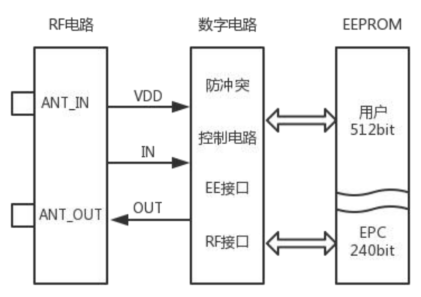

## 1. 芯片概述

HY5950/HY5960 物联网安全芯片是山东华翼微电子自主研发的新一代<Highlight color="#25c2a0">高抗冲突物联网安全芯片</Highlight>。该款芯片兼容 ISO 18000-3 mode 3 /EPC Class-1 标准的无源智能电子标签产品，支持 EPC 编码。芯片内部有 240 位的 EPC 存储区，512 位的用户存储区，支
持国密 SM7 安全算法。

该产品采用自主研发的高性能抗冲突算法，最大优势在于识别率高、防冲突速度快、安全防伪级别高，尤其适用于防冲突要求高且读取要求快速、密集、精准的应用场景，如无人超市、档案文件管理、工业物流管理等。

## 2. 芯片特性与优点

### 2.1 芯片特性

- 512 bit 用户存储区
- 240 bit of EPC 存储区
- 96 bit 标签 (TID) 包含 48 bit 唯一序列号
- EAS (Electronic Article Surveillance) 电子防盗
- 32 bit 密码保护实现重置普通/安全状态切换和废止功能
- 高灵敏度，读写距离高达 1.5m(门宽)
- 先进防冲突算法，识别速率高达 800 标签/s
- 可选择支持 SM7 流加密
- 载波频率:13.56MHz
- 谐振电容 23.5pF
- 下行速率: 25 kbit/s ~ 100 kbit/s
- 上行速率: 53 kbit/s~ 848 kbit/s

### 2.2 芯片优点

- 识别速度快

    最快每秒可识别 800 个，传统标签每秒可识别 50 个，单次最多识别 200 个。

- 识别准确率高

    识别率高达 100%，传统标签无法实现 100%读取。

- 支持 EPC 电子编码

    芯片内部有 240 位的 EPC 存储区域，与一维条码、二维条码相兼容。

- 支持国密 SM7 算法

    采用高性能流加密算法保证芯片和读写器之间传输数据的安全性。

## 3. 应用领域

- 供应链和物流管理
- 图书馆和文档管理
- 电子票证
- 商品防伪
- 超市自动结算和防盗
- 体检和化验
- 药物和食品溯源
- 餐饮结算
- 游戏厅、赌场筹码

## 4. 结构框图

## 5. 引脚定义

## 6. 极限参数

## 7. 典型封装

- 标签封装

- SOT1122封装

- 其他封装形式：  卡片/XOA-2/COB/Die等

## 8. 联系我们

**山东华翼微电子技术股份有限公司**

**www.holichip.com**

<Highlight color="#25c2a0"> PH： 18595257011</Highlight> 

export const Highlight = ({children, color}) => (
  
    {children}
  
);