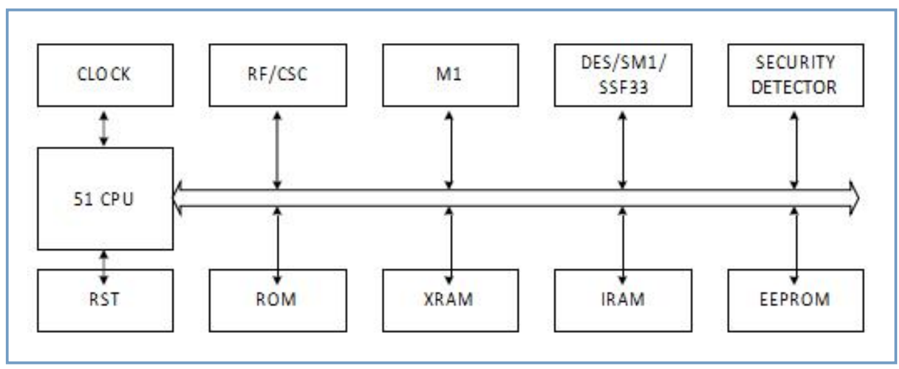
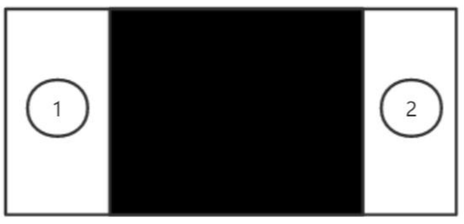
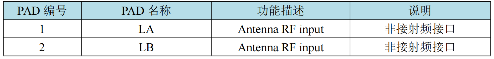
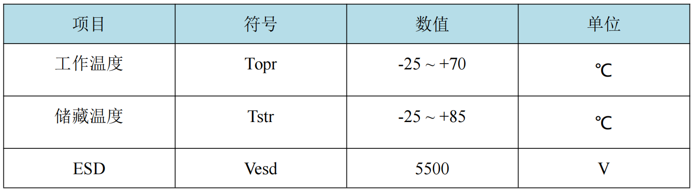
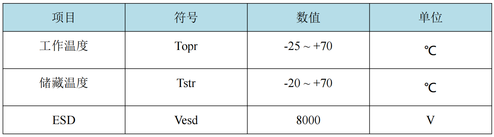
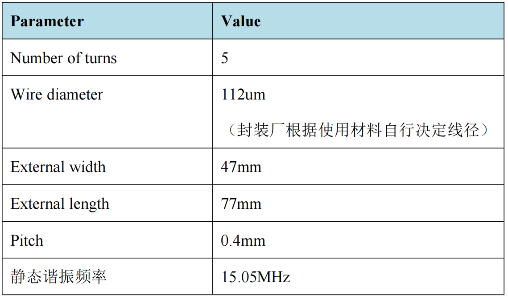
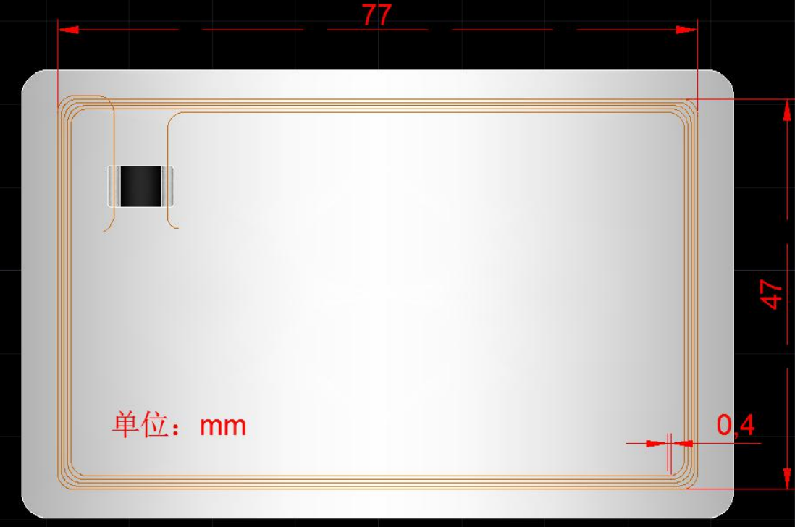

## 1. 芯片概述

HYM4616A4 芯片为山东华翼微电子技术股份有限公司自主研发的<Highlight color="#25c2a0">非接触 CPU 智能卡安全芯片</Highlight> 。片上集成高安全性固件，具有良好的可靠性、稳定性和安全性。<Highlight color="#25c2a0"> 提供各类智能卡操作系统（COS）定制开发</Highlight> 。

## 2. 芯片特性

- 支持 ISO/IEC14443 TYPE-A 非接触式通讯协议。
- 支持 DES-TripleDES、国密 33 算法、国密 SM1 算法、国密 SM4 算法。
- 32bit 随机数发生器(符合 FIPS140-2 和 NIST SP800-22)。
- 集成 Turbo 51 微处理器（MCU指令兼容 8051）。
- 搭载M1 协处理器。
- ROM 容量 32KB。
- EEPROM 容量 16KB。
- XRAM 容量 512B。
- IRAM 容量256B。
- 2 个 16bit 可编程定时器/计数器。
- 支持温度，光，场强等安全检测机制。
- 存储器(ROM、EEPROM、IRAM、XRAM)数据加密。
- EEPROM 满足 10 万次擦写，十年数据存储。
- ESD PAD 对模块衬底大于 2000V, 芯片 PAD 间大于 4000V （HBM）。
- 工作温度：-20℃~70℃

## 3. 应用领域

- 居住证
- 小额支付
- 公共交通
- 高速公路
- 居民健康卡
- 市民卡
- 社保卡
- 城市一卡通
- 校园一卡通
- 高安全应用

## 4. 结构框图

## 5. 引脚定义

## 6. 极限参数

- 模块极限参数

- 成卡极限参数

## 7. 典型封装

非接触模块<Highlight color="#25c2a0"> 可封装为标准卡和异形卡</Highlight> ，具体天线参数请咨询山东华翼微电子技术股份有限公司。

- 标准卡典型天线推荐参数

- 标准卡封装

## 8. 联系我们

**山东华翼微电子技术股份有限公司**

**www.holichip.com**

<Highlight color="#25c2a0"> PH： 18595257011</Highlight> 

export const Highlight = ({children, color}) => (
  
    {children}
  
);