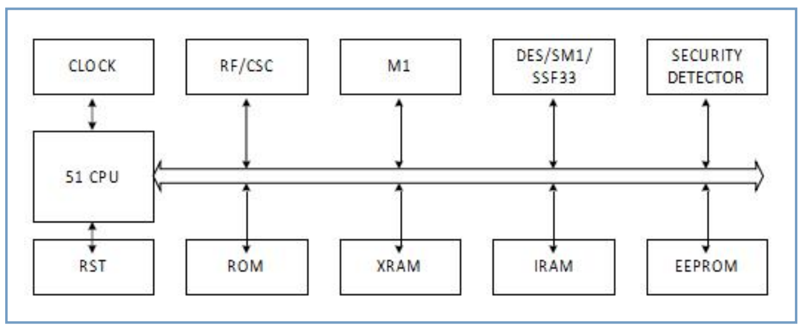
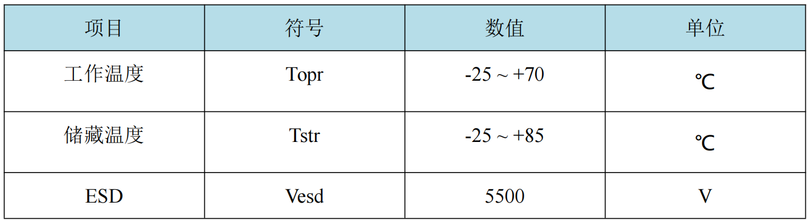

## 1. 芯片概述

HYM4616B4 是山东华翼微电子依托多年智能卡行业经验开发的一款<Highlight color="#25c2a0">接触式安全芯片</Highlight>。芯片集成 Turbo 51 微处理器，提供 ISO7816 接口和 I2C 总线接口，内置 32bit 真随机数发生器和安全防护电路，支持互相独立的多应用、多密钥安全防护，支持国密
SM1、SM3、SM4 算法和国际 DES/3DES、SHA1 算法。

HYM4616B4 具有低功耗、高性能、高安全性等优点，操作系统（COS）开发灵活，<Highlight color="#25c2a0">可提供各类特殊应用场景的定制开发</Highlight>，适用于嵌入式物联网安全芯片、嵌入式门禁安全芯片、社会保障卡、ESAM、PSAM 等各类安全芯片应用场景，封装形式主要有 IS07816、SOP8、DIP8 等。

## 2. 芯片特性

### 2.1 接口

### 2.2 内核与Memory

### 2.3 安全算法与安全策略

## 3. 应用领域

- 嵌入式物联网安全应用
- ESAM、PSAM
- 小额支付
- 公共交通
- 高速公路
- 居民健康卡
- 市民卡
- 社保卡
- 城市一卡通
- 校园一卡通
- 高安全应用

## 4. 结构框图

## 5. 极限参数

- 模块极限参数

- 成卡极限参数

## 6. 典型封装

### 6.1 接触式模块封装（ISO7816）

- 管脚说明

### 6.2 SOP8/DIP8模块封装

- 管脚说明

## 7. 联系我们

**山东华翼微电子技术股份有限公司**

**www.holichip.com**

<Highlight color="#25c2a0"> PH： 18595257011</Highlight> 

export const Highlight = ({children, color}) => (
  
    {children}
  
);