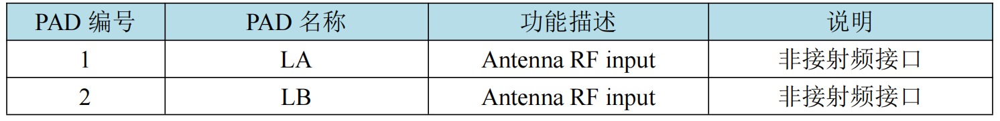
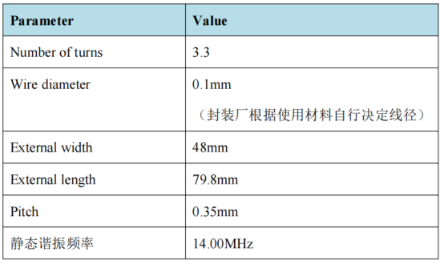
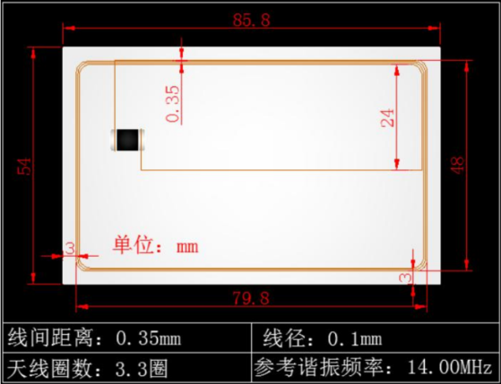
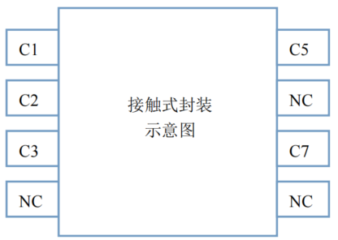
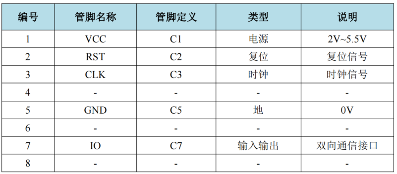
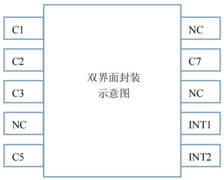
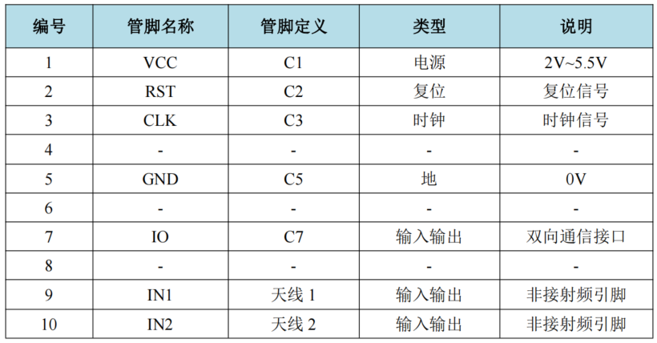
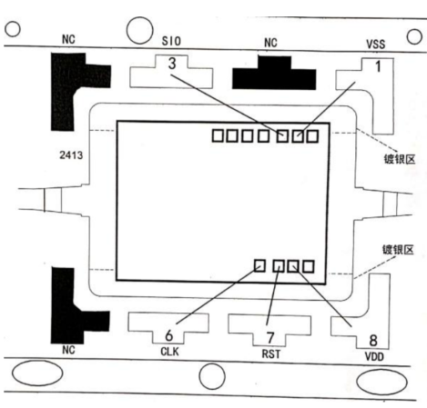
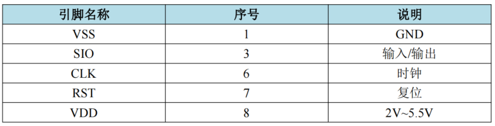

## 1. 芯片概述

HYM4616C7 芯片为山东华翼微电子技术股份有限公司自主研发的<Highlight color="#25c2a0">双界面 CPU 智能卡安全芯片</Highlight> 。支持 ISO/IEC 14443 TYPEA 非接触式通讯协议、ISO 7816 接触式通讯协议，提供超过 200K Bytes 用户空间，搭载 DES/3DES、RSA、SM2、SM3、SM4 等高抗攻击安全算法协处理器，片上集成高安全性固件，具有良好的可靠性、稳定性和安全性。<Highlight color="#25c2a0"> 提供各类智能卡操作系统（COS）定制开发</Highlight> ，可应用于公共交通、电子钱包等电子支付领域，同时适用于身份认证、居住证、驾驶证、出入境卡等安全认证领域；另外，使用
不同形式封装，能够以 PSAM、ESAM 等产品形式，应用于 POS 机、各类表具等安全认证物联网终端设备中。

## 2. 芯片特性

- 支持 ISO/IEC14443 TYPE-A 非接触式通讯协议。
- 支持 ISO/IEC7816通信协议。

- 支持 最高4096bitRSA算法。
- 支持 SHA1、SHA256算法。
- 支持 ECDSA算法、ECC算法。
- 支持 DES/3DES算法。
- 支持 SM1、SM2、SM3、SM4算法。

- 128 bit 真随机数发生器。
- ROM 容量 320KB。
- EEPROM 容量 80KB。
- EEPROM 满足20万次擦写，15年数据存储。

- ESD PAD对模块衬底大于2000V,芯片PAD间大于4000V（HBM）。
- 支持温度，电压，频率等安全检测机制。

- 工作温度：-20℃~70℃

- COS 支持PBOC3.0、QPBOC、标准ED/EP、交通部应用。

## 3. 应用领域

- 金融IC卡
- 金融社保卡
- 金融ETC 
- 居住证
- 小额支付
- 城市一卡通
- 公共交通
- 身份识别
- 市民卡
- 高安全应用

## 4. 结构框图

## 5. 引脚定义

## 6. 极限参数

- 模块极限参数

- 成卡极限参数

## 7. 典型封装

### 7.1 非接触式CPU卡模块封装

非接触模块<Highlight color="#25c2a0"> 可封装为标准卡和异形卡</Highlight> ，具体天线参数请咨询山东华翼微电子技术股份有限公司。

- 标准卡典型天线推荐参数

- 标准卡封装

### 7.2 接触式CPU卡模块封装

- 接触式封装示意图

- 管脚说明

### 7.3 双界面CPU卡模块封装

- 双界面封装示意图

- 管脚说明

### 7.4 SOP/DIP8模块封装

- SOP/DIP8封装示意图

- 管脚说明

## 8. 联系我们

**山东华翼微电子技术股份有限公司**

**www.holichip.com**

<Highlight color="#25c2a0"> PH： 18595257011</Highlight> 

export const Highlight = ({children, color}) => (
  
    {children}
  
);