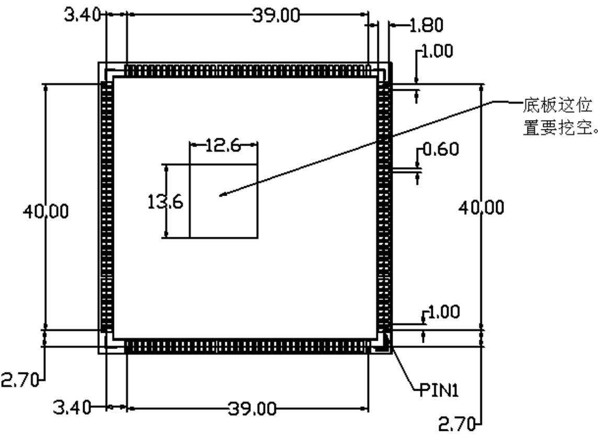

## 一.简介

​   该核心板一款 4G LTE 六模通信模块，定位为行业应用。采用SMT 封装，外形紧凑。性能稳定，功能强大，性价比高， 拥有良好的可扩展性。

**主要特性 : **

| 类别     | 描述                                                         |
| -------- | ------------------------------------------------------------ |
| 操作系统 | Android 8.1，可升级到 Android12/13                           |
| 处理器   | MTK8768(可选):  ARM 4 x Cortex‐A53@2.3GHz and  ARM 4 x Cortex‐A53@1.8GHz MTK6761(可选):  ARM 4 x Cortex‐A53@2.0GHz MTK6762(默认):  ARM 4 x Cortex‐A53@2.0GHz and  ARM 4 x Cortex‐A53@1.5GHz  |
| 内存     | 16GB eMMC + 16Gb LPDDR3(默认) 32GB eMMC + 24Gb LPDDR3(可选) 64GB eMMC + 32Gb LPDDR3(可选)  |
| WIFI     | 支持 802.11 a/b/g/n/ac                                       |
| 蓝牙     | BT5.0                                                        |
| 卫星定位 | GPS/Beidou/Galileo/Glonass A‐GPS，支持双星系统               |
| 蜂窝网络 | TDD_LTE: Band38/39/40/41(2555~2655MHz) FDD_LTE:Band1/3/5//8/12/17/20 WCDMA: Band1/2/5/8  GSM/GPRS/EDGE: Band2/3/5/8  GPRS/EDGE Class 12 |
| 显示     | 最大支持HD+ 1080P(1920 * 1200)                               |
| 触摸     | 支持电容触摸、电磁屏                                         |
| 摄像头   | 前置摄像头最大支持8MP，后置摄像头最大支持21MP                |

## 二.规格

| 类别     | 描述                                                         |
| -------- | ------------------------------------------------------------ |
| 供电电压 | 3.6~4.5V                                                     |
| 尺寸     | 45mm * 43mm *2.8mm ，162pin SMT                              |
| 操作温度 | ‐20°～+70°                                                   |
| 扩展接口 | 3 路 SPI（或 2 路 SPI+1 路 I2S） 1 路 SIM 卡 2 路 UART 4 路 I2C 音频：3 路 MIC输入/3 路输出 USB 2.0 HS peripheral(OTG) 2*2 按键阵列 多个外中断 3 个天线（WIFI/BT/GPS 天线、LTE 主集天线、分集天线） |

## 三.外形尺寸

###  3.1 核心板尺寸

### 3.2 底板设计要求

## 四.实物图片

