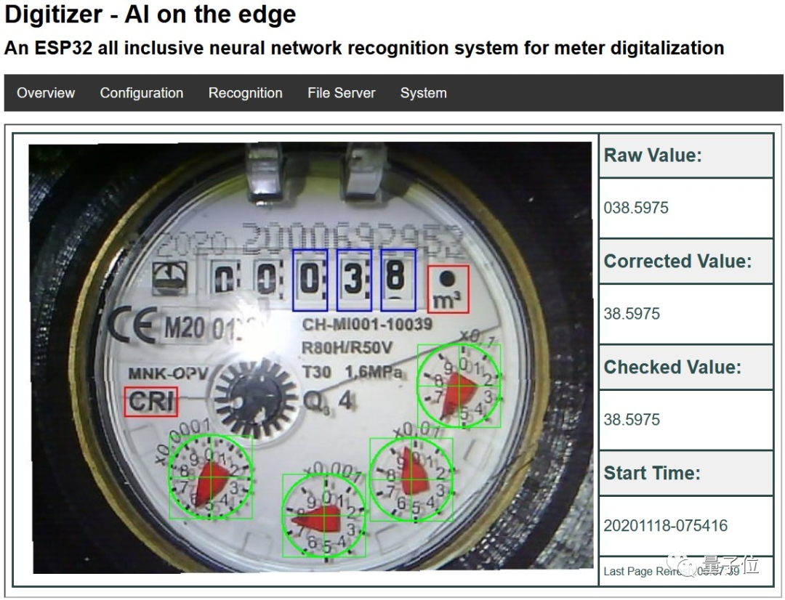

<!-- truncate -->

>>>内容来自安富莱嵌入式周报、痞子衡嵌入式周报及其他网络资源。

### Unicode算法
含编解码，大小写转换，文本分割，排序和文本压缩解压。
下载：
https://github.com/railgunlabs/unicorn/
案例：
https://railgunlabs.com/unicorn/manual/code-examples/

### AI读取水表数

项目地址：
https://github.com/jomjol/AI-on-the-edge-device

硬件配置：
https://www.thingiverse.com/thing:4573481

3D打印文件：
https://www.thingiverse.com/thing:4571627/files

