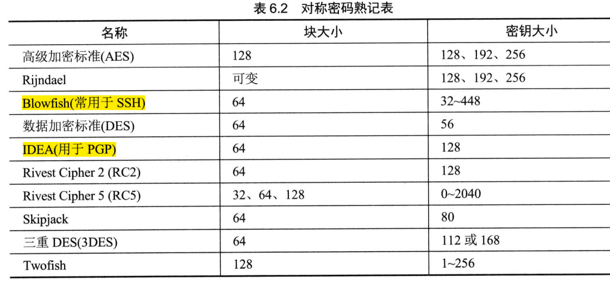
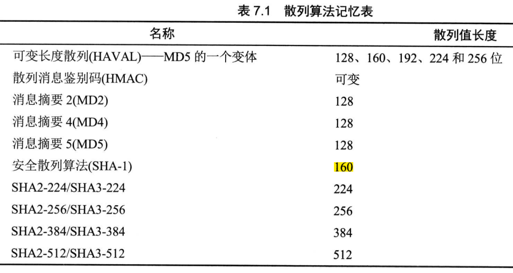

## 第六章 密码学和对称秘钥算法

### 6.1 密码学的历史里程碑

- 凯撒密码  又称 ROT3（Rotate3），是一种采用单一字母替换法的替换密码。可通过频率分析攻击破解。
- Enigma，二战时德国采用的。

### 6.2 密码学基础知识

- 密码学的目标： 保密性、完整性、身份验证、不可否认性
- 保密性：  确保数据在静止(存储)、传输(运动中)、使用(RAM中)三种状态下保持私密。对称、非对称密码系统。
- 完整性：  确保数据没有被人未经授权的更改。通过加密的消息摘要（数字签名）实现。
- 身份验证：用于验证系统用户所声称的身份。
- 不可否认性：由公钥或非对称密码系统提供。
- 密钥空间   2^n^ 
- 科克霍夫原则 ：  算法公开，只要密钥保密，整个密码系统就是安全的。
- 密码术和密码分析(研究打败代码和密码的方法)构成密码学。
- Nonce是一个随机数 ，比较有名的是初始化向量（IV），密码通过给加密过程添加随机性来获得强度。
- 零知识证明   向第三方证明你知道这个事实但又不把事实本身披露给第三方。
- 分割知识   “密钥托管”概念   N分之M 操办人总数(N)中至少有M个操办人同时在场
- 代价函数  代价函数大小与受保护资产的价值匹配。代价函数只需略大于该资产的时间值
- 代码与密码、移位密码、替换密码、单次密本、运动密钥密码（书密码）、块密码、流密码、混淆和扩散

### 6.3 现代密码学

- 对称密钥又称秘密密钥、私钥加密法。密钥分发、不提供不可否认、缺乏可伸缩性、必须经常重新生成。速度快。
- 非对称密钥算法  添加新用户只需生成一个公钥-私钥对，便于移除用户，密钥分发简单，不需预先建立通信关联。
- 对称密钥数  n(n-1)/2 ,非对称密钥数 2n
- 散列算法     消息摘要是由散列算法生成的消息内容归纳。  冲突。

### 6.4 对称密码

- DES、3DES、IDEA、AES 、Blowfish、Skipjack
- DES 64位块密码，5种模式。
  - 电子密码本（ECB）　６４位一块，最不安全。
  - 密码块链接（CBC）　初始化向量、异或、错误传播问题。
  - 密码反馈（CFB）　CBC模式的流密码版。
  - 输出反馈（OFB）　用一个种子值对明文进行异或运算。不存在链接函数，传输错误不会传播。
  - 计数器（CTR）　　流密码，不存在错误传播。
- 3DES　4个版本：DES-EEE3、DES－EDE３、DES－EEE２、DES－EDE２。
- IDEA　　128位密钥。
- Blowfish   密钥长度可变 32~448位。
- Skipjack   80位密钥，支持加密密钥托管。
- Rivest Cipher 5（RC5） 块大小可变（32、64、128），密钥从0~2040位。
- AES/Rijndael  密钥128、192、256位。 允许块大小和密钥长度相等。加密轮数取决于密钥长度(128/10、192/12、256/14)。

- 对称密钥管理
  - 创建和分发对称密钥： 线下分发、公钥加密、Diffie-Hellman密钥交换算法
  - 存储和销毁对称密钥
  - 密钥托管和恢复：  公平密码系统、受托加密标准。

### 6.5 密码生命周期

## 第七章 PKI和密码应用

### 7.1 非对称密码

- 常用公钥密码系统： RSA、El Gamal、椭圆曲线密码ECC。
- 公钥系统使用的密钥必须比私钥系统密钥更长，才能产生同等强度的密码系统。

### 7.2 散列函数

- SHA、MD2、MD4、MD5。
- SHA-1 生成160位消息摘要。
- SHA-2 4个变体：SHA-256、SHA-224、SHA-512、SHA-384。
- SHA-3

### 7.3 数字签名

- 依托公钥加密法和散列函数，实现不可否认性、完整性。
- 数字签名流程并不对自己所含内容及其签名本身提供任何隐私保护。
- HMAC （经过散列处理的消息鉴别码） ：保证完整性，不提供不可否认性。 共享秘密密钥+消息摘要。
- 数字签名标准： SHA3-3散列 + DSA、RSA、ECDSA。

### 7.4 公钥基础设施（PKI）

- 数字证书，符合X.509标准。
- 发证机构（CA） 
- 注册机构（RA）
- 证书的生成与销毁： 注册、验证、注销
- 证书注销列表（CRL）
- 在线证书状态协议（OCSP）

### 7.5 非对称密钥管理

- 硬件安全模块（HSM）

### 7.6 应用密码学

- 便携设备 ：  BitLocker、Encypting File System、FileVault、VeraCrypt

- 电子邮件：
  - 良好隐私（PGP）分商业版和免费版。 商业版（RSA交换密钥、IDEA加解密、MD5生成摘要），免费版（Diffie-Hellman、CAST、SHA-1）
  - 安全/多用途互联网邮件扩展（S/MIME ） 使用RSA。
- Web应用程序：  SSL 、TLS ，使用443端口
- 隐写术和水印
- 数字版权管理（DRM）：音乐DRM、电影DRM、电子书DRM、电子游戏DRM、文档DRM
- 联网
  - 线路加密：链路加密和端到端加密。链路加密是对所有数据（消息包头、消息尾部、地址、路由数据）都加密。在每个中继段要解密后重新加密才能进入下一个中继段。   SSH是端到端加密的例子。
  - IPsec：身份验证头（AH）、封装安全载荷（ESP）
  - ISAKMP（互联网安全关联和密钥管理协议）
  - 无线联网：有线等效保密（WEP）、WiFi受保护访问（WPA）

### 7.7 密码攻击

- 分析攻击、执行攻击、统计攻击、蛮力攻击。
- 彩虹表为密码散列提供预先算出的值。通常用于破解以散列形式保存在系统中的口令。
- 密码盐
- 频率分析和唯密文攻击
- 已知明文、选择密文、选择明文、中间相遇、中间人、生日、重放。

## 第八章 安全模型、设计和能力的原则

### 8.1 使用安全设计原则实施和管理工程过程

### 8.2 理解安全模型的基本概念

### 8.3 基于系统安全需求选择控制措施

### 8.4 理解信息系统的安全功能

## 第九章 安全漏洞、威胁和对策

## 第十章 物理安全要求

