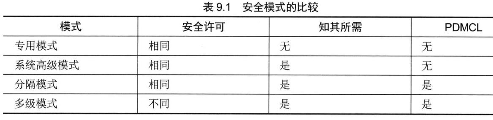

## 第六章 密码学和对称秘钥算法

### 6.1 密码学的历史里程碑

- 凯撒密码  又称 ROT3（Rotate3），是一种采用单一字母替换法的替换密码。可通过频率分析攻击破解。
- Enigma，二战时德国采用的。

### 6.2 密码学基础知识

- 密码学的目标： 保密性、完整性、身份验证、不可否认性
- 保密性：  确保数据在静止(存储)、传输(运动中)、使用(RAM中)三种状态下保持私密。对称、非对称密码系统。
- 完整性：  确保数据没有被人未经授权的更改。通过加密的消息摘要（数字签名）实现。
- 身份验证：用于验证系统用户所声称的身份。
- 不可否认性：由公钥或非对称密码系统提供。
- 密钥空间   2^n^ 
- 科克霍夫原则 ：  算法公开，只要密钥保密，整个密码系统就是安全的。
- 密码术和密码分析(研究打败代码和密码的方法)构成密码学。
- Nonce是一个随机数 ，比较有名的是初始化向量（IV），密码通过给加密过程添加随机性来获得强度。
- 零知识证明   向第三方证明你知道这个事实但又不把事实本身披露给第三方。
- 分割知识   “密钥托管”概念   N分之M 操办人总数(N)中至少有M个操办人同时在场
- 代价函数  代价函数大小与受保护资产的价值匹配。代价函数只需略大于该资产的时间值
- 代码与密码、移位密码、替换密码、单次密本、运动密钥密码（书密码）、块密码、流密码、混淆和扩散

### 6.3 现代密码学

- 对称密钥又称秘密密钥、私钥加密法。密钥分发、不提供不可否认、缺乏可伸缩性、必须经常重新生成。速度快。
- 非对称密钥算法  添加新用户只需生成一个公钥-私钥对，便于移除用户，密钥分发简单，不需预先建立通信关联。
- 对称密钥数  n(n-1)/2 ,非对称密钥数 2n
- 散列算法     消息摘要是由散列算法生成的消息内容归纳。  冲突。

### 6.4 对称密码

- DES、3DES、IDEA、AES 、Blowfish、Skipjack
- DES 64位块密码，5种模式。
  - 电子密码本（ECB）　６４位一块，最不安全。
  - 密码块链接（CBC）　初始化向量、异或、错误传播问题。
  - 密码反馈（CFB）　CBC模式的流密码版。
  - 输出反馈（OFB）　用一个种子值对明文进行异或运算。不存在链接函数，传输错误不会传播。
  - 计数器（CTR）　　流密码，不存在错误传播。
- 3DES　4个版本：DES-EEE3、DES－EDE３、DES－EEE２、DES－EDE２。
- IDEA　　128位密钥。
- Blowfish   密钥长度可变 32~448位。
- Skipjack   80位密钥，支持加密密钥托管。
- Rivest Cipher 5（RC5） 块大小可变（32、64、128），密钥从0~2040位。
- AES/Rijndael  密钥128、192、256位。 允许块大小和密钥长度相等。加密轮数取决于密钥长度(128/10、192/12、256/14)。

- 对称密钥管理
  - 创建和分发对称密钥： 线下分发、公钥加密、Diffie-Hellman密钥交换算法
  - 存储和销毁对称密钥
  - 密钥托管和恢复：  公平密码系统、受托加密标准。

### 6.5 密码生命周期

## 第七章 PKI和密码应用

### 7.1 非对称密码

- 常用公钥密码系统： RSA、El Gamal、椭圆曲线密码ECC。
- 公钥系统使用的密钥必须比私钥系统密钥更长，才能产生同等强度的密码系统。

### 7.2 散列函数

- SHA、MD2、MD4、MD5。
- SHA-1 生成160位消息摘要。
- SHA-2 4个变体：SHA-256、SHA-224、SHA-512、SHA-384。
- SHA-3

### 7.3 数字签名

- 依托公钥加密法和散列函数，实现不可否认性、完整性。
- 数字签名流程并不对自己所含内容及其签名本身提供任何隐私保护。
- HMAC （经过散列处理的消息鉴别码） ：保证完整性，不提供不可否认性。 共享秘密密钥+消息摘要。
- 数字签名标准： SHA3-3散列 + DSA、RSA、ECDSA。

### 7.4 公钥基础设施（PKI）

- 数字证书，符合X.509标准。
- 发证机构（CA） 
- 注册机构（RA）
- 证书的生成与销毁： 注册、验证、注销
- 证书注销列表（CRL）
- 在线证书状态协议（OCSP）

### 7.5 非对称密钥管理

- 硬件安全模块（HSM）

### 7.6 应用密码学

- 便携设备 ：  BitLocker、Encypting File System、FileVault、VeraCrypt

- 电子邮件：
  - 良好隐私（PGP）分商业版和免费版。 商业版（RSA交换密钥、IDEA加解密、MD5生成摘要），免费版（Diffie-Hellman、CAST、SHA-1）
  - 安全/多用途互联网邮件扩展（S/MIME ） 使用RSA。
- Web应用程序：  SSL 、TLS ，使用443端口
- 隐写术和水印
- 数字版权管理（DRM）：音乐DRM、电影DRM、电子书DRM、电子游戏DRM、文档DRM
- 联网
  - 线路加密：链路加密和端到端加密。链路加密是对所有数据（消息包头、消息尾部、地址、路由数据）都加密。在每个中继段要解密后重新加密才能进入下一个中继段。   SSH是端到端加密的例子。
  - IPsec：身份验证头（AH）、封装安全载荷（ESP）
  - ISAKMP（互联网安全关联和密钥管理协议）
  - 无线联网：有线等效保密（WEP）、WiFi受保护访问（WPA）

### 7.7 ==密码攻击==

- 分析攻击、执行攻击、统计攻击、蛮力攻击（彩虹表、密码盐）。
- 彩虹表为密码散列提供预先算出的值。通常用于破解以散列形式保存在系统中的口令。
- 密码盐
- 频率分析
- ==唯密文攻击、已知明文、选择明文、选择密文==
- ==中间相遇（2DES）、中间人==
- 生日、重放。

## 第八章 安全模型、设计和能力的原则

### 8.1 使用安全设计原则实施和管理工程过程

- 客体和主体
  - 主体是发出访问资源请求的用户或进程。 客体是用户或进程想要访问的资源
  - 信任传递，一个严重的安全问题。
- 封闭系统和开放系统
- 开源和闭源
- 用于确保保密性、完整性、可用性的技术
  - 限制（Confinement）
  - 界限（Bound）
  - 隔离（Isolation）
- 控制  强制访问控制（MAC）、自主访问控制（DAC）
- 信任与保证

### 8.2 理解==安全模型==的基本概念

- 令牌、能力和标签
- 可信计算基（Trust Computing Base，TCB），职责是确保系统在所有情况下都能正常运行，在所有情况下都遵守安全策略。
  - 安全边界
  - 参考监视器和安全内核
- 状态机模型
- 信息流模型  防止未经授权、不安全或受限制的信息流，通常在不同安全级别之间。
- 非干扰模型  防止处在高安全分类水平的主体的行为影响处于较低安全分类水平的系统状态。
- Take-Grant模型   使用**有向图**来规定如何将权限从一个主体传递到另一个主体或从主体传递到客体。
- 访问控制矩阵   指示每个主体可对每个客体执行的动作或功能。（访问控制列表+能力列表）
- ==Bell-LaPadula==模型  多级安全策略中的第一个数学模型。仅解决==数据保密性==，未涉及完整性和可用性。
  - 简单安全规则 ：不能向上读
  - *-型属性规则：不能向下写
  - 强星型属性规则：只能操作相同安全级别的
- ==Biba==模型  解决==完整性==问题。
  - *-型完整性公理：不上写
  - 简单型完整性公理：不能向下读
  - 请求调用属性：低级别不能向高级别申请调用
- ==Clark-Wilson==模型 确保==完整性==。 使用被称为访问控制三元组的主体/程序/客体的三部分关系。
- ==Brewer and Nash==模型 当且仅当一个主体不能读取另一个数据集中的客体时，这个主体才能写入一个客体。
  - 目标：预防利益冲突。  
- Goguen-Meseguer模型
- Sutherland模型
- Graham-Denning模型

### 8.3 基于系统安全需求选择控制措施

- 三个主要评估模型或分类标准模型：TCSEC、ITSEC、通用准则（CC）
- 彩虹系列
- TCSEC分类（ABCD）和所需功能
- ITSEC类别与所需保证和功能（F-D到F-B3、E0到E6）
- 通用准则 定义了测试和确认系统安全功能的各种级别，级别的数字表示执行了哪种类型的测试和确认。
  - 保护范畴（Protection Profile，PP）
  - 安全目标（Security Targets，ST）
  - 评估保证级别（EAL）
- 行业和国际安全实施指南（PCI DSS、ISO）
- 认证和鉴定

### 8.4 理解信息系统的安全功能

- 内存保护    防止活动的进程与不是专门指派或分配给它的内存区域进行交互。
- 虚拟化
- 可信平台模块（Trusted Platform Module,TPM）用于满足基于硬件支持/实现的硬盘加密系统。
  - 硬件安全模块（HSM）
- 接口
- 容错

## 第九章 安全漏洞、威胁和对策

### 9.1 评估和缓解安全漏洞

- 执行类型： 多任务、多核、多处理（SMP、MMP）、多程序、多线程
- 处理类型：单一状态、多状态
- 保护机制：保护环、操作状态、安全模式
- 保护环：环0一般是操作系统内核；环3是应用程序；环1是操作系统内核外部分，环2是IO驱动及系统实用程序驻留的地方。
- 环模型的本质在于优先级、特权、内存分段。
- 进程状态：就绪、等待、运行、停止、监管
- 安全模式
- 专用模式
- 系统高级模式
- 分隔模式
- 多级模式

- 操作模式：用户模式、特权模式
- 存储器：ROM、PROM、EPROM（UVEPROM、EEPROM）、RAM
- 存储器寻址、寄存器寻址、立即寻址、直接寻址、间接寻址、基址+偏移量寻址
- 辅助存储器
- 存储设备：主存储设备和辅助存储设备、易失性存储设备与非易失性存储设备
- 随机存取和顺序存取
- 存储介质的安全
- 输入和输出设备：显示器（TEMPEST）、打印机、键盘鼠标调制解调器
- 固件：BIOS、UEFI、设备固件

### 9.2 基于客户端的系统

- applet ： Java applet、ActiveX控件
- 本地缓存：ARP缓存、域名缓存、Internet文件缓存。

### 9.3 基于服务端的系统

- 数据流控制
- 数据流是进程之间、设备之间、网络之间或通信通道之间的数据移动。
- 负载均衡器用于在多个网络链路或网络设备之间传播或分配网络流量负载。

### 9.4 数据库系统安全

- 聚合 ：SQL提供的函数可将一个或多个表记录组合在一起，以生成可能有用的信息。  聚合攻击
- 推理 : 推理攻击指组合若干非敏感信息以获得本应属于更高分类级别的信息。
- 数据挖掘 ：允许分析人员搜索数据仓库并寻找潜在的相关信息。
- 数据仓库： 数据仓库中常包含通常生产数据库中不存储的详细历史信息。
- 数据分析： 是检查原始数据的科学，重点是从大批量信息集中提取出有用信息。

### 9.5 分布式系统和端点安全

- 客户端/服务器模型网络的概念称为分布式系统或分布式体系结构。
- 纵深防御用于提供防止各种攻击形式的多层的保护性屏障。
- 平台即服务（Platform as a Service）
- 软件即服务（Software as a Service）
- 基础设施即服务（Infrastructure as a Service）
- 云服务部署：私有云、公有云、混合云、社区云
- 网格计算是一种并行分布式处理形式，将大量处理节点松散地分组，以实现特定处理目标。
- 对等网络（Peer to Peer）

### 9.6 物联网

- 哑路由器

### 9.7 工业控制系统

- 工业控制系统（Industrial Control System，ICS）是一种控制工业过程和机器的计算机管理设备。 如分布式控制系统（DCS）、可编程逻辑控制器（PLC）、监控和数据采集（SCADA）。

### 9.8 评估和缓解基于Web系统的漏洞

- 开放Ｗｅｂ应用程序项目（OWASP）
- 注入、XML利用、跨站脚本（XSS）、XSRF
- 保护Web应用程序免受SQL注入攻击的技术：执行输入验证、限制账户权限
- XML利用是一种编程攻击的形式，用于伪造发送给访问者的信息，或者导致他们的系统在未经授权的情况下泄露信息。
- 跨站脚本（XSS）是一种恶意代码注入攻击形式，攻击者可攻击Ｗｅｂ服务器并将自己的恶意代码注入发送给其他访问者的内容中。

### 9.9 评估和缓解移动系统的漏洞

- 设备安全：全设备加密、远程擦除、锁定、锁屏、GPS、应用程序控制、存储分离、资产跟踪、库存控制、移动设备管理、设备访问控制、可移动存储、关闭不使用的功能
- 应用安全：密钥管理、凭据管理、身份验证、地理位置标记、加密、应用白名单
- BYOD（Bring Your Own Device　自带设备）允许员工将自己的个人移动设备投入工作，并使用这些设备连接，经由公司网络连接到业务资源或互联网。

### 9.10 评估和缓解嵌入式设备和信息物理系统的漏洞

- 保护嵌入式和静态系统的方法：　网络分段、安全层、应用防火墙、手动更新、固件版本控制、包装器、监控、控制冗余和多样性

### 9.11 基本安全保护机制

- 技术机制：分层、抽象、数据隐藏、进程隔离、硬件分隔。
- 策略机制：最小特权原则、特权分离、问责制

### 9.12 常见的架构缺陷和安全问题

- 隐蔽通道：时间隐蔽通道、存储隐蔽通道。　　防御措施是实施审核和分析日志文件。
- 基于设计或编码缺陷的攻击和安全问题　可信恢复、输入和参数检查、维护钩子和特权程序、增量攻击（数据欺骗和ｓａｌａｍｉ攻击）
- 编程
- 计时、状态改变和通信中断
- 技术和过程集成
- 电磁辐射

## 第十章 物理安全要求
### 10.1 站点与设施设计的安全原则

- 安全设施计划   需列出组织的安全需求，并突出保障安全所使用的方法及技术。  关键路径分析
- 站点选择   基于组织的安全需求。
- 可见度
- 自然灾害
- 设施设计     CPTED(通过环境设计预防犯罪)

### 10.2 实现站点与设施安全控制

- 物理安全中安全控制可分为管理类、技术类、现场类。
- 为环境设计物理安全时，各类控制功能顺序：**吓阻、阻挡、监测、延迟。**
- 设备故障    SLA（服务水平协议）  MTTF(平均故障时间)、MTTR(平均恢复时间)、MTBF(平均故障间隔时间)
- 配线间
- 服务器间与数据中心
  - 智能卡
  - 接近式读卡器
  - 入侵检测系统
  - 访问滥用
  - 发射安全
- 介质存储设施
- 证据存储
- 受限区与工作区安全
- 基础设施与HVAC      噪声、温度、湿度与静电、关于水的问题（漏水、洪水）
- 火灾预防、探测与消防   
  - 首要目标是保障人身的安全。
  - 火灾三角形（燃料、热量、氧气） 
  - 火灾发展阶段  ：早期、烟雾、火焰、炙热
  - 灭火器
  - 火灾探测系统 ： 固定温度探测、上升率探测、火焰驱动、烟雾驱动
  - 喷水消防系统： 湿管系统、干管系统、集水系统、预动作系统
  - 气体消防系统
  - 破坏

### 10.3 物理安全的实现与管理

- 边界安全控制
  - 围栏、门、旋转门、捕人陷阱
  - 照明
  - 安全警卫与警犬
- 内部安全控制
  - 钥匙与密码锁
  - 胸卡
  - 动作探测器
  - 入侵警报
  - 二次验证机制
  - 环境与生命安全
  - 隐私责任与法律要求
  - 监管要求

