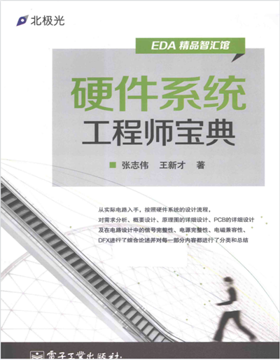
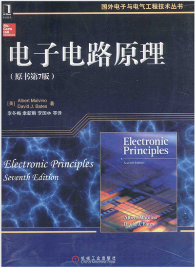
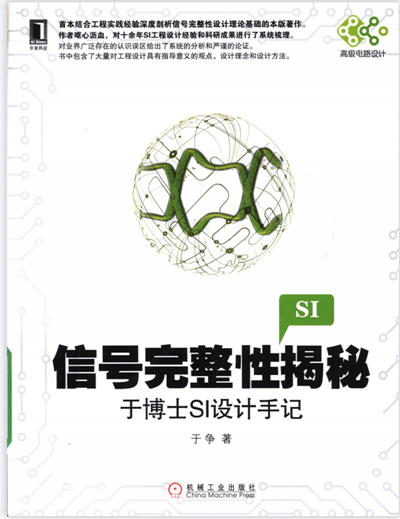
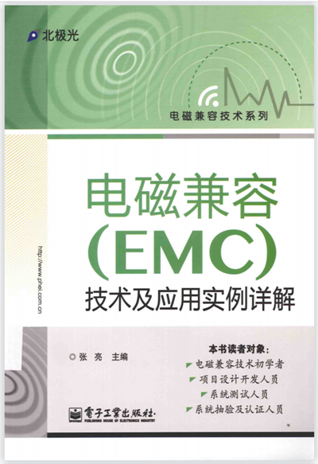
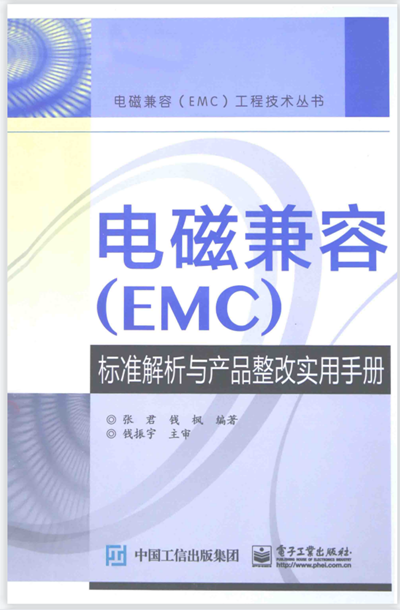

## 1、硬件基础

### 1.1《硬件系统工程师宝典》

### 1.2《电子电路原理》

***

## 2、开关电源设计

### 2.1《精通开关电源设计 》  
马尼克塔拉著-人民邮电出版社.png)
***

## 3、信号完整性
### 3.1《信号完整性揭秘于博士SI设计手记》

### 3.2《电磁兼容 EMC技术及应用实例详解》

### 3.3《电磁兼容（EMC）标准解析与产品整改实用手册》

