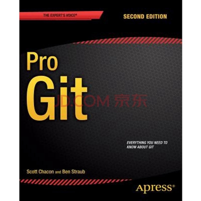
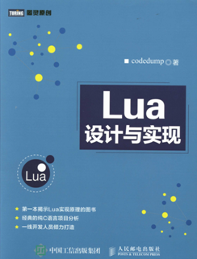

## 1. 版本管理

### 1.1. 《GitHub 入门与实践》

### 1.2. 《Pro Git》

### 1.3. 《Git 权威指南》

***

## 2. 安全

### 2.1. 《图解密码技术》

### 2.2. 《漫画密码》

### 2.3. 《Openssl Cookbook》

### 2.4. 《深入浅出密码学—常用加密技术原理与应用》

***

## 3. 网络

### 3.1. 《图解HTTP》

### 3.2. 《图解TCP/IP》

### 3.3. 《图解物联网》

### 3.4. 《图解服务器端网络架构》

### 3.5. 《TCP/IP网络编程》

### 3.6. 《物联网实战指南》

### 3.7. 《IoT 开发实战 CoAP卷》

### 3.8. 《MQTT Essentials - A Lightweight IoT Protocol》

***

## 4. C
### 4.1. 《C Primer Plus》

### 4.2. 《C和指针》

### 4.3. 《C陷阱与缺陷》

### 4.4. 《Modern C》

### 4.5. 《Anssi Guide Rules for Secure C Language Software Development》

***

## 5. Python

### 5.1. 《流畅的Python》

### 5.2. 《Programming with MicroPython》

***

## 6. 嵌入式

### 6.1. 《嵌入式系统构件》

### 6.2. 《ARM Cortex-M3与Cortex-M4权威指南》

### 6.3. 《ARM Cortex-M3 权威指南》

### 6.4. 《ARM Cortex-M0与Cortex-M0+权威指南》

***

## 7. Linux
### 7.1. Linux设备驱动开发详解

### 7.2. 深度实践嵌入式Linux 系统移植

### 7.3. 深入Linux内核架构

### 7.4. Unix网络编程

### 7.5. Unix环境高级编程

### 7.6. Linux内核设计与实现

***

## 8. 未分类

### 8.1. 《Modbus 软件开发实战》

### 8.2. 《CAN总线嵌入式开发  从入门到实战》

### 8.3. 《Embedded Networking with CAN and CANopen》

### 8.4. 《SQLite 权威指南》

### 8.5. 《Lua设计与实现》

### 8.6. 《JSON 必知必会》

### 8.7. 《嵌入式系统的事件驱动编程技术》

### 8.8. 《NASA Systems Engineering Handbook》

### 8.9. 《进化树 技术信息分析及新方案的产生》

