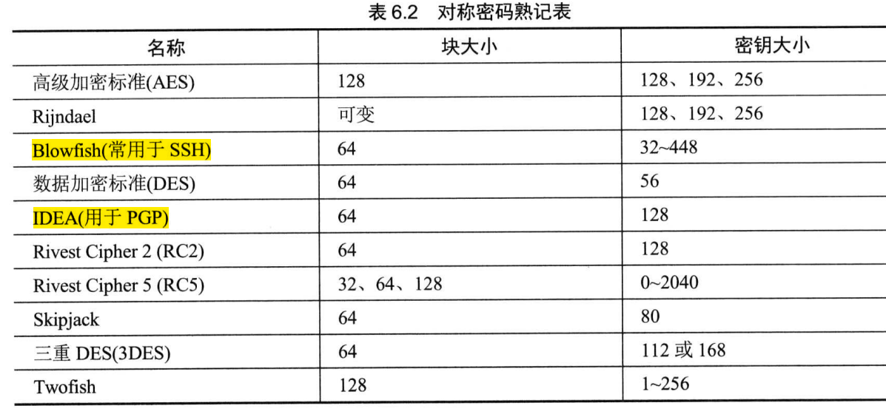

## 第六章 密码学和对称秘钥算法

### 6.1 密码学的历史里程碑

- 凯撒密码  又称 ROT3（Rotate3），是一种采用单一字母替换法的替换密码。可通过频率分析攻击破解。
- Enigma，二战时德国采用的。

### 6.2 密码学基础知识

- 密码学的目标： 保密性、完整性、身份验证、不可否认性
- 保密性：  确保数据在静止(存储)、传输(运动中)、使用(RAM中)三种状态下保持私密。对称、非对称密码系统。
- 完整性：  确保数据没有被人未经授权的更改。通过加密的消息摘要（数字签名）实现。
- 身份验证：用于验证系统用户所声称的身份。
- 不可否认性：由公钥或非对称密码系统提供。
- 密钥空间   2^n^ 
- 科克霍夫原则 ：  算法公开，只要密钥保密，整个密码系统就是安全的。
- 密码术和密码分析(研究打败代码和密码的方法)构成密码学。
- Nonce是一个随机数 ，比较有名的是初始化向量（IV），密码通过给加密过程添加随机性来获得强度。
- 零知识证明   向第三方证明你知道这个事实但又不把事实本身披露给第三方。
- 分割知识   “密钥托管”概念   N分之M 操办人总数(N)中至少有M个操办人同时在场
- 代价函数  代价函数大小与受保护资产的价值匹配。代价函数只需略大于该资产的时间值
- 代码与密码、移位密码、替换密码、单次密本、运动密钥密码（书密码）、块密码、流密码、混淆和扩散

### 6.3 现代密码学

- 对称密钥又称秘密密钥、私钥加密法。密钥分发、不提供不可否认、缺乏可伸缩性、必须经常重新生成。速度快。
- 非对称密钥算法  添加新用户只需生成一个公钥-私钥对，便于移除用户，密钥分发简单，不需预先建立通信关联。
- 对称密钥数  n(n-1)/2 ,非对称密钥数 2n
- 散列算法     消息摘要是由散列算法生成的消息内容归纳。  冲突。

### 6.4 对称密码

- DES、3DES、IDEA、AES 、Blowfish、Skipjack
- DES 64位块密码，5种模式。
  - 电子密码本（ECB）　６４位一块，最不安全。
  - 密码块链接（CBC）　初始化向量、异或、错误传播问题。
  - 密码反馈（CFB）　CBC模式的流密码版。
  - 输出反馈（OFB）　用一个种子值对明文进行异或运算。不存在链接函数，传输错误不会传播。
  - 计数器（CTR）　　流密码，不存在错误传播。
- 3DES　4个版本：DES-EEE3、DES－EDE３、DES－EEE２、DES－EDE２。
- IDEA　　128位密钥。
- Blowfish   密钥长度可变 32~448位。
- Skipjack   80位密钥，支持加密密钥托管。
- Rivest Cipher 5（RC5） 块大小可变（32、64、128），密钥从0~2040位。
- AES/Rijndael  密钥128、192、256位。 允许块大小和密钥长度相等。加密轮数取决于密钥长度(128/10、192/12、256/14)。

- 对称密钥管理
  - 创建和分发对称密钥： 线下分发、公钥加密、Diffie-Hellman密钥交换算法
  - 存储和销毁对称密钥
  - 密钥托管和恢复：  公平密码系统、受托加密标准。

### 6.5 密码生命周期

## 第七章 PKI和密码应用

## 第八章 安全模型、设计和能力的原则

## 第九章 安全漏洞、威胁和对策

## 第十章 物理安全要求

